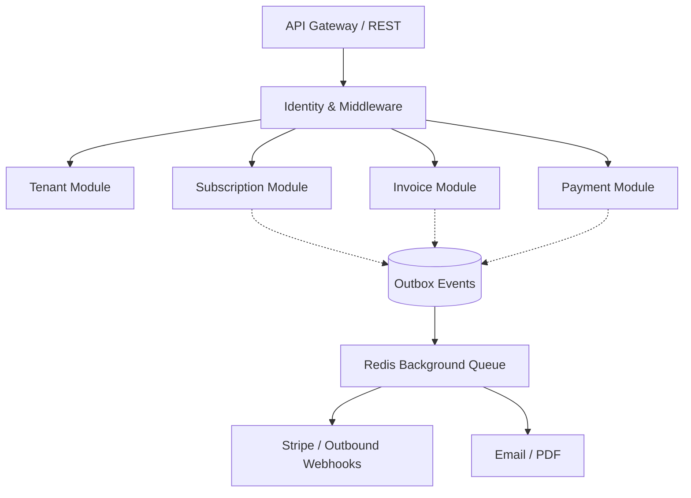

# OmniBill

<div align="center">
  <p><strong>Enterprise-Grade Multi-Tenant SaaS Billing Platform</strong></p>

  [](https://php.net)
  [](https://laravel.com)
  [](https://phpstan.org/)
  [](https://pestphp.com/)
  [](LICENSE)
</div>

---

## Project Overview

OmniBill is a high-performance, strictly isolated, multi-tenant billing engine built on the Laravel 13 framework. 

Designed for SaaS organizations processing complex recurring revenue models, OmniBill acts as an isolated financial ledger and subscription orchestrator. It acts as an abstraction layer over Stripe, prioritizing **correctness, maintainability, and auditability** over premature optimization. The system is designed to handle thousands of tenants securely, enforcing strict data isolation while orchestrating complex asynchronous payment workflows.

> **Status**: 🟢 **Version 1.0 (Production Ready)**

## Key Features

The system is compartmentalized into strict Bounded Contexts representing discrete business capabilities:

- **Identity & RBAC**: API token-based authentication using Laravel Sanctum with strict Role-Based Access Control and Global Super Admin capabilities.
- **Multi-Tenancy**: Complete horizontal logical isolation. Every financial query is implicitly scoped to the active tenant via Row-Level Security (RLS) strategies and global Eloquent scopes.
- **Customer & Catalog Management**: Highly customizable Subscription Plans, Features, and Pricing schemas synced synchronously.
- **Subscription Engine**: Orchestration of recurring subscription states (Active, Canceled, Past Due) driven by secure webhooks.
- **Invoice Engine**: Immutable financial ledgers. Invoices enforce strict immutability once transitioned out of `Draft` state.
- **Payment State Machines**: Complex Dunning flows, webhook-driven payment retries, and asynchronous tracking of Payment Intents.
- **Robust Operations**: Surgical Cache-Aside architecture, automated Spatie DB Backups, Laravel Pulse observability, and deterministic IDOR protection.

## Architecture

OmniBill employs a **Modular Monolith** architecture governed by Domain-Driven Design (DDD).

- **Strict Boundaries**: Modules (`Tenant`, `IdentityAccess`, `Subscription`, `Invoice`, `Payment`) are explicitly isolated.
- **CQRS**: Commands (Mutations) and Queries (Reads) are separated via discrete Application Services.
- **Event-Driven Workflows**: Modules communicate asynchronously using the **Transactional Outbox Pattern** instead of distributed database transactions, guaranteeing cross-module event delivery even during external network failures.



## Tech Stack

| Domain | Technology |
|---|---|
| **Backend Framework** | Laravel 13 (PHP 8.4) |
| **Database** | PostgreSQL 15 |
| **Queue & Cache** | Redis 7 |
| **Payment Gateway** | Stripe SDK |
| **Observability** | Laravel Pulse, Spatie Health |
| **Documentation** | Scramble (OpenAPI) |
| **Testing & CI/CD** | Pest PHP, GitHub Actions |
| **Static Analysis** | PHPStan (Level Max), Laravel Pint |

## Repository Structure

<details>
<summary>Click to view directory tree</summary>

```text
omnibill/
├── Modules/                  # Core Business Domains (Modular Monolith)
│   ├── Customer/             # Customer CRM records
│   ├── IdentityAccess/       # Auth, Tokens, RBAC
│   ├── Invoice/              # Invoices, Line Items, Credit Notes
│   ├── Notification/         # Dispatched email and system notifications
│   ├── Payment/              # Transactions, Stripe Intents
│   ├── Queue/                # Background job structures
│   ├── Shared/               # Cross-cutting concerns (Context, Exceptions)
│   ├── Subscription/         # Plans, Catalogs, Active Subscriptions
│   ├── Tenant/               # Multi-tenancy, RLS Scopes, Settings
│   └── Webhook/              # Inbound/Outbound event routing
├── app/                      # Standard Laravel framework files
├── database/                 # Migrations & Factories
├── docs/                     # Deep-dive architectural documentation
├── public/                   # Public assets and openapi.json
└── tests/                    # Comprehensive Pest Test Suite
```
</details>

## Getting Started

Frictionless developer onboarding is a priority. OmniBill is containerized out of the box using **Docker Compose**.

### Prerequisites
- Docker & Docker Compose
- Composer (Optional, can run inside the container)

### Installation

1. **Clone the repository:**
   ```bash
   git clone https://github.com/nishant-dd-24/omnibill.git
   cd omnibill
   ```

2. **Prepare Environment Variables:**
   ```bash
   cp .env.example .env
   # Update STRIPE_SECRET and STRIPE_WEBHOOK_SECRET in .env if needed
   ```

3. **Spin up the Infrastructure:**
   ```bash
   docker compose up -d
   ```

4. **Install Dependencies:**
   ```bash
   docker compose exec app composer install
   ```

5. **Generate Keys & Migrate the Database:**
   ```bash
   docker compose exec app php artisan key:generate
   docker compose exec app php artisan migrate --seed
   ```

The API is now running locally at `http://localhost:8000`.

## Development Workflow

We enforce strict quality gates before any code is merged to `main`. 

### Testing
OmniBill uses [Pest](https://pestphp.com/) for its elegant, expectation-based testing API.
```bash
docker compose exec app vendor/bin/pest
```
*To verify architectural boundaries specifically, run:* `docker compose exec app vendor/bin/pest --group arch`

### Static Analysis & Formatting
Zero PHPStan errors are required.
```bash
# Code Formatting
docker compose exec app vendor/bin/pint

# Static Analysis
docker compose exec app vendor/bin/phpstan analyse
```

## API Documentation

OmniBill utilizes **Scramble** to automatically generate OpenAPI documentation directly from source code and docblocks, completely eliminating documentation drift.

- **Local UI:** Start the application and navigate to `http://localhost/docs/api`.
- **Exported Schema:** A static `openapi.json` is generated on every successful CI/CD deployment.

## Operations & Observability

OmniBill is built for production operations (Phase 6 implementation):
- **Laravel Pulse**: Accessible to authenticated users at `/pulse` for real-time queue, slow query, and business metric (MRR) dashboards.
- **Spatie Health Checks**: Internal readiness probes pinging PostgreSQL, Redis, Queues, and the Stripe API located at `/api/v1/health`.
- **Context Tracing**: Fully threaded `correlation_id` and `tenant_id` propagation across standard logs, queues, and HTTP boundaries.
- **Disaster Recovery**: Automated database backups and S3 retention scheduled daily via `spatie/laravel-backup`.

## Security

Security is foundational, not bolted on.
> [!IMPORTANT]
> **Tenant Isolation:** A Global Eloquent Scope (`TenantScope`) implicitly appends `WHERE tenant_id = ?` to all relevant queries. Under no circumstances should `withoutGlobalScope(TenantScope::class)` be executed outside of explicit Admin reporting CLI commands.

- **Idempotency**: `IdempotencyMiddleware` guards all POST/PUT/PATCH/DELETE endpoints to prevent double-billing and replay attacks.
- **IDOR Protection**: Resources are strictly bounded by Tenant IDs preventing cross-tenant URL manipulation.

## Deep-Dive Documentation

For engineers contributing to the core, please consult the authoritative architecture documentation located in the `/docs` directory:

- [Architecture Blueprint](docs/blueprint/OmniBill_Architecture_Blueprint.md) - The master architectural law.
- [Software Architecture Document (SAD)](docs/sad/OmniBill_SAD.md) - System context and design decisions.
- [High Level Design (HLD)](docs/hld/OmniBill_HLD.md) - Module boundaries and interactions.
- [Low Level Design (LLD)](docs/lld/OmniBill_LLD.md) - Specific technical implementation rules.
- [Software Requirements Specification (SRS)](docs/srs/OmniBill_SRS.md) - Product requirements and SLA targets.
- [AI Engineering Guide](GEMINI.md) - Context parameters for AI assistants.
- [Development Roadmap](ROADMAP.md) - Completed and future milestones.

## Contributing

Contributions, issues, and feature requests are welcome.

Please:

- Follow the established architecture and coding standards.
- Use Conventional Commits.
- Keep commits small and atomic.
- Ensure all quality gates (Pest, PHPStan, Pint) pass before opening a pull request.

For architectural guidance, refer to the documentation in the `/docs` directory.

## License

OmniBill is open-sourced software licensed under the [MIT license](LICENSE).
