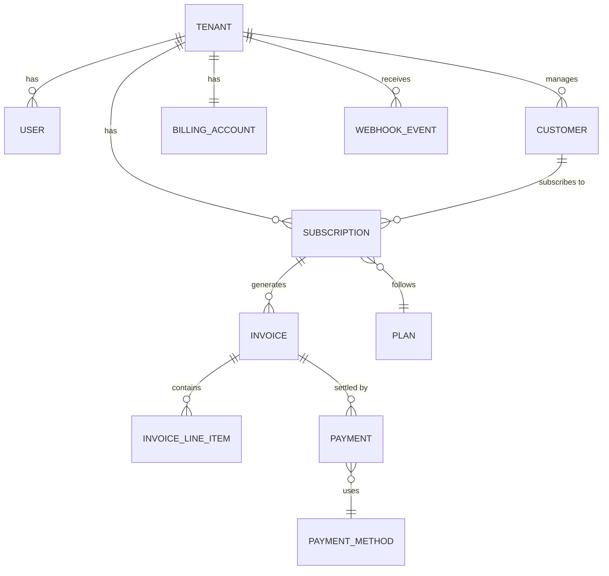
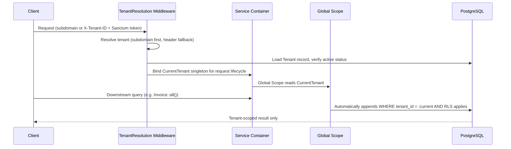
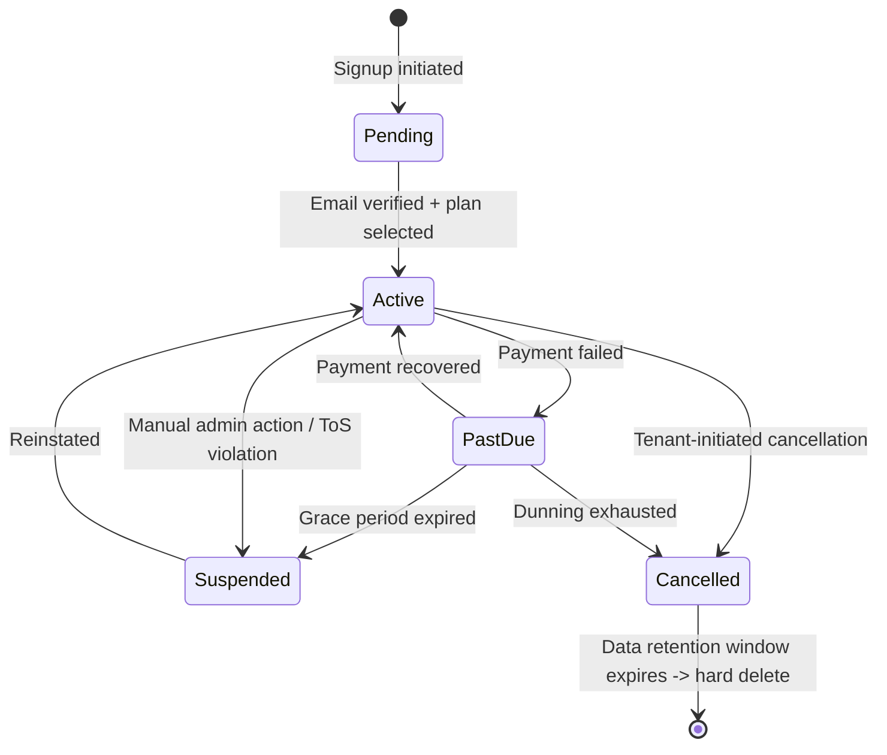
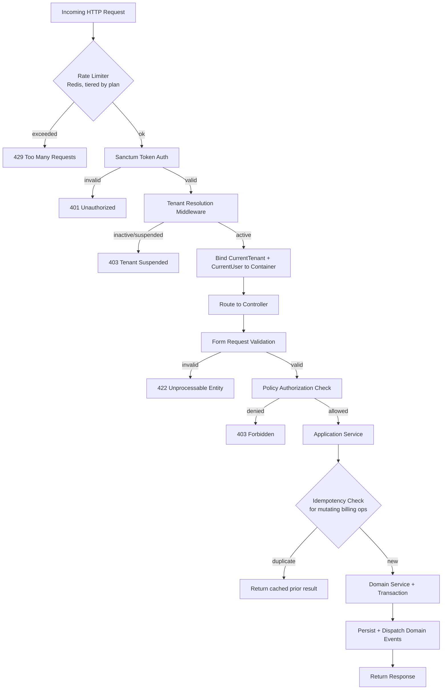
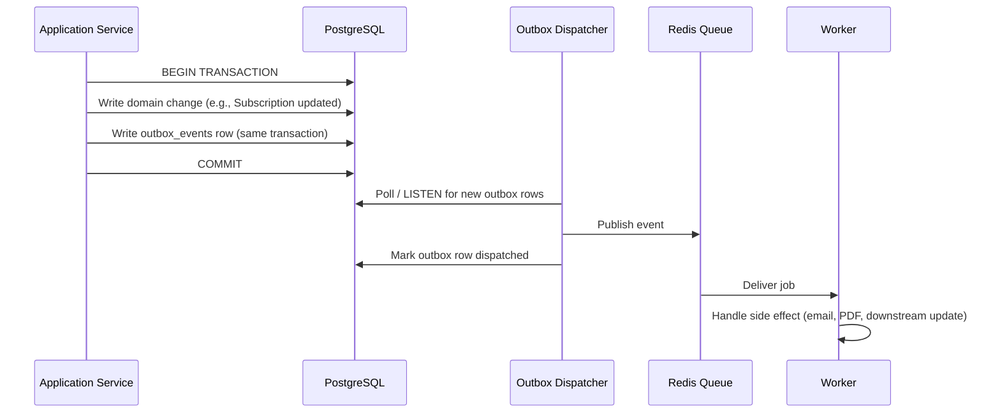
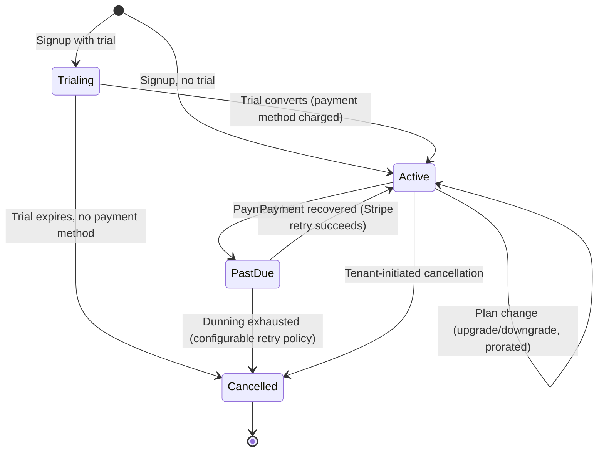
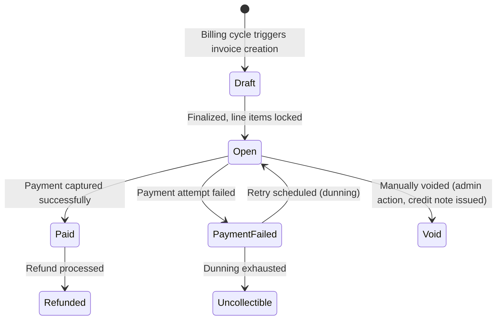
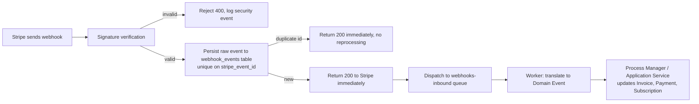
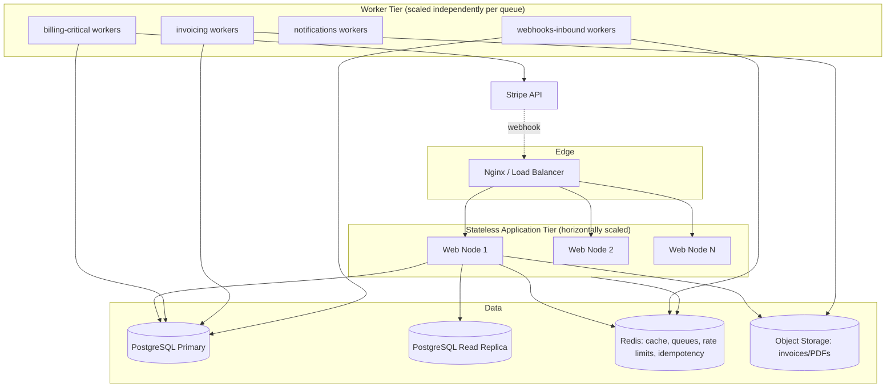

# OmniBill Architecture Blueprint
### Distributed Multi-Tenant SaaS Billing Platform — Canonical Architectural Foundation

**Status:** Pre-Implementation Blueprint
**Purpose:** Establish every major architectural decision before a single line of production code is written.

---

## 0. How to Read This Document

This blueprint sits one level above implementation. It does not contain code, Laravel syntax, or file-by-file specifications. It contains **decisions** — each with rationale, trade-offs, alternatives considered, and consequences — so that the SRS, HLD, LLD, and SAD that follow can be written by simply drilling into any section here.

Each major decision is recorded as a lightweight **Architecture Decision Record (ADR)** inline, using this shape:

> **Decision:** what we chose
> **Why:** the reasoning
> **Alternatives considered:** what else was on the table
> **Trade-off accepted:** what we knowingly gave up
> **Revisit when:** the condition that would make us reconsider

---

## 1. Product Vision & Guiding Principles

OmniBill is a **production-grade, distributed-ready, multi-tenant SaaS billing platform**. It exists to let a company plug in subscription billing, invoicing, and payment processing without building that machinery themselves — the same category as Chargebee, Recurly, or a private-label Stripe Billing layer.

### 1.1 First-order goals
1. **Tenant data isolation is non-negotiable.** No code path may return cross-tenant data, even under bugs or malicious input.
2. **Billing correctness over billing speed.** Money-moving operations favor consistency and auditability over low latency.
3. **The HTTP request thread never does billing work.** Anything involving Stripe, PDF generation, or email is asynchronous.
4. **Boring, observable, operable.** Prefer well-understood patterns over clever ones. Every subsystem must be debuggable at 3 AM by someone who didn't write it.
5. **Modular monolith, not microservices.** Bounded contexts are enforced through code organization and module boundaries, not network hops — until there's concrete evidence a hop is needed.

### 1.2 Non-goals (explicitly out of scope for v1 architecture)
- Multi-currency FX conversion engine (single billing currency per tenant at launch).
- Usage-based/metered billing (architecture leaves room for it; not built now).
- Physical microservice decomposition or a service mesh.
- White-label reseller / sub-tenant hierarchies (flat tenancy only).

> **Decision:** Build a modular monolith on Laravel 13, decomposed internally into bounded-context modules, deployable as a single application with horizontally scalable stateless web/worker nodes.
> **Why:** At the expected scale (thousands of tenants, not billions of events/day), a monolith with disciplined module boundaries delivers 90% of microservices' maintainability benefits with a fraction of the operational cost (no service mesh, no distributed tracing across network boundaries, no cross-service schema versioning).
> **Alternatives considered:** Microservices per bounded context (Billing, Tenancy, Notifications); serverless functions per job type.
> **Trade-off accepted:** A future true scale-out of, say, the billing engine independent of the API will require extraction work later. We mitigate this by keeping module boundaries clean now (see §5).
> **Revisit when:** A single module's resource profile (CPU/memory/queue depth) diverges so far from the rest of the system that co-deployment becomes a genuine bottleneck — not before.

---

## 2. Domain Model & Bounded Contexts

### 2.1 Bounded contexts

| Context | Owns | Does NOT own |
|---|---|---|
| **Identity & Access** | Users, roles, permissions, sessions/tokens | Tenant billing state |
| **Tenancy** | Tenant record, tenant lifecycle, tenant settings, plan assignment | User credentials |
| **Billing** | Subscriptions, plans, prices, Stripe customer linkage | Invoice documents |
| **Invoicing** | Invoice generation, line items, invoice lifecycle/state | Payment capture |
| **Payments** | Payment intents, payment methods, transaction records, refunds | Subscription state |
| **Webhooks & Integration Events** | Inbound Stripe events, outbound domain events, delivery/retry state | Business logic itself (it dispatches into the owning context) |
| **Notifications** | Email/PDF delivery, templates, delivery status | Domain state |
| **Platform/Observability** | Logging, metrics, audit trail | — |

Each context is a **module** (a top-level namespace) with its own models, services, events, and its own explicit "public API" (a small set of Application Services other modules are allowed to call). Modules do not reach into each other's Eloquent models directly — they talk through Application Services or Domain Events.

> **Decision:** Enforce inter-module communication through Application Service interfaces and Domain Events only — never direct cross-module Eloquent queries.
> **Why:** This is what makes a future extraction into real services possible without a rewrite, and it prevents the "big ball of mud" failure mode monoliths are famous for.
> **Alternatives considered:** Free access between modules (fastest to write, fastest to rot).
> **Trade-off accepted:** More boilerplate (interfaces, DTOs) than direct model access.
> **Revisit when:** Never fully — this constraint should hold permanently regardless of deployment topology.

### 2.2 Core domain relationships

### 2.3 Aggregate boundaries

Aggregates are the transactional consistency boundaries. Crossing an aggregate boundary in a single DB transaction is a code smell here and should instead go through a domain event.

- **Tenant** aggregate: Tenant + TenantSettings + TenantPlanAssignment.
- **Subscription** aggregate: Subscription + SubscriptionItems (its plan lines). Does *not* include Invoices.
- **Invoice** aggregate: Invoice + InvoiceLineItems. References Subscription and Customer by ID only.
- **Payment** aggregate: Payment + PaymentAttempts. References Invoice by ID only.
- **Customer** aggregate: Customer + PaymentMethods (tokenized references only, never raw card data).

> **Decision:** Invoice and Payment are separate aggregates from Subscription, connected only by ID reference and domain events.
> **Why:** Subscriptions change on a human/business timescale; invoices and payments happen on a transactional timescale (webhooks arriving out of order, retries). Coupling them in one aggregate would force every payment retry to lock subscription state.
> **Alternatives considered:** A single "Billing" aggregate containing all four entities.
> **Trade-off accepted:** More cross-aggregate event plumbing; eventual consistency between "subscription says active" and "latest invoice says paid" for a short window.
> **Revisit when:** If eventual-consistency bugs around subscription/invoice state become a recurring support burden, consider a saga/state-machine coordinator (see §8).

---

## 3. Multi-Tenancy Strategy

### 3.1 Isolation model

> **Decision:** Shared database, shared schema, row-level logical isolation via a mandatory `tenant_id` column on every tenant-owned table, enforced by a Laravel Global Scope, with a secondary defense-in-depth layer of PostgreSQL Row-Level Security (RLS) policies.
> **Why:** Shared-schema is the right cost/complexity point for a platform expecting many small-to-medium tenants (not a handful of huge enterprise tenants). It keeps migrations, backups, and cross-tenant analytics (for OmniBill's own operators) simple, while RLS as a second layer means a bug in application-level scoping cannot leak data — the database itself refuses cross-tenant reads.
> **Alternatives considered:** Database-per-tenant (best isolation, but migration/ops cost scales linearly with tenant count — untenable at "thousands of tenants"); schema-per-tenant in PostgreSQL (middle ground, but connection pooling and migration tooling complexity is high, and PgBouncer transaction pooling fights against `SET search_path`).
> **Trade-off accepted:** A single noisy-neighbor tenant can theoretically affect others sharing the database; mitigated via query-level resource limits and the rate-limiting/tiering strategy in §12. A "true" enterprise tenant demanding physical isolation is a future exception path, not the default.
> **Revisit when:** A tenant's contractual/compliance requirements demand physical data isolation (e.g., data residency law) — that tenant gets promoted to a dedicated database, and the architecture supports this because tenant resolution is already abstracted (§3.3).

### 3.2 Why RLS as a second layer

Global Scopes are an **application-level** control: correct only if every query goes through Eloquent and no one adds `withoutGlobalScope` carelessly, uses raw queries, or writes a new query builder path that forgets the scope. RLS is a **database-level** control: even a raw SQL query, a rogue migration script, or a future non-Laravel service hitting the same database cannot bypass it. Defense in depth here is proportionate to the blast radius of a tenancy bug (cross-tenant financial data exposure).

### 3.3 Tenant resolution

> **Decision:** Resolve tenant identity once, at the edge (middleware), bind it as a request-scoped singleton, and never re-resolve it mid-request.
> **Why:** A single resolution point is auditable and testable; scattering "which tenant am I" checks throughout controllers/services invites drift.
> **Alternatives considered:** Resolving tenant per-query from the authenticated user's token claims.
> **Trade-off accepted:** Background jobs (which have no HTTP request) must explicitly carry and re-bind tenant context — this is treated as a first-class concern, not an afterthought (§7.4).

### 3.4 Super-admin (cross-tenant) access

`SUPER_ADMIN` operations (OmniBill's own operators) run through a **separate, explicitly-named code path** (`WithoutTenantScope` intent-revealing wrapper), never through silently disabling the scope inline. Every such bypass is logged to the audit trail with the operator's identity and reason.

---

## 4. Tenant & User Lifecycle

### 4.1 Tenant lifecycle states

> **Decision:** Tenant state is an explicit finite state machine, not an implicit derivation from subscription status.
> **Why:** Tenant access control (can this tenant's users log in at all?) must be decidable with a single field read, not a join into billing tables on every request.
> **Alternatives considered:** Deriving tenant "activeness" live from Subscription status each request.
> **Trade-off accepted:** A synchronization step (via domain event) is required whenever billing state changes tenant-relevant status — see §8.

### 4.2 Delete strategy for tenants

> **Decision:** Soft-delete (status = Cancelled) with a defined data-retention window (default 30 days, configurable per compliance need), followed by a scheduled **hard delete job** that cascades through owned data. No tenant row is ever hard-deleted synchronously in a request.
> **Why:** Financial/billing data has legal retention implications (tax, audit); accidental or malicious deletion must be recoverable within the window. Cascading hard-deletes across a multi-table tenant footprint is heavy and must be a background job, not a request-time cascade.
> **Alternatives considered:** Immediate hard delete on cancellation; never hard-delete (indefinite soft-delete).
> **Trade-off accepted:** Storage cost during the retention window; must exclude soft-deleted tenants from every active-tenant query (handled by the same Global Scope).

### 4.3 User lifecycle & role model

Roles are tenant-scoped except `SUPER_ADMIN`, which is platform-scoped and cannot be assigned by tenant admins.

| Role | Scope | Can manage billing | Can manage users | Can view invoices |
|---|---|---|---|---|
| `SUPER_ADMIN` | Platform | Any tenant | Any tenant | Any tenant |
| `TENANT_ADMIN` | Single tenant | Own tenant | Own tenant | Own tenant |
| `TENANT_BILLING_MANAGER` | Single tenant | Own tenant | No | Own tenant |
| `TENANT_USER` | Single tenant | No | No | Own submitted only |

> **Decision:** Add a `TENANT_BILLING_MANAGER` role beyond the original two-tier tenant roles.
> **Why:** Real organizations separate "who can add teammates" from "who can see invoices/change cards" (finance vs. ops). Baking this in now avoids a breaking RBAC migration later.
> **Alternatives considered:** Keep only `TENANT_ADMIN`/`TENANT_USER` and add granular permissions later.
> **Trade-off accepted:** Slightly more upfront policy complexity.

---

## 5. Authentication & Authorization

### 5.1 Authentication

> **Decision:** Laravel Sanctum, token-based, one token per (user, device/client) pair, with explicit token abilities (scopes) and server-side revocation.
> **Why:** OmniBill is an API-first product (SPA/dashboard + programmatic API consumers). Sanctum gives lightweight, statelessly-verifiable tokens without the operational overhead of a full OAuth2 server (Passport), which is unnecessary until third-party OAuth app integrations are a real requirement.
> **Alternatives considered:** Laravel Passport (OAuth2) for full third-party app support; stateless JWT.
> **Trade-off accepted:** No standards-based OAuth2 flows (authorization code grant, etc.) at launch — acceptable since v1 has no third-party developer ecosystem.
> **Revisit when:** OmniBill needs to let external developers build apps against tenant data with delegated, revocable, scoped OAuth consent (a marketplace/app-store moment) — that's when Passport or a dedicated OAuth layer gets introduced *alongside*, not instead of, Sanctum for first-party clients.

Session/token invalidation is **explicit and centralized**: a `TENANT_ADMIN` suspending a user, a password reset, or a tenant suspension must revoke all of that user's/tenant's tokens in one operation, not rely on token expiry alone.

### 5.2 Authorization

> **Decision:** Two-layer authorization: (1) Global Scope guarantees tenant-boundary isolation at the query level (§3), (2) Laravel Policies express **role-and-ownership** rules within a tenant (e.g., "TENANT_USER can view only invoices they created").
> **Why:** Separating "which tenant's data" from "which role can do what" keeps each layer simple and independently testable. Mixing tenancy checks into every Policy method would duplicate logic across dozens of policies.
> **Alternatives considered:** A single unified authorization layer combining both concerns (e.g., a custom ABAC engine).
> **Trade-off accepted:** Two concepts to reason about instead of one; mitigated by a shared base Policy class that all context-specific policies extend, so tenancy is never re-implemented per policy.

### 5.3 Request lifecycle (composite view)

---

## 6. API Architecture

> **Decision:** A single versioned REST API (`/api/v1`), resource-oriented, JSON:API-inspired response envelope (not strict JSON:API), with cursor-based pagination for large collections.
> **Why:** REST + predictable envelopes is the lowest-friction integration point for billing API consumers (most competitors — Stripe, Chargebee — are REST-first, and consumers expect that shape). GraphQL was considered and rejected for v1.
> **Alternatives considered:** GraphQL (flexible querying, but adds complexity to rate-limiting and caching a billing API where predictable, cacheable responses matter more than client-driven shape flexibility); gRPC (excellent for internal service-to-service, poor fit for external tenant-facing integrations who overwhelmingly expect REST/JSON).
> **Trade-off accepted:** Some over-fetching/under-fetching REST is known for; mitigated with sparse fieldsets (`?fields=`) and includes (`?include=`) conventions.
> **Revisit when:** Internal service-to-service calls (if the monolith is ever split) — gRPC becomes attractive purely for internal east-west traffic, independent of the external API.

**API versioning policy:** breaking changes require a new version path; additive changes (new optional fields) do not. Deprecated versions carry a published sunset date communicated via response headers.

**Idempotency:** all mutating endpoints that trigger billing side effects (creating a subscription, capturing a payment) require an `Idempotency-Key` header. Keys are stored in Redis with the response payload for 24 hours; a repeated key within that window returns the original response rather than re-executing (see §12.2).

---

## 7. Database Architecture

### 7.1 Foreign key philosophy

> **Decision:** Foreign keys are enforced at the database level for **within-aggregate** relationships (e.g., `invoice_line_items.invoice_id`), and stored as **plain indexed UUID columns without a DB-level FK constraint** for **cross-aggregate** references (e.g., `invoices.subscription_id`).
> **Why:** Within an aggregate, referential integrity should be impossible to violate — the database is the right enforcement point. Across aggregates, a hard FK constraint couples migration order and deletion order between bounded contexts, which fights the module-independence goal from §2. Cross-aggregate integrity is instead guaranteed by domain events and, where needed, periodic reconciliation jobs.
> **Alternatives considered:** FK constraints everywhere (simplest, but re-couples the modules we just spent §2 decoupling); no FK constraints anywhere (maximum flexibility, but allows real bugs like orphaned line items).
> **Trade-off accepted:** Cross-aggregate orphan records are possible in theory (e.g., a bug leaves an invoice pointing at a deleted subscription); mitigated by soft-delete-only policies on referenced aggregates (§7.3) and a nightly integrity-check job that alerts on orphans rather than silently allowing them.

### 7.2 Primary keys

> **Decision:** UUIDv7 (time-ordered UUID) primary keys on all tenant-owned tables, not auto-incrementing integers.
> **Why:** UUIDs prevent enumeration attacks against a multi-tenant API (sequential IDs let one tenant guess another's resource IDs), and are safe to generate client-side or in distributed workers without a central sequence. UUIDv7 specifically preserves rough time-ordering, avoiding the B-tree index fragmentation that plain random UUIDv4 causes at scale.
> **Alternatives considered:** Auto-increment integers with a separate public-facing "external ID"; UUIDv4.
> **Trade-off accepted:** Slightly larger index size than integers; negligible at OmniBill's target scale and outweighed by the security property.

### 7.3 Delete strategy

> **Decision:** Soft deletes (via a `deleted_at` timestamp) on every business entity that has financial or audit relevance (Tenant, Subscription, Invoice, Payment, Customer). Hard deletes only via scheduled background jobs after retention windows, and only for entities with no legal retention requirement (e.g., expired idempotency keys, stale webhook event logs).
> **Why:** Billing systems are audited; "we deleted the invoice" is rarely an acceptable answer to an auditor or a disputing customer.
> **Alternatives considered:** Hard delete everywhere with a separate audit-log table capturing pre-delete snapshots.
> **Trade-off accepted:** Every query must exclude soft-deleted rows (handled by Eloquent's built-in SoftDeletes + the tenancy Global Scope composing together); table growth over time, mitigated by the archival strategy in §16.

### 7.4 Transaction boundaries

> **Decision:** A database transaction never spans more than one aggregate, and never wraps a call to an external service (Stripe API, email provider). Cross-aggregate consistency is achieved via the outbox pattern: within the same transaction as a local write, a domain event row is written to an `outbox_events` table; a separate dispatcher process reads the outbox and publishes to the queue.
> **Why:** Wrapping a Stripe API call inside a DB transaction is a classic reliability bug — if the DB commit fails after Stripe already charged the card, or the transaction holds a row lock for the duration of a slow network call, both correctness and throughput suffer. The outbox pattern guarantees "the event is queued if and only if the local write committed," without needing a distributed transaction.
> **Alternatives considered:** Two-phase commit against Stripe (not offered by Stripe, so not actually possible); firing queue jobs directly inside the transaction (risks the classic race where the job runs before the transaction commits, reading stale data).
> **Trade-off accepted:** An extra table and a lightweight dispatcher process; slight latency between "event happened" and "event dispatched" (typically sub-second, polling or LISTEN/NOTIFY-driven).

---

## 8. Service Layer Architecture

> **Decision:** Three explicit layers: **Domain Services** (pure business rules, no I/O, no framework dependency), **Application Services** (orchestrate a use case: load data, call domain services, persist, dispatch events — this is the module's public API), and **Controllers** (HTTP concerns only: request parsing, response shaping, delegating to exactly one Application Service call).
> **Why:** This separation is what makes business logic testable without spinning up HTTP or a database, and is what allows the same Application Service to be called from a controller, a queue job, or an Artisan command identically.
> **Alternatives considered:** "Fat model" Active Record style (business logic on Eloquent models) — fast to write initially, but couples business rules to persistence and makes cross-cutting rules (e.g., "a subscription downgrade must check three other aggregates") awkward to express on a single model class.
> **Trade-off accepted:** More classes and indirection than fat models; justified by the long project lifetime this blueprint is written for.

**Rule of thumb:** if a piece of logic answers *"is this allowed / what should happen"* with no side effects, it's a Domain Service. If it answers *"do the thing and record that it happened"*, it's an Application Service.

### 8.1 Sagas for cross-aggregate workflows

Some workflows (e.g., "subscription cancellation must: mark subscription cancelled → generate final prorated invoice → notify customer") span aggregates and cannot be one transaction (§7.4). These are modeled as explicit **process managers** (a lightweight in-house saga: an event-driven state machine that listens for domain events and issues the next command), not as a single Application Service method calling everything inline.

> **Decision:** Cross-aggregate workflows are explicit process managers subscribed to domain events, not orchestrated synchronously inline.
> **Why:** Inline orchestration hides the fact that steps 2 and 3 can fail independently of step 1 having already committed; making it event-driven forces the failure/retry semantics to be designed rather than assumed.
> **Alternatives considered:** Inline orchestration with manual try/catch compensation logic per workflow.
> **Trade-off accepted:** More moving parts to trace for a given business workflow (mitigated by structured logging with a correlation/workflow ID threaded through every step, §15).

---

## 9. Event-Driven Design & Queue Architecture

### 9.1 Two kinds of events

- **Domain Events** (internal): "SubscriptionCancelled", "InvoicePaid" — used for in-process module decoupling and process managers.
- **Integration Events** (external-facing, e.g., inbound Stripe webhooks, outbound webhooks OmniBill sends to *its* tenants) — a different, versioned schema, since external consumers (tenants' own systems) depend on stability domain events don't need to promise.

> **Decision:** Keep Domain Events and Integration Events as distinct types with an explicit translation layer between them, even though both ride on Redis queues.
> **Why:** Domain events are free to change shape as internal refactors happen. Integration events are a public contract with tenants' systems and must be versioned and backward-compatible. Conflating them means every internal refactor risks breaking tenants' webhook consumers.
> **Alternatives considered:** One unified event bus/schema for everything.
> **Trade-off accepted:** A translation/mapping step at the boundary; worth it for contract stability.

### 9.2 Queue architecture

> **Decision:** Redis-backed Laravel Queues with **separate named queues per concern and priority**, not one global queue: `billing-critical` (payment capture, subscription state changes), `invoicing` (PDF/invoice generation), `notifications` (email), `webhooks-inbound` (Stripe event processing), `webhooks-outbound` (delivering OmniBill's own webhooks to tenants), `default`.
> **Why:** Without separate queues, a burst of low-priority email jobs can starve time-sensitive payment-state jobs. Separate queues let worker pools be scaled and prioritized independently (e.g., more workers on `billing-critical` than `notifications`).
> **Alternatives considered:** Single default queue with job-level priority attributes.
> **Trade-off accepted:** More worker process configuration to manage; justified operationally by being able to independently scale/alert per queue depth.

Every job is designed to be **idempotent and safely retryable** (jobs check current state before acting, not just "trust I haven't run before"), with exponential backoff and a dead-letter queue (`*-failed`) for jobs exhausting retries, which pages an operator rather than silently dropping.

### 9.3 Background workers carrying tenant context

Because tenant resolution normally happens in HTTP middleware (§3.3), every queued job explicitly serializes `tenant_id` as part of its payload and re-binds `CurrentTenant` at the start of job execution — this is a mandatory convention enforced by a base `TenantAwareJob` class all billing-related jobs extend, so no job can accidentally run without a tenant context or on the wrong one.

---

## 10. Billing Architecture

### 10.1 Stripe & Cashier integration boundary

> **Decision:** Laravel Cashier is used strictly as a **thin adapter to Stripe's subscription/customer primitives**, wrapped behind OmniBill's own Billing Application Service. No controller or other module ever calls Cashier directly.
> **Why:** Cashier's model conventions (billable trait on the User/Tenant model) are convenient but couple business code to Cashier's API surface. Wrapping it means a future migration (different payment processor, or Cashier major-version breaking changes) touches one adapter layer, not the whole codebase.
> **Alternatives considered:** Using Cashier's conventions directly throughout the app (fastest initially, highest coupling).
> **Trade-off accepted:** An extra abstraction layer over Cashier's already-abstracted API; justified given billing is the product's core differentiator and must remain swappable/extensible (e.g., adding a second payment processor for regional coverage later).

### 10.2 Subscription lifecycle

### 10.3 Invoice lifecycle

> **Decision:** Invoices are **immutable once `Open`** — line items cannot be edited after finalization. Corrections after that point are made via credit notes / adjustment invoices, never by mutating a finalized invoice.
> **Why:** This is standard accounting practice and a hard requirement for audit trails and tax compliance; mutable finalized invoices are a common source of billing disputes and compliance failures.
> **Alternatives considered:** Allowing edits to `Open` invoices before payment.
> **Trade-off accepted:** Slightly more friction for "oops, wrong amount" corrections; the correct amount of friction for financial documents.

### 10.4 Payment lifecycle & webhook processing

> **Decision:** OmniBill treats **Stripe as the source of truth for payment state**, never derives payment success from the synchronous API response alone. The synchronous response only initiates the attempt; the webhook (`payment_intent.succeeded`, `invoice.payment_failed`, etc.) is what actually transitions local state.
> **Why:** Payment processing is inherently asynchronous (3D Secure, bank delays, retries) — treating the synchronous HTTP response as final is a well-known correctness bug in naive Stripe integrations.
> **Alternatives considered:** Optimistic local state update on the synchronous response, reconciled later.
> **Trade-off accepted:** A short window where local state says "processing" rather than a final state; this is the correct reflection of reality, not a flaw to hide.

**Webhook processing pipeline:**

> **Decision:** Every inbound Stripe event is persisted (with its Stripe event ID as a unique constraint) *before* business processing, and the HTTP 200 is returned to Stripe immediately after persistence — actual processing happens asynchronously in a worker.
> **Why:** Stripe retries webhooks aggressively on non-200 responses or timeouts. Persisting first with a unique constraint makes the pipeline naturally idempotent (duplicate deliveries are detected at the DB level), and responding fast prevents Stripe from perceiving OmniBill as unhealthy during a traffic spike.
> **Alternatives considered:** Processing synchronously within the webhook request.
> **Trade-off accepted:** A processing delay between "Stripe says it happened" and "OmniBill's local state reflects it" — bounded by queue latency SLOs (§16.2).

---

## 11. Caching Strategy

> **Decision:** Redis cache-aside pattern for read-heavy, low-volatility data (plan catalogs, tenant settings, permission sets); **no caching of financial transactional state** (invoice/payment status is always read from PostgreSQL as source of truth).
> **Why:** Caching billing state risks serving stale "unpaid" status after payment succeeded, or vice versa — an unacceptable class of bug in a billing product. Plan catalogs and settings, by contrast, change rarely and tolerate brief staleness well.
> **Alternatives considered:** Write-through caching for all entities including invoices.
> **Trade-off accepted:** Higher DB read load for invoice/payment status than a fully-cached approach would produce; mitigated by DB read replicas at scale (§13) rather than caching correctness-critical data.

**Cache key convention:** `{tenant_id}:{resource}:{id}` — tenant ID is always part of the key, both for isolation and so a tenant-wide cache flush (e.g., on plan change) is a simple prefix invalidation.

**Cache invalidation:** event-driven — a domain event (e.g., `TenantSettingsUpdated`) triggers explicit invalidation of the relevant keys, rather than relying on short TTLs alone. TTLs are a safety net, not the primary invalidation mechanism.

---

## 12. Rate Limiting & Idempotency

### 12.1 Rate limiting

> **Decision:** Redis-backed sliding-window rate limiter, tiered by the tenant's subscription plan, applied per-tenant (not per-IP, since many users of one tenant may share a NAT/office IP, and one tenant should not be able to exhaust a shared IP-based bucket that punishes another tenant).
> **Why:** Per-tenant limiting aligns rate limits with what's actually being sold (plan tiers) and protects tenants from each other, which is the whole point of the multi-tenancy story.
> **Alternatives considered:** Per-IP rate limiting (simpler, but wrong unit of isolation for a B2B multi-user-per-tenant product); per-token limiting (too granular — punishes a tenant rotating tokens rather than the tenant's actual usage).
> **Trade-off accepted:** Slightly more complex limiter key (tenant + optionally per-endpoint category) than a naive per-IP bucket.

| Plan | Requests/min | Burst allowance |
|---|---|---|
| Free | 60 | 10 |
| Pro | 300 | 50 |
| Enterprise | Custom (contractual) | Custom |

### 12.2 Idempotency

> **Decision:** Client-supplied `Idempotency-Key` header required on all state-mutating billing endpoints; server stores `(tenant_id, idempotency_key) -> response` in Redis for 24 hours (with a corresponding durable audit row in Postgres for anything that actually touched money, since Redis is not the system of record).
> **Why:** Network retries are a fact of life for API clients (timeouts, connection drops mid-request). Without idempotency keys, a retried "create subscription" call could double-charge a customer.
> **Alternatives considered:** Server-generated idempotency (deriving a key from request body hash) — rejected because it can't distinguish "the user genuinely wants to do this twice" from "this is a retry."
> **Trade-off accepted:** API consumers must be educated to generate and reuse keys correctly on retry — documented as a hard requirement in API docs, not optional guidance.

---

## 13. Scalability & Performance Strategy

> **Decision:** Horizontally scalable stateless web nodes and worker nodes behind Nginx/a load balancer; PostgreSQL scales vertically first, then via read replicas for read-heavy reporting paths, with the primary reserved for writes and transactionally-consistent reads.
> **Why:** Statelessness (no local session/file state on app servers — sessions in Redis, files in object storage via Laravel Filesystem) is what makes horizontal scaling a config change rather than an architecture change. Database scaling is deliberately staged (vertical → read replicas → partitioning) rather than jumping straight to sharding, which is premature at target scale.
> **Alternatives considered:** Designing for database sharding from day one.
> **Trade-off accepted:** A hard scaling ceiling exists before sharding becomes necessary; acceptable because reaching that ceiling is itself a signal of success and a good problem to revisit with real usage data rather than speculation.
> **Revisit when:** Write throughput on the primary approaches saturation even after read-replica offload and query optimization — that's the trigger for tenant-based partitioning/sharding (the `tenant_id`-first schema design already positions the data for this).

**Performance guardrails set now, enforced later by tooling (Telescope in dev, Pulse in prod):**
- No N+1 queries in any list endpoint (eager loading is mandatory, enforced via code review checklist and CI query-count assertions in tests).
- Any endpoint touching more than one aggregate must justify why it isn't two calls.
- P95 API latency budget: 300ms for read endpoints, 800ms for write endpoints (excluding async billing side effects, which happen off the request thread by design — see §9).

---

## 14. Security Model & Threat Model

### 14.1 Threat model summary

| Threat | Primary mitigation |
|---|---|
| Cross-tenant data leakage | Global Scope + PostgreSQL RLS (§3.1) |
| Token theft / replay | Sanctum token abilities, short-lived tokens for sensitive scopes, revocation on suspicious activity |
| Stripe webhook spoofing | Mandatory signature verification against Stripe's signing secret; reject unsigned/invalid requests before any processing |
| Billing amount tampering (client-supplied prices) | Prices/amounts are **never** accepted from client input for anything already defined server-side in the Plan catalog; server always recomputes from source-of-truth pricing |
| Raw card data exposure | Card data never touches OmniBill's servers — Stripe Elements/Payment Element tokenizes client-side; OmniBill only ever stores Stripe payment method references |
| Privilege escalation within a tenant | Policies check role AND ownership; role changes require `TENANT_ADMIN` and are audit-logged |
| SUPER_ADMIN abuse | All cross-tenant scope bypasses logged with operator identity + justification (§3.4); sensitive super-admin actions require re-authentication |
| Denial of service / noisy neighbor | Per-tenant rate limiting (§12.1) |
| Replay of mutating requests | Idempotency keys (§12.2) |
| SQL injection / mass assignment | Eloquent parameter binding by default; explicit `$fillable` allow-lists on every model, never `$guarded = []` |
| Secrets exposure | All credentials (Stripe keys, DB credentials) via environment/secret manager, never committed, never logged (structured logger has a redaction list, §15) |

### 14.2 Data classification

- **Restricted:** Stripe payment method tokens, Sanctum token hashes, password hashes — encrypted at rest, never logged.
- **Confidential:** Tenant financial data (invoices, payments, subscriptions) — tenant-scoped access only.
- **Internal:** Platform metrics, aggregate (anonymized) usage stats.

> **Decision:** Application-level field encryption (Laravel's encrypted casts) for any stored value that is itself sensitive beyond tenant-scoping (e.g., API keys tenants configure for their own outbound webhook integrations), in addition to at-rest disk encryption at the infrastructure level.
> **Why:** Disk encryption alone protects against physical media theft, not against a SQL injection or backup-file mishandling scenario. Field-level encryption is defense in depth for the specific fields where compromise is highest-impact.
> **Trade-off accepted:** Encrypted fields cannot be searched/filtered directly in SQL; acceptable since these are precisely the fields that should never be queried by value.

---

## 15. Error Handling & Logging

> **Decision:** Structured JSON logging everywhere (no free-text log lines), with a mandatory field set on every log entry: `timestamp`, `level`, `tenant_id` (nullable for pre-tenant-resolution events), `request_id`/`correlation_id`, `user_id` (nullable), `event`, `context`. A dedicated correlation ID is generated at the edge middleware and threaded through every downstream job (including async queue jobs) so a single business transaction (e.g., one subscription upgrade) can be traced end-to-end across the sync request and every async job it spawned.
> **Why:** Free-text logs are unqueryable at scale; structured logs feed directly into log aggregation/alerting without brittle regex parsing. Correlation IDs are what make the async, event-driven architecture (§9) debuggable — otherwise tracing "what happened to this one webhook" across three queues is archaeology.
> **Alternatives considered:** Plain text logs with human-readable formatting.
> **Trade-off accepted:** Slightly less pleasant to `tail -f` by eye; solved by log viewer tooling, not by giving up structure.

**Error handling layers:**
- **Domain-level exceptions** (e.g., `SubscriptionAlreadyCancelledException`) — expected business-rule violations, mapped to specific 4xx responses with machine-readable error codes.
- **Infrastructure exceptions** (Stripe API errors, DB connection issues) — caught at the Application Service boundary, logged with full context, mapped to 5xx or 503 as appropriate, and retried where retry is safe (idempotent operations only).
- **Unexpected exceptions** — never leak stack traces or internal details to API responses in production; always logged with correlation ID; a generic error code returned to the client referencing that correlation ID for support follow-up.

---

## 16. Monitoring & Observability

> **Decision:** Laravel Pulse for real-time operational dashboards (queue depth, slow queries, exception rates) in all environments; Laravel Telescope enabled in development/staging only, never in production (its overhead and data retention model are unsuitable for prod, and it would itself become a sensitive-data exposure surface if left on).
> **Why:** Pulse is lightweight enough for production; Telescope's detailed request/query capture is a debugging tool, not a monitoring tool, and its data store would itself need tenant-isolation and encryption if ever exposed in prod — better to simply not run it there.

**Key SLOs tracked:**
- Webhook processing latency (Stripe event received → local state updated): target P95 < 60 seconds.
- Queue depth per named queue, with alerting thresholds tuned per queue's business criticality (`billing-critical` alerts far more aggressively than `notifications`).
- Failed job rate (dead-letter queue growth) — any sustained non-zero rate on `billing-critical` pages an operator.
- Audit trail completeness: every state-changing action on Tenant, Subscription, Invoice, Payment, and RBAC changes is written to an append-only audit log table, independent of the general structured logs (so it survives log-retention rotation and is queryable for compliance requests).

---

## 17. Testing Philosophy

> **Decision:** Test pyramid weighted toward fast unit tests for Domain Services (pure logic, no DB), a substantial layer of integration tests for Application Services (real DB via a test transaction, real Redis, **fake/sandboxed Stripe** via Stripe's test mode or recorded fixtures — never a live Stripe call in CI), and a thin layer of end-to-end tests for critical user journeys (signup → subscribe → invoice → pay).
> **Why:** Domain Service unit tests give the fastest feedback on business rule correctness. Billing-critical paths (webhook processing, subscription state transitions) get extra integration-test weight specifically because bugs there have financial and trust consequences disproportionate to their code volume.
> **Alternatives considered:** Heavy reliance on end-to-end tests only (slow, flaky, expensive to maintain at the volume needed for billing edge cases).
> **Trade-off accepted:** More test infrastructure investment upfront (Stripe fixture/sandbox tooling, test DB tenancy setup helpers).

**Mandatory test coverage for the billing module specifically:** every Stripe webhook event type the system handles must have a corresponding test using a recorded real Stripe payload fixture (not a hand-written approximation), refreshed periodically against Stripe's actual schema to catch upstream changes.

---

## 18. CI/CD Philosophy

> **Decision:** Every merge to the main branch runs the full automated test suite, static analysis (PHPStan at a strict level), and a migration dry-run against a disposable database; deploys are automated on green but billing-module changes specifically require an additional manual approval gate before production deploy.
> **Why:** Full automation everywhere is right for most of the codebase, but the billing module's blast radius (real money, real customer trust) justifies one human confirmation step that the rest of the system doesn't need — this is a deliberate, narrow exception, not a general "manual approval everywhere" policy that would slow the team down.
> **Trade-off accepted:** Slightly slower deploy cadence for billing-touching changes; acceptable given what's at stake.

Database migrations are always **backward-compatible with the currently-deployed code** (additive-first: add new nullable columns, backfill, then a later deploy removes old ones) — this is what enables zero-downtime deploys with rolling worker/web node restarts.

---

## 19. Folder Organization & Coding Standards (Principles, Not File Trees)

> **Decision:** Organize by **bounded context/module first, technical layer second** (`Modules/Billing/{Domain,Application,Http}` rather than a global `app/Services`, `app/Http/Controllers` split by technical layer across the whole app).
> **Why:** Module-first organization is what makes §2's module-boundary discipline visible and enforceable in the codebase itself — a developer working on Billing should be able to see the entire bounded context in one directory, and cross-module imports become visually obvious (and lintable) as `use Modules\Tenancy\...` inside `Modules\Billing\...`.
> **Alternatives considered:** Traditional Laravel layer-first structure (`app/Models`, `app/Services`, `app/Http/Controllers` all flat).
> **Trade-off accepted:** A steeper on-ramp for engineers used to default Laravel conventions; worth it for a codebase expected to live for years and grow past a handful of contributors.

**Naming conventions (principles):** Domain Events are named in past tense (`SubscriptionCancelled`), Application Services are named as use cases (`CancelSubscription`, not `SubscriptionService`), and every public Application Service method name should read as a sentence when combined with its class: `CancelSubscription::handle($command)`.

---

## 20. Deployment Architecture

Containerized via Docker Compose for local/staging parity (web, worker, PostgreSQL, Redis, and a Mailhog-equivalent for local email testing, defined as services); production deployment targets the same images promoted through environments, not environment-specific Dockerfiles, to guarantee dev/prod parity.

---

## 21. Future Extensibility & Technical Debt Prevention

| Future capability | How today's architecture already supports it |
|---|---|
| Usage-based/metered billing | Subscription aggregate already separate from Invoice generation; adding a "usage event → invoice line item" pipeline slots into the existing outbox/event architecture without redesign |
| Multi-currency | `Money` value object (amount + currency) used everywhere internally rather than bare integers/floats, even though v1 enforces single-currency-per-tenant at the application rule level |
| Dedicated-database tenants (enterprise/compliance) | Tenant resolution already abstracted behind middleware (§3.3); connection routing per tenant is an additive change, not a rearchitecture |
| Third-party developer ecosystem / OAuth apps | Sanctum today, Passport layered alongside later (§5.1) — API versioning policy (§6) already anticipates external consumers |
| Extraction of Billing into a real microservice | Module boundaries already enforced via Application Service interfaces + domain events, not direct model access (§2.1) — the interface is already the seam a network boundary would be inserted at |
| Additional payment processors | Cashier/Stripe isolated behind OmniBill's own Billing Application Service, not called directly from business code (§10.1) |

> **Decision:** Treat every "Revisit when" trigger throughout this document as a literal, monitored condition (many map directly to the SLOs/metrics in §16), not just a note for later. Architecture reviews should periodically check these triggers against real production data rather than re-litigating decisions from intuition alone.
> **Why:** This is what keeps the blueprint from becoming either dogma (never revisited) or constantly re-argued (revisited without evidence).

---

## 22. Summary of Key Decisions

| # | Decision | Section |
|---|---|---|
| 1 | Modular monolith, not microservices, at launch | §1 |
| 2 | Inter-module communication only via Application Services + Domain Events | §2 |
| 3 | Shared DB/schema, row-level tenancy, Global Scope + PostgreSQL RLS defense-in-depth | §3 |
| 4 | Tenant lifecycle as explicit state machine | §4 |
| 5 | Sanctum now, Passport layered in later if needed | §5 |
| 6 | REST, versioned, idempotency-key required for mutating billing ops | §6 |
| 7 | FK constraints within aggregates only; UUIDv7 PKs; soft-delete financial entities | §7 |
| 8 | Outbox pattern for cross-aggregate consistency; no DB transaction wraps external calls | §7.4 |
| 9 | Domain/Application/Controller service layering; process managers for sagas | §8 |
| 10 | Named, prioritized Redis queues; tenant-aware jobs | §9 |
| 11 | Cashier/Stripe wrapped behind an internal Billing Application Service | §10 |
| 12 | Stripe webhooks are source of truth for payment state; persist-then-process pipeline | §10.4 |
| 13 | No caching of financial transactional state | §11 |
| 14 | Per-tenant, plan-tiered rate limiting | §12.1 |
| 15 | Client-supplied idempotency keys on mutating billing endpoints | §12.2 |
| 16 | Stateless horizontal scaling; staged DB scaling (vertical → replicas → partitioning) | §13 |
| 17 | Structured JSON logs with mandatory correlation IDs | §15 |
| 18 | Pulse in all environments, Telescope dev/staging only | §16 |
| 19 | Manual approval gate specifically for billing-module production deploys | §18 |
| 20 | Module-first, not layer-first, codebase organization | §19 |

---

*This document is the canonical architectural foundation for OmniBill. The SRS, HLD, LLD, and SAD should each reference the relevant ADRs above rather than re-deriving these decisions.*
