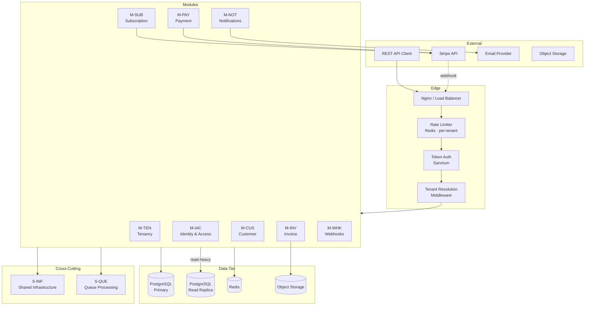
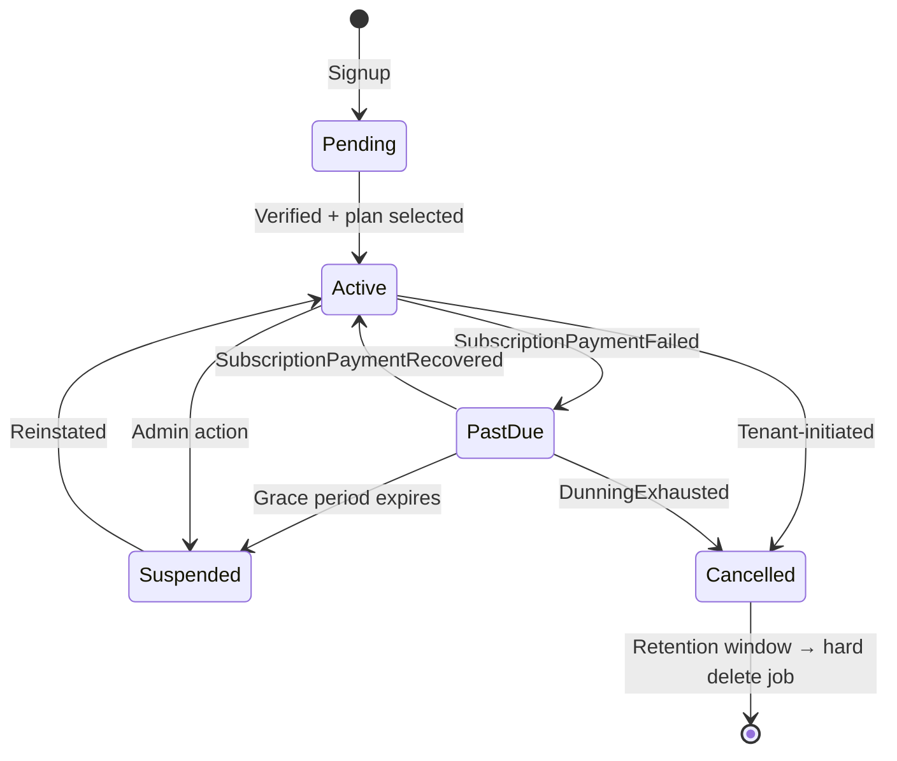
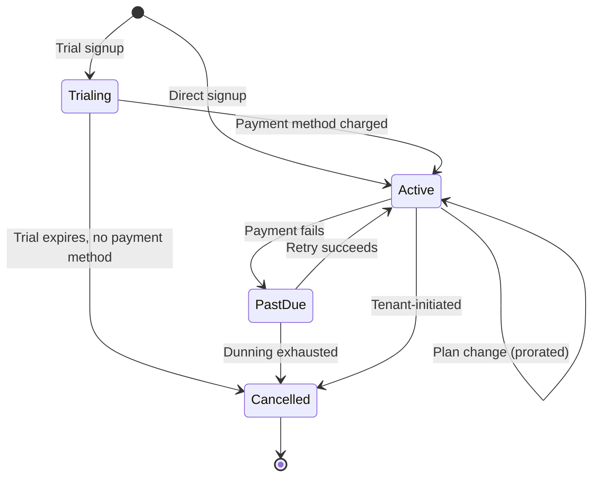
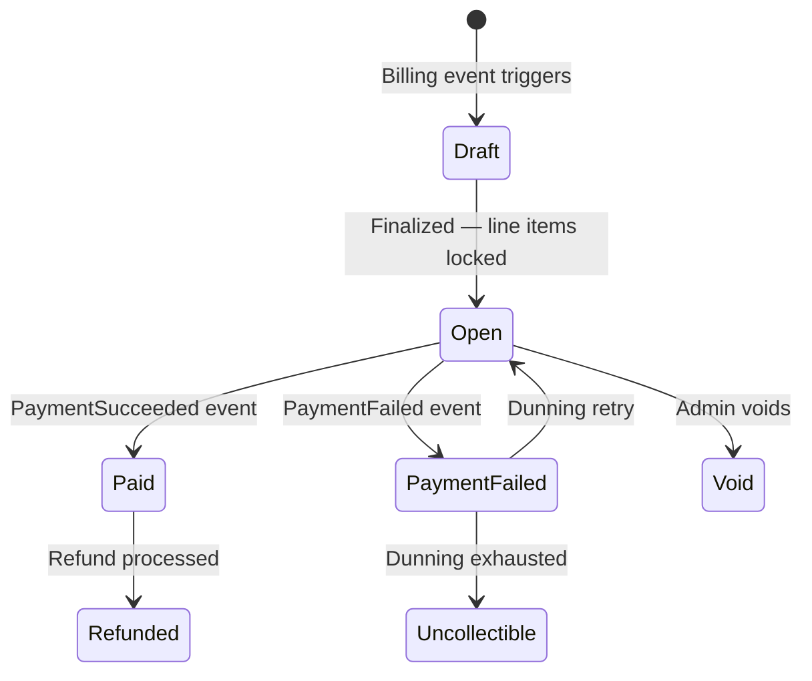
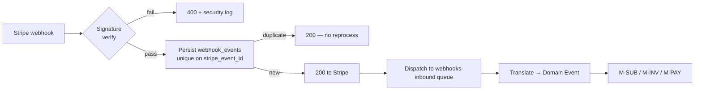
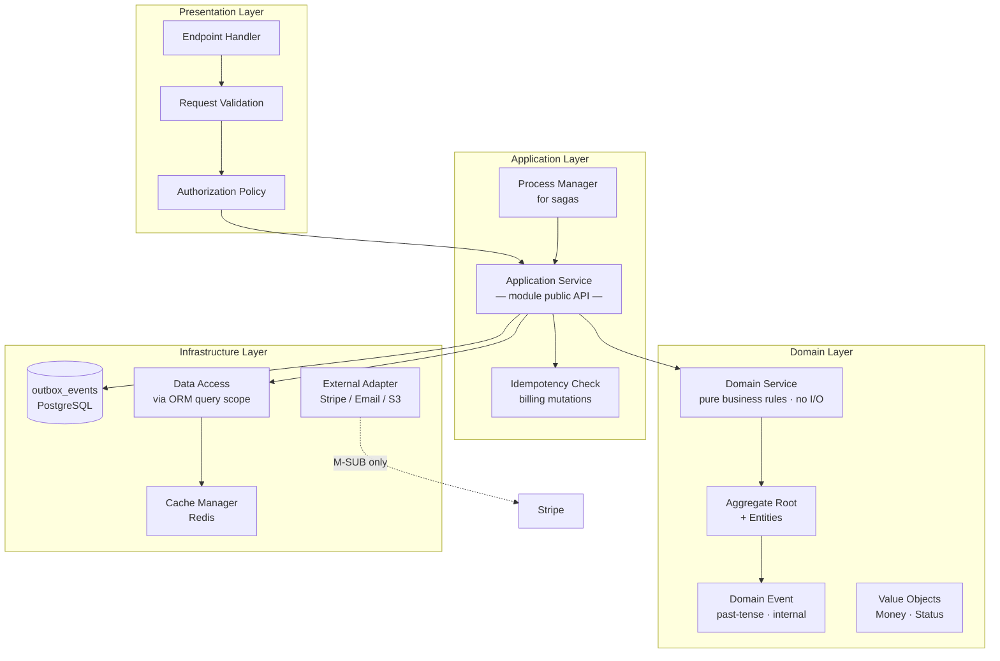
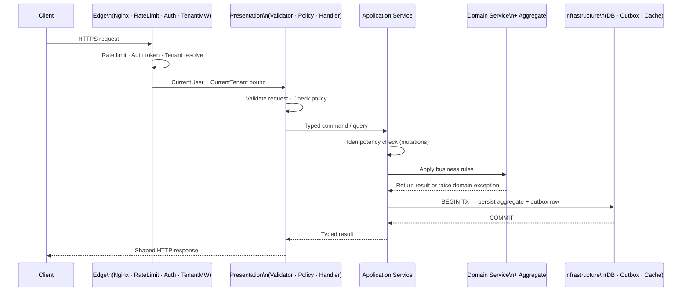
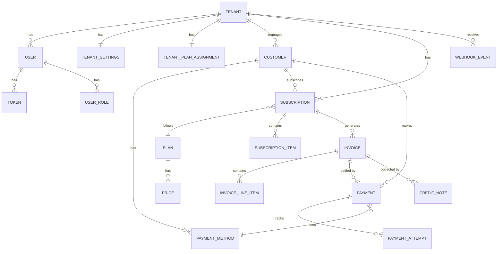
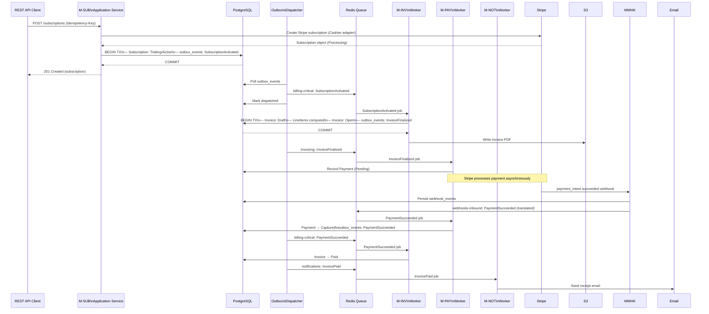
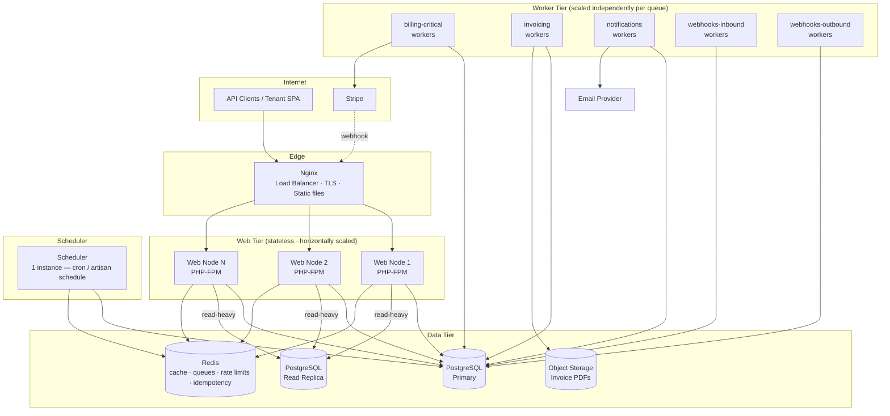

# OmniBill — High-Level Design (HLD)

**Source of truth:** *OmniBill Architecture Blueprint* · *OmniBill Software Architecture Document (SAD)*
**Assumes:** Reader has read the SAD. Architectural rationale is not repeated here; SAD section numbers are cited where rationale lives.

---

## Table of Contents

| Section | Title |
|---|---|
| **1** | Introduction |
| **2** | System Overview |
| **3** | Module Design |
| **4** | Application Layer Design |
| **5** | API Design |
| **6** | Data Design |
| **7** | Event & Queue Design |
| **8** | Deployment Overview |
| **9** | Operational Considerations |
| **10** | Traceability Matrix |
| **11** | References |

---

## 1. Introduction

### 1.1 Purpose

This High-Level Design (HLD) describes the **logical organization** of the OmniBill platform. It answers:

- How is the system decomposed into modules?
- What does each module own and expose?
- How do modules communicate?
- How is data structured at the aggregate level?
- How are asynchronous workflows orchestrated?
- How is the system deployed?

The HLD is the practical bridge between the SAD's architectural decisions and the Low-Level Design (LLD), which will specify concrete class structures, database schemas, and API endpoint shapes.

### 1.2 Scope

**In scope:**
- Logical module decomposition and inter-module contracts
- Application layer organization and dependency rules
- API conventions (versioning, auth, errors, pagination)
- Data ownership, aggregate boundaries, and key entity relationships
- Event taxonomy, queue architecture, and asynchronous workflow design
- Deployment topology and container responsibilities
- Operational monitoring, logging, and security posture (summary; detail in SAD §18–21)

**Out of scope:**
- Laravel class names, method signatures, repository patterns
- Database table DDL, column definitions, index specifications
- Concrete API endpoint documentation (URL, HTTP method, request/response shapes)
- Implementation patterns (Active Record, Repository, etc.)

### 1.3 Relationship to Blueprint and SAD

| Document | Role | Relationship to HLD |
|---|---|---|
| **Blueprint** | Canonical ADRs — every major decision with rationale and trade-offs | HLD implements decisions; does not revisit them |
| **SAD** | Formalized architecture — quality attributes, risk register, decision summary | HLD derives from SAD; references SAD sections rather than repeating rationale |
| **This HLD** | Logical design — module interfaces, data ownership, workflow design | Input to LLD; must not contradict SAD or Blueprint |
| **LLD** (future) | Implementation specification — classes, schemas, endpoints | Must trace back to this HLD |

> Every HLD decision that requires justification references its governing SAD section. Unexplained decisions here are implementation derivations that do not alter the architecture.

---

## 2. System Overview

### 2.1 Major modules

OmniBill is organized into **eight bounded-context modules** plus two cross-cutting subsystems. Each module maps directly to a bounded context in Blueprint §2.1 and a subsystem in SAD §10.

| Module | Abbreviation | Core responsibility |
|---|---|---|
| Tenancy | M-TEN | Tenant lifecycle, settings, platform plan assignment |
| Identity & Access | M-IAC | User accounts, Sanctum tokens, RBAC roles |
| Customer Management | M-CUS | Tenant-managed customer records, payment method references |
| Subscription Management | M-SUB | Subscriptions, plan catalog, Stripe integration, dunning |
| Invoice Management | M-INV | Invoice generation, finalization, PDF, credit notes |
| Payment Processing | M-PAY | Payment transaction records, Stripe state machine |
| Notifications | M-NOT | Email delivery, transactional templates |
| Webhooks & Integration Events | M-WHK | Inbound Stripe event ingestion, outbound tenant webhooks |
| Shared Infrastructure | S-INF | Logger, audit writer, cache manager, idempotency, Money VO |
| Queue Processing | S-QUE | Worker pools, outbox dispatcher, dead-letter management |

### 2.2 Logical architecture



### 2.3 External integrations

| External system | Interaction direction | Owning module | Protocol |
|---|---|---|---|
| **Stripe** | Outbound (API calls) + Inbound (webhooks) | M-SUB (outbound), M-WHK (inbound) | HTTPS REST |
| **Email provider** | Outbound only | M-NOT | SMTP / provider API |
| **Object storage (S3-compatible)** | Outbound reads and writes | M-INV (write PDFs), M-NOT (read PDF URLs) | S3 API |
| **PostgreSQL** | Read/write | All modules | TCP / pg protocol |
| **Redis** | Read/write | All modules (cache, queue, rate limit, idempotency) | Redis protocol |

---

## 3. Module Design

All inter-module communication follows two patterns only (SAD §8.5):
- **Synchronous:** Calling another module's public Application Service interface (for lookups needed to complete the current use case).
- **Asynchronous:** Raising a Domain Event via the outbox pattern; the receiving module reacts via a queued job.

Direct cross-module data access is prohibited.

---

### 3.1 M-TEN — Tenancy

| Attribute | Detail |
|---|---|
| **Responsibility** | Tenant record lifecycle (Pending → Active → PastDue → Suspended → Cancelled), tenant settings, platform plan assignment, data retention policy |
| **Owned data** | `Tenant`, `TenantSettings`, `TenantPlanAssignment` |
| **Dependencies** | None (organizational root; no synchronous upstream module calls) |

**Public interfaces:**

| Interface | Callers | Description |
|---|---|---|
| `ResolveTenant(identifier)` | Request pipeline | Load and verify Tenant; return active record or reject |
| `GetTenantSettings(tenantId)` | M-SUB, M-INV, M-NOT | Return settings (cacheable, non-financial) |
| `GetActivePlan(tenantId)` | Rate limiter, M-SUB | Return current platform plan tier |

**Key interactions:**

| Event | Direction | Trigger | Receiving module |
|---|---|---|---|
| `TenantActivated` | Outbound | Tenant reaches Active | M-SUB (provision Stripe customer) |
| `TenantSuspended` | Outbound | Admin suspends tenant | M-IAC (revoke all tenant tokens) |
| `TenantCancelled` | Outbound | Tenant cancels or dunning exhausted | M-SUB (cancel active subscriptions) |
| `TenantSettingsUpdated` | Outbound | Settings change | Cache invalidation |
| `SubscriptionPaymentFailed` | Inbound | M-SUB event | Transition tenant → PastDue |
| `DunningExhausted` | Inbound | M-SUB event | Transition tenant → Cancelled |

**Tenant state machine:**



---

### 3.2 M-IAC — Identity & Access

| Attribute | Detail |
|---|---|
| **Responsibility** | User creation, email verification, Sanctum token issuance/revocation, RBAC role assignment |
| **Owned data** | `User`, `Token` (Sanctum record), `UserRole` |
| **Dependencies** | M-TEN (read tenant status before token issuance) |

**Public interfaces:**

| Interface | Callers | Description |
|---|---|---|
| `GetAuthenticatedUser(token)` | Request pipeline | Validate token; return user with roles and abilities |
| `RevokeAllTokensForTenant(tenantId)` | M-TEN (on `TenantSuspended`) | Invalidate all tokens for every user in the tenant |
| `GetUserRoles(userId, tenantId)` | Resource-owning modules (as policy input) | Return roles for a user within a tenant scope |

**Key interactions:**

| Event | Direction | Trigger | Receiving module |
|---|---|---|---|
| `EmailVerified` | Outbound | User verifies email | M-TEN (advance tenant toward Active) |
| `TenantSuspended` | Inbound | M-TEN event | Revoke all tenant tokens |

**RBAC model:**

| Role | Scope | Billing access | User management | Invoice access |
|---|---|---|---|---|
| `SUPER_ADMIN` | Platform | Any tenant | Any tenant | Any tenant |
| `TENANT_ADMIN` | Single tenant | Own tenant | Own tenant | Own tenant |
| `TENANT_BILLING_MANAGER` | Single tenant | Own tenant | None | Own tenant |
| `TENANT_USER` | Single tenant | None | None | Own submitted only |

---

### 3.3 M-CUS — Customer Management

| Attribute | Detail |
|---|---|
| **Responsibility** | Tenant-managed customer records; tokenized payment method references (never raw card data) |
| **Owned data** | `Customer`, `PaymentMethod` (tokenized Stripe reference; part of Customer aggregate) |
| **Dependencies** | None at read/write time; payment method sync delegated to M-SUB's Stripe adapter |

**Public interfaces:**

| Interface | Callers | Description |
|---|---|---|
| `GetCustomer(customerId, tenantId)` | M-SUB, M-INV, M-PAY | Return customer with payment method references |
| `GetDefaultPaymentMethod(customerId, tenantId)` | M-SUB, M-PAY | Return current default payment method reference |

**Key interactions:**

| Event | Direction | Trigger | Receiving module |
|---|---|---|---|
| `CustomerCreated` | Outbound | New customer created | M-SUB (provision Stripe customer object) |
| `CustomerPaymentMethodAttached` | Outbound | Payment method attached | M-SUB (sync with Stripe) |

---

### 3.4 M-SUB — Subscription Management

| Attribute | Detail |
|---|---|
| **Responsibility** | Plan catalog, subscription lifecycle, dunning policy, **sole owner of Stripe API/Cashier integration** |
| **Owned data** | `Subscription`, `SubscriptionItem`, `Plan`, `Price` |
| **Dependencies** | M-TEN (settings), M-CUS (customer + payment method) |

**Public interfaces:**

| Interface | Callers | Description |
|---|---|---|
| `GetSubscription(subscriptionId, tenantId)` | M-INV, M-PAY | Return subscription state |
| `GetPlan(planId)` | M-INV | Return plan pricing and interval |

**Key interactions:**

| Event | Direction | Trigger | Receiving module |
|---|---|---|---|
| `SubscriptionActivated` | Outbound | Subscription goes Active | M-INV (first invoice), M-TEN (status sync) |
| `SubscriptionCancelled` | Outbound | Subscription cancelled | M-INV (final invoice), M-TEN (retention window) |
| `SubscriptionPlanChanged` | Outbound | Plan change | M-INV (adjustment invoice) |
| `SubscriptionPastDue` | Outbound | Payment failed | M-TEN (PastDue), M-NOT (alert) |
| `SubscriptionPaymentRecovered` | Outbound | Retry succeeded | M-TEN (Active) |
| `DunningExhausted` | Outbound | All retries failed | M-TEN (Cancelled), M-NOT (final alert) |
| Stripe webhook events (translated) | Inbound | M-WHK queue | Drive subscription state transitions |

**Stripe boundary:**
All Stripe API and Cashier calls are contained exclusively within M-SUB. No other module calls Stripe or Cashier directly (SAD §15.4, Blueprint §10.1).

**Subscription state machine:**



---

### 3.5 M-INV — Invoice Management

| Attribute | Detail |
|---|---|
| **Responsibility** | Invoice generation, finalization, state machine, PDF production, credit notes |
| **Owned data** | `Invoice`, `InvoiceLineItem` (within Invoice aggregate), `CreditNote` |
| **Dependencies** | M-SUB (plan pricing), M-CUS (customer header), M-TEN (locale/currency settings) |

**Public interfaces:**

| Interface | Callers | Description |
|---|---|---|
| `GetInvoice(invoiceId, tenantId)` | M-PAY, REST API | Return invoice state |
| `ListInvoicesForSubscription(subscriptionId, tenantId)` | REST API | Paginated invoice history |
| `GetInvoicePdfUrl(invoiceId, tenantId)` | REST API, M-NOT | Pre-signed object storage URL for PDF |

**Key interactions:**

| Event | Direction | Trigger | Receiving module |
|---|---|---|---|
| `InvoiceFinalized` | Outbound | Invoice transitions to Open | M-PAY (record payment intent), M-NOT (email) |
| `InvoicePaid` | Outbound | Payment confirmed | M-SUB (subscription status check), M-NOT (receipt) |
| `InvoicePaymentFailed` | Outbound | Payment failed | M-SUB (begin dunning), M-NOT (alert) |
| `InvoiceVoided` | Outbound | Voided by admin | M-NOT (notification) |

> **Immutability invariant (SAD §11.12, Blueprint §10.3):** Line items are immutable after `Draft → Open` transition. This is enforced at the domain layer.

**Invoice state machine:**



---

### 3.6 M-PAY — Payment Processing

| Attribute | Detail |
|---|---|
| **Responsibility** | Payment transaction records, payment state machine driven by Stripe webhook events |
| **Owned data** | `Payment`, `PaymentAttempt` (within Payment aggregate) |
| **Dependencies** | M-INV (validate invoice state), M-SUB (validate subscription context) |

**Public interfaces:**

| Interface | Callers | Description |
|---|---|---|
| `GetPayment(paymentId, tenantId)` | REST API, M-INV | Return payment state |
| `ListPaymentsForInvoice(invoiceId, tenantId)` | REST API | Payment attempt history |

**Key interactions:**

| Event | Direction | Trigger | Receiving module |
|---|---|---|---|
| `PaymentSucceeded` | Outbound | `payment_intent.succeeded` webhook | M-INV (Paid), M-NOT (receipt) |
| `PaymentFailed` | Outbound | `invoice.payment_failed` webhook | M-INV (PaymentFailed), M-SUB (dunning) |
| `PaymentRefunded` | Outbound | `charge.refunded` webhook | M-INV (Refunded), M-NOT (confirmation) |
| `InvoiceFinalized` | Inbound | M-INV event | Record outstanding payment intent |

> **State source constraint (SAD §23.16, Blueprint §10.4):** Payment state advances exclusively on confirmed Stripe webhook events via M-WHK. Synchronous Stripe API responses do not drive local state.

---

### 3.7 M-NOT — Notifications

| Attribute | Detail |
|---|---|
| **Responsibility** | Transactional email delivery, template rendering, delivery status tracking |
| **Owned data** | `NotificationLog` (delivery audit record, not a domain aggregate) |
| **Dependencies** | M-INV (PDF URL for attachments), M-TEN (locale/branding settings) — both synchronous reads |

**Public interfaces:** None. M-NOT exposes no interface to peer modules. It is a pure Domain Event consumer.

**Event subscriptions:**

| Event consumed | Producing module | Notification triggered |
|---|---|---|
| `InvoiceFinalized` | M-INV | Invoice-ready email with PDF link |
| `InvoicePaid` | M-INV | Payment receipt |
| `InvoicePaymentFailed` | M-INV | Payment failure alert |
| `SubscriptionCancelled` | M-SUB | Cancellation confirmation |
| `DunningExhausted` | M-SUB | Final failure / subscription ending |
| `PaymentRefunded` | M-PAY | Refund confirmation |
| `TenantSuspended` | M-TEN | Account suspension notice to `TENANT_ADMIN` |

> **Isolation guarantee (Blueprint §1.1 principle 3):** Email delivery failure must never block, fail, or roll back billing state. The `notifications` queue is independent of `billing-critical`.

---

### 3.8 M-WHK — Webhooks & Integration Events

| Attribute | Detail |
|---|---|
| **Responsibility** | Inbound: Stripe event ingestion, signature verification, persist-then-process. Outbound: tenant-facing Integration Event delivery with retry |
| **Owned data** | `WebhookEvent` (inbound raw record), `OutboundWebhookDelivery` |
| **Dependencies** | None (pure translation and delivery layer) |

**Public interfaces:** None. Stripe delivers to the webhook HTTP endpoint; other modules deliver events to queues consumed by M-WHK workers.

**Inbound pipeline:**



**Outbound pipeline:**
Domain events designated for external delivery are translated to versioned Integration Events and delivered via HTTP POST to the tenant's configured webhook URL, with exponential-backoff retry and a `webhooks-outbound-failed` dead-letter queue.

**Event schema separation (SAD §23.21, Blueprint §9.1):**

| Type | Consumers | Versioning |
|---|---|---|
| **Domain Event** | Internal modules only | Unversioned; free to change with refactors |
| **Integration Event** | Tenant systems (external) | Explicitly versioned; backward-compatible until sunset |

---

### 3.9 S-INF — Shared Infrastructure

Cross-cutting capabilities available to all modules. Owns no domain data.

| Capability | Description | SAD reference |
|---|---|---|
| **Tenant-aware job base** | Base type all billing jobs extend; enforces `tenant_id` in payload and re-binds tenant context at job start | SAD §17.9 |
| **Structured logger** | JSON log output with mandatory fields: `timestamp`, `level`, `tenant_id`, `correlation_id`, `user_id`, `event`, `context`; redacts sensitive fields | SAD §21.2 |
| **Correlation ID propagation** | Generated at edge middleware; threaded through request context, outbox payloads, and every spawned job | SAD §21.3 |
| **Audit log writer** | Appends to append-only audit log table; independent of general log rotation | SAD §18.17 |
| **Cache manager** | Cache-aside, tenant-prefixed keys (`{tenant_id}:{resource}:{id}`); enforces no-financial-state-cache rule; event-driven invalidation | SAD §19.8 |
| **Money value object** | Amount + ISO currency code; prevents bare integer/float arithmetic on monetary values | Blueprint §21 |
| **Idempotency key store** | Redis store (`{tenant_id}:{key}` → response, 24 h TTL); durable Postgres audit row for money-touching operations | SAD §20.7 |

---

### 3.10 S-QUE — Queue Processing

Worker infrastructure. Owns no domain data.

| Queue | Priority | Consumer module(s) | Alerting |
|---|---|---|---|
| `billing-critical` | Highest | M-SUB, M-PAY | Dead-letter > 0 → page operator immediately |
| `invoicing` | High | M-INV | Depth alert per SLO |
| `webhooks-inbound` | High | M-WHK → M-SUB, M-INV, M-PAY | Depth alert (P95 < 60 s SLO) |
| `notifications` | Medium | M-NOT | Depth alert (no billing impact) |
| `webhooks-outbound` | Medium | M-WHK | Depth alert (tenant-facing degradation) |
| `default` | Low | Various | Depth alert |

**Outbox dispatcher:** Continuously polls / LISTENs on `outbox_events` table. For each unprocessed row: publishes to named queue → marks dispatched. Guarantees at-least-once delivery with durability. Detail: SAD §20.8.

---

## 4. Application Layer Design

### 4.1 Logical layers

OmniBill's application code is organized into four logical layers within every module. The pattern is identical across all eight bounded-context modules.



### 4.2 Layer responsibilities and dependency rules

| Layer | Responsibility | May depend on | May NOT depend on |
|---|---|---|---|
| **Presentation** | Parse HTTP input; validate request shape; enforce authorization policy; delegate to one Application Service; shape HTTP response | Application layer | Domain layer directly; Infrastructure layer |
| **Application** | Orchestrate a use case: load data, call Domain Services, persist, dispatch events via outbox. This is the module's public API surface | Domain layer; Infrastructure layer (via interfaces) | Presentation layer; sibling module internals |
| **Domain** | Express business rules and invariants with no I/O dependency. Pure logic: given inputs, compute outputs or raise domain exceptions | Value objects; other domain entities within the same aggregate | Application, Presentation, or Infrastructure layers |
| **Infrastructure** | Data access, external adapters (Stripe, email, S3), cache, queue interaction | All layers (it wires them together) | Business logic (must not make domain decisions) |

**Cross-module dependency rule:** A module's Application Service may call another module's Application Service (synchronous lookup). It must **never** access another module's Infrastructure layer or Domain layer directly.

### 4.3 Request lifecycle



---

## 5. API Design

### 5.1 API organization

All public endpoints are prefixed `/api/v1`. Resources are grouped by bounded context:

| Prefix | Module | Example resources |
|---|---|---|
| `/api/v1/tenants` | M-TEN | Tenant settings, plan assignment |
| `/api/v1/auth` | M-IAC | Login, logout, token management |
| `/api/v1/users` | M-IAC | User CRUD, role management |
| `/api/v1/customers` | M-CUS | Customer CRUD, payment methods |
| `/api/v1/subscriptions` | M-SUB | Subscription CRUD, plan changes |
| `/api/v1/plans` | M-SUB | Plan catalog (read-only for tenants) |
| `/api/v1/invoices` | M-INV | Invoice list, detail, PDF, credit notes |
| `/api/v1/payments` | M-PAY | Payment history, refund initiation |
| `/api/v1/webhooks` | M-WHK | Outbound webhook configuration |

### 5.2 Versioning

| Rule | Detail |
|---|---|
| **Version prefix** | `/api/v1` is the current version; breaking changes create `/api/v2` |
| **Breaking change** | Removing a field, changing a field type, changing a mandatory constraint |
| **Non-breaking change** | Adding optional response fields or optional request fields |
| **Sunset policy** | Deprecated versions carry a `Sunset` response header with the deprecation date |
| **Backward compatibility** | Guaranteed for the lifetime of a version path |

*(Blueprint §6, SAD §23.8)*

### 5.3 Authentication

All non-public endpoints require a valid Sanctum token in the `Authorization: Bearer {token}` header.

| Endpoint class | Auth requirement |
|---|---|
| Registration, login | None |
| Email verification | One-time verification token |
| All other API endpoints | Sanctum Bearer token |
| Stripe webhook endpoint | Stripe signature header (no Sanctum) |

Token abilities (scopes) restrict what a given token may do. A token issued for read-only access cannot trigger a mutating billing operation (SAD §13.3, Blueprint §5.1).

### 5.4 Authorization

Two-layer model (SAD §13.8, Blueprint §5.2):

| Layer | Mechanism | Enforced at |
|---|---|---|
| **Tenant isolation** | Global Scope + PostgreSQL RLS — automatically applied to every query | Infrastructure layer |
| **Role & ownership** | Laravel Policies per resource — checked by Endpoint Handler before Application Service is called | Presentation layer |

Policies never make tenancy checks (that is the Global Scope's job). Policies only express role-and-ownership rules.

### 5.5 Request validation

All input validation happens in the Presentation layer before the Application Service is invoked. The Application Service receives only valid, typed data. Validation failures return `422 Unprocessable Entity`.

### 5.6 Idempotency

All state-mutating billing endpoints (create subscription, capture payment, refund) require an `Idempotency-Key` header. The key is a client-generated UUID.

| Condition | Behavior |
|---|---|
| Key not seen before | Execute the operation; store `(tenant_id, key) → response` in Redis for 24 hours; write durable audit row |
| Key already seen, same operation | Return the original response without re-executing |
| Key already seen, different operation | Return `422` — key reuse across different operations is an error |

*(Blueprint §12.2, SAD §20.7)*

### 5.7 Standard response envelope

```json
{
  "data": { /* resource object or array */ },
  "meta": { /* pagination, totals */ },
  "links": { /* pagination cursors */ }
}
```

Error responses:

```json
{
  "error": {
    "code": "SUBSCRIPTION_ALREADY_CANCELLED",
    "message": "Human-readable message",
    "correlation_id": "01HXYZ..."
  }
}
```

Error codes are machine-readable strings. `correlation_id` is always present and links to structured logs for support follow-up (SAD §21.11).

### 5.8 Pagination

All list endpoints use **cursor-based pagination** (not offset). Response `meta` includes `total_count` and `links` includes `next` and `prev` cursor URLs (Blueprint §6).

### 5.9 Error taxonomy

| HTTP status | Meaning | Example |
|---|---|---|
| `400 Bad Request` | Malformed request (syntax, missing required header) | Missing `Idempotency-Key` on billing mutation |
| `401 Unauthorized` | No valid token | Expired or revoked Sanctum token |
| `403 Forbidden` | Valid token; insufficient permissions | `TENANT_USER` attempting admin action |
| `404 Not Found` | Resource not found or not in tenant scope | Invoice ID from another tenant |
| `409 Conflict` | State conflict | Cancelling an already-cancelled subscription |
| `422 Unprocessable Entity` | Validation failure | Required field missing or wrong type |
| `429 Too Many Requests` | Rate limit exceeded | Tenant plan limit hit |
| `5xx` | Server error | Infrastructure failure; never leaks stack trace |

---

## 6. Data Design

### 6.1 Data ownership principles

- Each module owns its entities exclusively. No other module reads or writes to another module's tables through direct queries (SAD §14.1, Blueprint §2.1).
- Cross-aggregate references use plain indexed UUID columns — no database-level foreign key constraints across module boundaries (SAD §14.4, Blueprint §7.1).
- Within-aggregate references use database-enforced foreign keys (SAD §14.4).

### 6.2 Primary key strategy

All tenant-owned entities use **UUIDv7** primary keys. UUIDv7 is time-ordered, preventing B-tree index fragmentation while also preventing ID enumeration attacks across tenants (SAD §14.3, Blueprint §7.2).

### 6.3 Major entities and aggregate ownership

| Module | Aggregate Root | Owned Entities | Cross-aggregate references (ID only) |
|---|---|---|---|
| **M-TEN** | `Tenant` | `TenantSettings`, `TenantPlanAssignment` | — |
| **M-IAC** | `User` | `Token`, `UserRole` | `Tenant.id` |
| **M-CUS** | `Customer` | `PaymentMethod` | `Tenant.id` |
| **M-SUB** | `Subscription` | `SubscriptionItem` | `Customer.id`, `Plan.id`, `Tenant.id` |
| **M-SUB** | `Plan` | `Price` | — |
| **M-INV** | `Invoice` | `InvoiceLineItem` | `Subscription.id`, `Customer.id`, `Tenant.id` |
| **M-INV** | `CreditNote` | — | `Invoice.id`, `Tenant.id` |
| **M-PAY** | `Payment` | `PaymentAttempt` | `Invoice.id`, `Customer.id`, `Tenant.id` |
| **M-NOT** | — | `NotificationLog` | `Tenant.id` |
| **M-WHK** | `WebhookEvent` | — | `Tenant.id` |
| **M-WHK** | `OutboundWebhookDelivery` | — | `Tenant.id` |
| **S-INF** | — | `AuditLog`, `OutboxEvent`, `IdempotencyKey` | `Tenant.id` |

### 6.4 High-level entity relationship



> **Reading this diagram:** Relationships crossing module boundaries (e.g., `SUBSCRIPTION` to `INVOICE`) are logical — they reflect business relationships, not database foreign key constraints. Cross-aggregate references are stored as UUID columns without FK enforcement (SAD §14.4).

### 6.5 Transaction boundaries

| Scope | Rule |
|---|---|
| **Within aggregate** | One database transaction. Includes the aggregate state change and an `outbox_events` row written atomically. |
| **Across aggregates** | Never in one transaction. Achieved via the outbox pattern: commit local aggregate → outbox dispatcher publishes event → receiving aggregate handles asynchronously. |
| **External calls (Stripe, email)** | Never inside a database transaction. Called after the transaction commits, or in a queued job. |

*(SAD §14.7, Blueprint §7.4)*

### 6.6 Soft delete strategy

All entities with financial or audit relevance use soft deletes (`deleted_at` timestamp). Hard deletes only via scheduled background jobs after the configured retention window. See SAD §14.6 for rationale.

| Entity class | Delete strategy |
|---|---|
| Tenant, Subscription, Invoice, Payment, Customer | Soft delete; hard delete after retention window via background job |
| NotificationLog, OutboundWebhookDelivery | Soft delete; pruned after shorter operational retention window |
| Expired idempotency keys, stale outbox rows | Hard delete by scheduled cleanup job (no financial relevance) |

### 6.7 Caching rules

| Data | Cached? | Reason |
|---|---|---|
| Plan catalog | Yes (cache-aside, event-invalidated) | Read-heavy, low volatility |
| Tenant settings | Yes (cache-aside, event-invalidated) | Read on every request; infrequently changed |
| Permission sets | Yes | Read on every authorization check |
| Invoice status | **No** | Financial state; must reflect PostgreSQL source of truth |
| Payment status | **No** | Financial state; must reflect PostgreSQL source of truth |
| Subscription status | **No** | Financial state; must reflect PostgreSQL source of truth |

*(SAD §19.8, Blueprint §11)*

---

## 7. Event & Queue Design

### 7.1 Event taxonomy

| Category | Examples | Consumers | Schema stability |
|---|---|---|---|
| **Domain Events** (internal) | `SubscriptionActivated`, `InvoicePaid`, `PaymentFailed` | Other OmniBill modules only | Internal; may change with refactors |
| **Integration Events** (external) | `subscription.activated.v1`, `invoice.paid.v1` | Tenant systems via outbound webhooks | Versioned; backward-compatible until sunset |

### 7.2 Domain event catalog

| Event | Producing module | Consuming modules |
|---|---|---|
| `TenantActivated` | M-TEN | M-SUB |
| `TenantSuspended` | M-TEN | M-IAC |
| `TenantCancelled` | M-TEN | M-SUB |
| `TenantSettingsUpdated` | M-TEN | S-INF (cache invalidation) |
| `EmailVerified` | M-IAC | M-TEN |
| `CustomerCreated` | M-CUS | M-SUB |
| `CustomerPaymentMethodAttached` | M-CUS | M-SUB |
| `SubscriptionActivated` | M-SUB | M-INV, M-TEN |
| `SubscriptionCancelled` | M-SUB | M-INV, M-TEN, M-NOT |
| `SubscriptionPlanChanged` | M-SUB | M-INV |
| `SubscriptionPastDue` | M-SUB | M-TEN, M-NOT |
| `SubscriptionPaymentRecovered` | M-SUB | M-TEN |
| `DunningExhausted` | M-SUB | M-TEN, M-NOT |
| `InvoiceFinalized` | M-INV | M-PAY, M-NOT, M-WHK |
| `InvoicePaid` | M-INV | M-SUB, M-NOT, M-WHK |
| `InvoicePaymentFailed` | M-INV | M-SUB, M-NOT |
| `InvoiceVoided` | M-INV | M-NOT |
| `PaymentSucceeded` | M-PAY | M-INV, M-NOT |
| `PaymentFailed` | M-PAY | M-INV, M-SUB |
| `PaymentRefunded` | M-PAY | M-INV, M-NOT, M-WHK |

### 7.3 Outbox pattern

Every domain event is produced via the outbox pattern:

1. Application Service opens a transaction.
2. Writes the aggregate state change.
3. Writes a row to `outbox_events` (event name, payload JSON, `tenant_id`, `correlation_id`).
4. Commits the transaction.
5. Outbox dispatcher reads and publishes to the appropriate named queue.
6. Worker picks up the job, re-establishes tenant context, calls the receiving module's Application Service.

The outbox guarantees that an event is dispatched **if and only if** the local write committed. There is no possibility of a committed state change with no event, or an event with no committed state change (SAD §20.8, Blueprint §7.4).

### 7.4 End-to-end async workflow: Subscription creation → Invoice → Payment



### 7.5 Job design principles

All queued jobs must be:

| Principle | Implementation |
|---|---|
| **Idempotent** | Jobs check current state before acting; re-execution of a job that already completed is a no-op |
| **Tenant-aware** | Extend the tenant-aware job base (S-INF); `tenant_id` in payload; re-bind at job start |
| **Correlation-traced** | Carry `correlation_id` from the originating request; log all entries with it |
| **Retryable with backoff** | Exponential backoff; configurable max attempts per queue priority |
| **Dead-letter on exhaustion** | Move to `{queue}-failed` on retry exhaustion; operator alerted per queue's criticality |

---

## 8. Deployment Overview

### 8.1 Deployment topology



### 8.2 Container responsibilities

| Container / Service | Role | Scales |
|---|---|---|
| **web** | PHP-FPM process handling HTTP requests | Horizontally (behind Nginx) |
| **worker-billing** | Consumes `billing-critical` queue | Independently per queue depth |
| **worker-invoicing** | Consumes `invoicing` queue | Independently |
| **worker-notifications** | Consumes `notifications` queue | Independently |
| **worker-webhooks** | Consumes `webhooks-inbound` and `webhooks-outbound` queues | Independently |
| **outbox-dispatcher** | Polls `outbox_events`; publishes to queues | Single instance (or low-redundancy pair) |
| **scheduler** | Runs recurring scheduled jobs (dunning checks, retention purges, integrity checks) | Single instance |
| **nginx** | TLS termination, load balancing, static file serving, webhook endpoint routing | Horizontally |
| **postgresql** | Primary database — all writes + consistency-critical reads | Vertically first, then read replicas |
| **redis** | Cache, queue transport, rate-limit counters, idempotency keys | Single instance → Redis Cluster at scale |
| **object-storage** | PDF document storage | Managed service (S3-compatible) |

### 8.3 Statelessness requirement

Web and worker nodes carry **no local state**:
- Sessions → Redis
- File state (PDFs) → Object storage
- Queue transport → Redis

Adding or removing a web or worker node requires only load-balancer configuration — no data migration, no session drain (SAD §19.3–19.4, Blueprint §13).

### 8.4 Environment parity

Docker Compose defines all services for local and staging environments with the same images promoted to production. No environment-specific Dockerfiles. Mailhog (or equivalent) replaces the live email provider in local environments (Blueprint §20).

### 8.5 Staged scaling path

| Stage | Trigger | Action |
|---|---|---|
| 1 | Read latency approaching SLO | Add PostgreSQL read replicas; route M-INV list queries to replica |
| 2 | Write latency approaching SLO | Vertical scale PostgreSQL primary |
| 3 | Worker queue depth sustained above SLO | Add worker instances to the specific affected queue's pool |
| 4 | Web node saturation | Add web nodes behind Nginx |
| 5 | Redis memory pressure | Migrate to Redis Cluster |
| 6 | PostgreSQL write saturation after replicas and vertical | Tenant-based partitioning (schema already positioned: `tenant_id`-first) |

*(SAD §19.2–19.16)*

---

## 9. Operational Considerations

### 9.1 Logging

All modules use S-INF's structured logger. Every log entry carries:

| Field | Nullability | Description |
|---|---|---|
| `timestamp` | Required | ISO 8601 UTC |
| `level` | Required | `debug` / `info` / `warning` / `error` / `critical` |
| `tenant_id` | Nullable (pre-resolution events) | UUID of the current tenant |
| `correlation_id` | Required | Generated at edge; threaded through all async jobs |
| `user_id` | Nullable (background jobs, unauthenticated) | UUID of the acting user |
| `event` | Required | Dot-notation event name, e.g., `subscription.cancelled` |
| `context` | Required | Structured payload (key–value pairs) |

Sensitive fields (`password`, `stripe_key`, `card_number`) are redacted by the logger before output. Detail: SAD §21.2.

### 9.2 Monitoring and observability

| Tool | Environment | Purpose |
|---|---|---|
| **Laravel Pulse** | All (including production) | Queue depth, slow queries, exception rate, job failure rate |
| **Laravel Telescope** | Development + Staging only | Per-request/query detail, event inspection |
| **Structured log aggregator** | All | Correlation-ID-scoped trace search, per-tenant event timelines |

Key SLOs tracked (Blueprint §16):
- Webhook processing latency: P95 < 60 seconds (Stripe event → local state updated)
- `billing-critical` dead-letter depth: any non-zero value pages operator
- API P95 latency: < 300 ms reads, < 800 ms writes (excluding async side effects)

Detail: SAD §21.

### 9.3 Error handling

| Layer | Handling strategy |
|---|---|
| **Domain exceptions** | Expected business-rule violations (e.g., `SubscriptionAlreadyCancelled`) — mapped to 4xx responses with machine-readable error codes |
| **Infrastructure exceptions** | Stripe API errors, DB connection issues — caught at Application Service boundary; logged with full context; retried where operation is idempotent |
| **Unexpected exceptions** | Never leak stack traces in production; logged with `correlation_id`; generic error code returned to client; `correlation_id` enables support follow-up |
| **Queued job failures** | Exponential backoff; dead-letter on retry exhaustion; `billing-critical` failures page operator immediately |

Detail: SAD §20.11, Blueprint §15.

### 9.4 Security posture summary

| Control | Implementation | SAD reference |
|---|---|---|
| Tenant isolation | Global Scope (app) + PostgreSQL RLS (DB) — two independent layers | SAD §18.6 |
| Cross-tenant admin access | `SUPER_ADMIN` bypass path explicitly named and audit-logged | SAD §18.5 |
| Stripe webhook integrity | Mandatory signature verification before any processing | SAD §18.7 |
| Sensitive field encryption | Application-level encrypted casts + at-rest disk encryption | SAD §18.13 |
| Rate limiting | Per-tenant sliding window, plan-tiered, applied before auth | SAD §18.10 |
| Idempotency | Client-supplied keys required on all billing mutations | SAD §20.7 |
| Billing amount integrity | Amounts computed server-side from Plan catalog; client-supplied prices rejected | SAD §18.7 |
| Card data isolation | Stripe Elements tokenizes client-side; raw card data never reaches OmniBill | SAD §18.13 |
| Secret management | All credentials via environment / secret manager; never committed or logged | SAD §18.12 |

Full threat model and OWASP alignment: SAD §18.3, SAD §18.20.

### 9.5 Audit trail

The audit log (S-INF) is an append-only table recording every state-changing action on audited entities (Tenant, Subscription, Invoice, Payment, RBAC changes). It is:
- Independent of general log rotation (survives log-retention purges)
- Queryable for compliance requests
- Written synchronously within the same transaction as the state change

Detail: SAD §18.17.

---

## 10. Traceability Matrix

| SAD Section | Topic | HLD Section | HLD Module |
|---|---|---|---|
| SAD §8 | Architectural overview and modular monolith | HLD §2 | All modules |
| SAD §10 | System decomposition / subsystems | HLD §3 | M-TEN through S-QUE |
| SAD §11 | Domain architecture, aggregates, events | HLD §6, §7 | All modules |
| SAD §12 | Multi-tenancy architecture | HLD §3.1, §6.1 | M-TEN, S-INF |
| SAD §13 | Authentication & authorization | HLD §3.2, §5.3–5.4 | M-IAC |
| SAD §14 | Data architecture | HLD §6 | All modules |
| SAD §15 | Integration architecture (Stripe, webhooks, email) | HLD §3.4 (M-SUB), §3.8 (M-WHK), §3.7 (M-NOT) | M-SUB, M-WHK, M-NOT |
| SAD §16 | Infrastructure architecture | HLD §8 | Deployment |
| SAD §17 | Runtime architecture (request/queue lifecycle) | HLD §4.3, §7.4 | All |
| SAD §18 | Security architecture | HLD §5.3–5.4, §9.4 | Edge, S-INF, M-IAC |
| SAD §19 | Scalability strategy | HLD §8.5 | Deployment |
| SAD §20 | Reliability strategy | HLD §7.3, §7.5, §9.3 | S-QUE, S-INF |
| SAD §21 | Observability | HLD §9.1–9.2 | S-INF |
| SAD §22 | Architectural risks | HLD §9.3–9.4 (mitigations reflected) | All |
| SAD §23 | Architecture decision summary | HLD §2–§8 (each decision implemented) | All |

---

## 11. References

### 11.1 Upstream authoritative documents

| Document | Path | Role |
|---|---|---|
| **OmniBill Architecture Blueprint** | `docs/blueprint/OmniBill_Architecture_Blueprint.md` | Canonical ADRs — all decisions originate here |
| **OmniBill Software Architecture Document** | `docs/sad/OmniBill_SAD.md` | Formalized architecture — the HLD must not contradict it |

### 11.2 Downstream documents

| Document | Status | Role |
|---|---|---|
| **Low-Level Design (LLD)** | Future | Concrete class structures, database schemas, API endpoint specifications. Must trace back to this HLD. |
| **Software Requirements Specification (SRS)** | Future | Functional and non-functional requirements. The HLD's quality targets (P95 latency, isolation guarantees) should trace to SRS requirements. |

### 11.3 Technology references

| Technology | Role | HLD section |
|---|---|---|
| PostgreSQL | System of record, RLS enforcement | §6, §8 |
| Redis | Cache, queue transport, rate limits, idempotency | §6.7, §7, §8 |
| Stripe + Laravel Cashier | Payment gateway (M-SUB boundary only) | §3.4 |
| Laravel Sanctum | Token authentication | §5.3 |
| S3-compatible object storage | Invoice PDF storage | §8.2 |
| Laravel Pulse | Production monitoring dashboards | §9.2 |
| Laravel Telescope | Development/staging debugging (not production) | §9.2 |
| Docker / Docker Compose | Containerization, environment parity | §8.4 |
| Nginx | Edge load balancer, TLS termination | §8.2 |

---

*OmniBill High-Level Design — Part 1 of N. Sections 1–11 complete. This document serves as the primary specification input for the upcoming Low-Level Design.*
