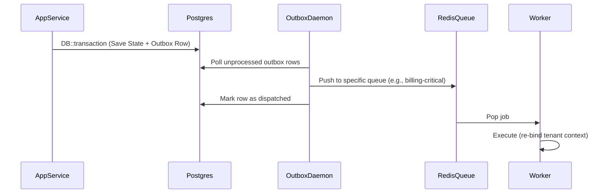

# OmniBill — Low-Level Design (LLD)

**Source of truth:** *OmniBill Architecture Blueprint* · *OmniBill Software Architecture Document (SAD)* · *OmniBill High-Level Design (HLD)*

---

## Table of Contents

| Section | Title |
|---|---|
| **1** | [Introduction](#1-introduction) |
| **2** | [Project Structure](#2-project-structure) |
| **3** | [Module Implementation Guide](#3-module-implementation-guide) |
| **4** | [Data Access Design](#4-data-access-design) |
| **5** | [API Implementation Guidelines](#5-api-implementation-guidelines) |
| **6** | [Background Processing](#6-background-processing) |
| **7** | [Error Handling Strategy](#7-error-handling-strategy) |
| **8** | [Testing Strategy](#8-testing-strategy) |
| **9** | [Coding Guidelines](#9-coding-guidelines) |
| **10** | [Traceability Matrix](#10-traceability-matrix) |
| **11** | [References](#11-references) |

---

## 1. Introduction

### 1.1 Purpose
This Low-Level Design (LLD) document provides actionable implementation guidance for the OmniBill platform. It translates the logical boundaries and constraints established in the High-Level Design (HLD) into concrete structural rules, naming conventions, and implementation expectations for the engineering team.

### 1.2 Scope
This document covers:
- Physical directory structures and namespaces.
- Implementation expectations for each major module.
- Persistence and data access patterns.
- Request lifecycle and API conventions.
- Queue processing and testing strategies.

It does **not** include line-by-line code, specific database migrations, or exhaustive API endpoint definitions, which are left to individual feature specifications and code implementation.

### 1.3 Relationship to Upstream Documents
- **Blueprint & SAD:** Define the architectural decisions and constraints.
- **HLD:** Defines the logical modules, aggregate boundaries, and inter-module communication.
- **This LLD:** Directs *how* to write the code that implements the HLD.

---

## 2. Project Structure

OmniBill follows a **module-first** organization (SAD §23.24) rather than a layer-first organization. 

### 2.1 Namespace and Directory Organization

The codebase is organized under a root `Modules\` namespace instead of scattering domain logic across standard Laravel `app/` folders.

```text
app/
├── Http/                 (Global middleware, Edge routing)
├── Console/              (Global commands)
└── Exceptions/           (Global exception handler)
Modules/
├── Tenancy/
├── IdentityAccess/
├── Customer/
├── Subscription/
├── Invoice/
├── Payment/
├── Notification/
├── Webhook/
├── Shared/               (Shared Infrastructure)
└── Queue/                (Queue Processing base logic)
```

### 2.2 Module Internal Structure

Every bounded-context module follows an identical internal structure mapped to the 4-layer architecture defined in the HLD.

```text
Modules/{ModuleName}/
├── Http/                 (Presentation Layer)
│   ├── Controllers/
│   ├── Requests/         (FormRequests)
│   └── Resources/        (API Resources)
├── Application/          (Application Layer)
│   ├── Services/         (Public API of the module)
│   ├── Commands/
│   └── ProcessManagers/
├── Domain/               (Domain Layer)
│   ├── Models/           (Aggregates / Entities)
│   ├── Events/           (Domain Events)
│   ├── Services/         (Pure business logic)
│   └── ValueObjects/
└── Infrastructure/       (Infrastructure Layer)
    ├── Repositories/     (Data access)
    ├── Adapters/         (External integration)
    └── Jobs/             (Module-specific queue jobs)
```

### 2.3 Shared Components
The `Modules/Shared/` namespace contains cross-cutting concerns:
- `Shared\Domain\ValueObjects\Money`
- `Shared\Infrastructure\Logging\StructuredLogger`
- `Shared\Infrastructure\Jobs\TenantAwareJob`

---

## 3. Module Implementation Guide

This section outlines the specific implementation responsibilities for each module based on the HLD.

### 3.1 Tenant Management
- **Purpose:** Manage the lifecycle and configuration of OmniBill's tenants.
- **Primary components:** `Tenant`, `TenantSettings`, `TenantPlanAssignment` Eloquent models. `TenantLifecycleStateMachine` (Domain Service).
- **Internal workflow:** Relies on a state machine domain service for `Pending -> Active -> PastDue -> Suspended -> Cancelled` transitions.
- **Interfaces:** `ResolveTenant` (used by middleware), `GetTenantSettings`.

### 3.2 Authentication & Authorization (Identity & Access)
- **Purpose:** Manage users, tokens, and role-based access control (RBAC).
- **Primary components:** `User` model, Sanctum Token integration, `UserRole` mapping.
- **Internal workflow:** Issues Sanctum tokens with specific abilities on login. Handles global revocation on tenant suspension.
- **Interfaces:** `GetAuthenticatedUser`, `RevokeAllTokensForTenant`.
- **Note:** Laravel Policies live in the module that owns the resource, but they query this module for role resolution.

### 3.3 Customer Management
- **Purpose:** Maintain tenant-specific customer profiles and safe payment method references.
- **Primary components:** `Customer` model, `PaymentMethod` (tokenized Stripe references only).
- **Internal workflow:** Simple CRUD logic. Delegates all Stripe customer synchronization to the Subscription module.

### 3.4 Subscription Management & Billing
- **Purpose:** Core subscription engine, Plan catalog, and sole owner of the Stripe Cashier integration.
- **Primary components:** `Subscription`, `Plan`, `Price` models. `StripeAdapter` (Infrastructure layer). `CatalogService`, `FeatureFlagService`, `PricingCalculationService` (Application layer).
- **Internal workflow:** Creates Stripe subscriptions via Cashier. Converts Stripe webhook events (received via Webhook module) into local state changes. `FeatureFlagService` resolves tenant feature access via `CatalogService` cached plan lookups. `PricingCalculationService` abstracts amount calculations.
- **Dependencies:** M-TEN (tenant status), M-CUS (customer info).

### 3.5 Invoice Management
- **Purpose:** Generate, finalize, and store invoices.
- **Primary components:** `Invoice`, `InvoiceLineItem` models. PDF generation service (Infrastructure).
- **Internal workflow:** Listens to `SubscriptionActivated` and renewal events. Generates Drafts, finalizes to Open (locking line items), and dispatches `InvoiceFinalized` to trigger payment.
- **Interfaces:** `GetInvoice`, `ListInvoicesForSubscription`.

### 3.6 Payment Processing
- **Purpose:** Record payment attempts and act on definitive webhook signals.
- **Primary components:** `Payment`, `PaymentAttempt` models.
- **Internal workflow:** Strictly reactive to webhooks (`payment_intent.succeeded`, etc.). Updates local state and dispatches Domain Events (`PaymentSucceeded`, `PaymentFailed`). Never trusts a synchronous Stripe charge response for final state.

### 3.7 Notifications
- **Purpose:** Stateless delivery of emails and alerts.
- **Primary components:** `NotificationLog` model, Mailables, Blade templates.
- **Internal workflow:** Subscribes to events (`InvoicePaid`, `PaymentFailed`). Renders tenant-specific templates and dispatches via standard Laravel Mail drivers.

### 3.8 Webhooks & Integration Events
- **Purpose:** Ingest external webhooks (Stripe) and dispatch outbound webhooks to tenants.
- **Primary components:** `WebhookEvent` (inbound), `OutboundWebhookDelivery` (outbound) models.
- **Internal workflow:** 
  - **Inbound:** Verifies Stripe signature -> Persists raw payload -> Returns 200 -> Dispatches job to translate to Domain Event.
  - **Outbound:** Translates internal Domain Events into versioned Integration Events -> Dispatches POST request with exponential backoff.

### 3.9 Queue Processing
- **Purpose:** Manage asynchronous job execution and the Outbox pattern.
- **Primary components:** `OutboxDispatcher` (scheduler/daemon), Laravel Horizon configuration.
- **Internal workflow:** Polls `outbox_events` table and pushes payloads to Laravel queues (`billing-critical`, `invoicing`, etc.).

### 3.10 Shared Infrastructure
- **Purpose:** Cross-cutting base classes and utilities.
- **Primary components:** `TenantAwareJob`, `StructuredLogger`, `Money` Value Object, `OmniBillUser` (Authentication Contract).

---

## 4. Data Access Design

### 4.1 Repository Responsibilities
- Repositories belong in the `Infrastructure` layer of each module.
- They implement interfaces defined in the `Application` layer.
- **Strict Rule:** A repository may only query models belonging to its own module. 
- Use Eloquent internally, but return Domain Models or simple DTOs to the Application Service.

### 4.2 Persistence Flow and Transaction Boundaries
1. **Application Service** initiates a DB transaction.
2. It calls the Repository to persist the aggregate state.
3. It writes a domain event payload to the `outbox_events` table.
4. The transaction is committed.
- *Never wrap external API calls (e.g., Stripe, Mail) inside a database transaction.*

### 4.3 Tenancy Enforcement
- Every tenant-owned Eloquent model MUST use a `TenantScoped` global scope trait.
- Queries explicitly bypassing this (for `SUPER_ADMIN` platform operations) must use `withoutGlobalScope(TenantScope::class)` and explicitly log the action to the Audit Log.

### 4.4 Caching Considerations
- Use Laravel's `Cache` facade with the Redis driver.
- **Key format:** `tenant:{tenant_id}:{module}:{resource}:{id}`.
- Financial state (Invoices, Payments, Subscriptions) is **never** cached.
- Read-heavy data (Plan catalog, Tenant settings) uses cache-aside with event-driven invalidation.

---

## 5. API Implementation Guidelines

### 5.1 Request Lifecycle
1. **Edge Middleware:** Rate limiting (tenant-tiered).
2. **Auth Middleware:** Sanctum token validation.
3. **Tenant Middleware:** Resolves `tenant_id` from subdomain/header and binds `CurrentTenant` singleton.
4. **Controller:** 
   - Validates using `FormRequest`.
   - Checks authorization using `$this->authorize()`.
   - Delegates payload to an Application Service.
   - Wraps the returned result in an `APIResource`.

### 5.2 Authorization Checks
- Implemented using standard Laravel Policies.
- Policies are defined in the module owning the resource (e.g., `InvoicePolicy` in `Modules/Invoice/Http/Policies`).
- Policies check user roles (via M-IAC) against resource ownership. Tenancy is already handled by the Global Scope.

### 5.3 Response Structure
All responses use Laravel API Resources to enforce a consistent JSON envelope:
```json
{
  "data": { "id": "...", "type": "..." },
  "meta": { "total": 100 }
}
```

### 5.4 Error Handling Conventions
- **Validation:** Let Laravel automatically return `422 Unprocessable Entity`.
- **Domain Logic:** Throw custom exceptions extending a base `DomainException` (e.g., `SubscriptionAlreadyCancelledException`).
- The global exception handler maps these to `400` or `409` responses with standard error codes and a `correlation_id`.

### 5.5 Idempotency
- All mutating billing endpoints must check the `Idempotency-Key` header via middleware.
- The middleware checks Redis. If found, returns the cached response. If not, proceeds and caches the final response for 24 hours.

---

## 6. Background Processing

### 6.1 Tenant-Aware Jobs
- All background jobs processing tenant data MUST extend `Modules\Shared\Infrastructure\Jobs\TenantAwareJob`.
- This base class explicitly serializes the `tenant_id` and re-binds the `CurrentTenant` context in its `handle()` method before executing derived logic.

### 6.2 Queue Interactions (Outbox Pattern)


### 6.3 Retry Behavior and Failure Handling
- Jobs are configured with exponential backoff (e.g., `$backoff = [10, 60, 300];`).
- Jobs must be strictly idempotent (safe to retry if they failed halfway).
- After `$tries` is exhausted, jobs are moved to the `failed_jobs` table.
- Dead-letter queues (`billing-critical-failed`) have configured alerts in Laravel Pulse.

### 6.4 Scheduled Tasks
- Registered in Laravel's Task Scheduler.
- Includes: Dunning retry evaluations, soft-delete retention purges, and outbox cleanup.

---

## 7. Error Handling Strategy

### 7.1 Exception Hierarchy
- `OmniBillException` (Base)
  - `DomainException` (Business rule violations, maps to 4xx)
  - `InfrastructureException` (DB/Network errors, maps to 5xx, retryable in queues)

### 7.2 Logging Expectations
- Inject and use the `StructuredLogger`.
- Never use `Log::info('string')`. Use `Log::info('event.name', ['context' => 'data'])`.
- The logger automatically appends `tenant_id` and `correlation_id` from the request container.

---

## 8. Testing Strategy

### 8.1 Unit Testing
- Focus on `Domain Services` and `Value Objects`.
- Fast, no database access. Mocks used only for pure interfaces.

### 8.2 Integration Testing
- Focus on `Application Services`.
- Uses a real test database with `RefreshDatabase` (transactions).
- Tests cross-module boundaries by asserting Domain Events were written to the outbox.

### 8.3 External Integrations (Stripe)
- **Rule:** Never hit the live Stripe API in CI.
- Use recorded JSON fixtures of Stripe webhooks to test the M-WHK inbound pipeline and M-SUB processing logic.

### 8.4 Architecture Tests
- Use Pest/PHPUnit architecture testing (e.g., `pestphp/pest-plugin-arch`) to enforce module boundaries:
  - `expect('Modules\Invoice')->not->toUse('Modules\Subscription\Domain')`
  - `expect('Modules\*\Infrastructure')->toOnlyBeUsedIn('Modules\*\Application')`

---

## 9. Coding Guidelines

1. **Dependency Injection:** Use constructor injection for Application Services and Repositories. Do not use Laravel Facades inside the Domain layer.
2. **SOLID Principles:** Favor small, single-purpose Application Services (e.g., `CancelSubscriptionService`) over bloated controllers or God models.
3. **Value Objects:** Always use the `Money` value object for financial amounts. Never pass bare floats or integers for currency.
4. **UUIDs:** Use `Str::uuid()` (UUIDv7 configured in Laravel) for all primary keys.
5. **Strict Types:** `declare(strict_types=1);` is mandatory on all PHP files.

---

## 10. Traceability Matrix

| HLD Module | LLD Implementation Section |
|---|---|
| Tenancy (M-TEN) | §3.1 Tenant Management |
| Identity & Access (M-IAC) | §3.2 Auth & Authz |
| Customer Management (M-CUS) | §3.3 Customer Management |
| Subscription Management (M-SUB) | §3.4 Subscription Management |
| Invoice Management (M-INV) | §3.5 Invoice Management |
| Payment Processing (M-PAY) | §3.6 Payment Processing |
| Notifications (M-NOT) | §3.7 Notifications |
| Webhooks (M-WHK) | §3.8 Webhooks & Integration Events |
| Queue Processing (S-QUE) | §3.9 & §6 Background Processing |
| Shared Infrastructure (S-INF) | §3.10 Shared Infrastructure |

---

## 11. References
- *OmniBill Architecture Blueprint* (`docs/blueprint/OmniBill_Architecture_Blueprint.md`)
- *OmniBill Software Architecture Document* (`docs/sad/OmniBill_SAD.md`)
- *OmniBill High-Level Design* (`docs/hld/OmniBill_HLD.md`)
