# OmniBill — Software Architecture Document (SAD)

**Source of truth:** *OmniBill Architecture Blueprint* (canonical)

> This document formalizes decisions already recorded in the OmniBill Architecture Blueprint. It does not introduce new architecture. Where the blueprint leaves a point open to interpretation, this is flagged explicitly as an **Assumption** rather than resolved with a new decision.

---

## Table of Contents

| Section | Title |
|---|---|
| **1** | Introduction |
| **2** | Purpose |
| **3** | Scope |
| **4** | Intended Audience |
| **5** | Architectural Goals |
| **6** | Quality Attributes |
| **7** | System Context |
| **8** | Architectural Overview |
| **9** | Architectural Drivers |
| **10** | System Decomposition |
| **11** | Domain Architecture |
| **12** | Multi-Tenancy Architecture |
| **13** | Authentication & Authorization Architecture |
| **14** | Data Architecture |
| **15** | Integration Architecture |
| **16** | Infrastructure Architecture |
| **17** | Runtime Architecture |
| **18** | Security Architecture |
| **19** | Scalability Strategy |
| **20** | Reliability Strategy |
| **21** | Observability |
| **22** | Architectural Risks |
| **23** | Architecture Decision Summary |
| **24** | References |

---

## 1. Introduction

OmniBill is a **production-grade, distributed-ready, multi-tenant SaaS billing platform**, built to let a company plug in subscription billing, invoicing, and payment processing without building that machinery in-house — occupying the same product category as Chargebee, Recurly, or a private-label Stripe Billing layer.

Architecturally, OmniBill is committed to a **modular monolith** built on Laravel 13: a single deployable application internally decomposed into disciplined bounded-context modules, rather than a network of independently deployed microservices. This choice is not a temporary simplification to be undone later — it is the deliberate architectural posture for the system's current scale (thousands of tenants, not billions of daily events), chosen because it delivers most of the maintainability benefit of service decomposition without the operational cost of a service mesh, distributed tracing across network hops, or cross-service schema versioning.

Five commitments run through every architectural decision in the blueprint, and therefore through this document:

1. **Tenant data isolation is non-negotiable** — no code path may return cross-tenant data, even under bugs or malicious input.
2. **Billing correctness over billing speed** — money-moving operations favor consistency and auditability over low latency.
3. **The HTTP request thread never does billing work** — anything touching Stripe, PDF generation, or email is asynchronous.
4. **Boring, observable, operable** — well-understood patterns are preferred over clever ones; every subsystem must be debuggable at 3 AM by someone who didn't build it.
5. **Modular monolith, not microservices** — bounded contexts are enforced through code organization and module boundaries, not network hops, until there is concrete evidence a hop is needed.

This SAD exists to translate those blueprint-level decisions into the structured, standards-shaped artifact that downstream High-Level Design (HLD) and Low-Level Design (LLD) documents will be written against.

**Explicitly out of scope for the v1 architecture** (and therefore out of scope for anything this SAD describes as current-state): multi-currency FX conversion, usage-based/metered billing, physical microservice decomposition or a service mesh, and white-label reseller/sub-tenant hierarchies. The architecture leaves room for several of these (see the blueprint's extensibility section) without building them now.

---

## 2. Purpose

The purpose of this document is to present OmniBill's software architecture in the form expected of a formal Software Architecture Document: a structured, stakeholder-oriented description of the system's structure, the rationale behind its major decisions, and the quality attributes those decisions are optimized for.

Specifically, this SAD is intended to:

- **Formalize** the architectural decisions already made in the OmniBill Architecture Blueprint into a document suitable for architecture review, onboarding, and governance — without re-deriving or re-litigating those decisions.
- **Establish traceability** between architectural goals (this section forward) and the concrete mechanisms (module boundaries, tenancy model, event-driven workflows, deployment topology) that later sections of the full SAD will describe.
- **Serve as the reference point** for HLD and LLD authors, so that detailed design work is demonstrably consistent with the architecture rather than diverging from it module by module.
- **Make quality attribute trade-offs explicit**, so that engineers making implementation decisions understand *why* the architecture favors, for example, correctness over latency in billing paths, or database-level enforcement over application-level enforcement for tenancy.

This document is not a requirements specification (that is the role of the SRS) and does not contain implementation detail, code, or file-level structure — those belong to the HLD/LLD layer that follows it.

---

## 3. Scope

### 3.1 In scope for this SAD

This document covers the architecture of the OmniBill platform as a whole: its bounded contexts, tenancy model, API surface, data architecture, service layering, event-driven infrastructure, integration with Stripe, caching, rate limiting, scalability posture, security model, observability, testing philosophy, CI/CD posture, codebase organization principles, and deployment topology — as these are defined in the blueprint.

### 3.2 Out of scope for this SAD

- **Re-deriving or altering architecture.** This document formalizes existing decisions; it does not propose alternatives beyond what the blueprint itself already records as "alternatives considered."
- **Implementation-level detail.** No Laravel code, file/directory listings, class diagrams at the method level, or database DDL. These belong in the HLD/LLD.
- **Product/business requirements.** Feature scope, pricing model details, and go-to-market considerations are not architectural concerns and are not addressed here.
- **Non-goals of the v1 architecture itself**, as declared in the blueprint: multi-currency FX conversion, usage-based/metered billing, physical microservice decomposition or a service mesh, and white-label reseller/sub-tenant hierarchies. The architecture is designed to *accommodate* several of these later (see the blueprint's future-extensibility mapping) without being required to *implement* them now.

### 3.3 Document scope

This document is the complete and final OmniBill Software Architecture Document, covering all twenty-four sections: Introduction through Architectural Risks, Architecture Decision Summary, and References. It addresses the full architectural scope of the OmniBill platform — domain model and bounded contexts, multi-tenancy, authentication and authorization, API architecture, data architecture, service layering, event-driven design, third-party integration, caching, rate limiting, idempotency, scalability, security, observability, runtime architecture, infrastructure, deployment, and architectural risk assessment.

---

## 4. Intended Audience

| Audience | How this document is used |
|---|---|
| **Software Architects** | As the formal record of architectural intent against which subsequent design decisions (HLD/LLD) are validated for consistency. |
| **Senior Software Engineers** | As the reference for *why* the system is structured the way it is — module boundaries, aggregate boundaries, transaction/consistency rules — before writing code that must respect them. |
| **Engineering Leadership** | As the basis for judging whether a proposed change is an implementation detail (safe to decide locally) or an architectural change (requires review against this document and the blueprint). |
| **Authors of future SRS / HLD / LLD documents** | As the upstream artifact their documents must trace back to; architectural statements here should not be re-derived or contradicted downstream. |
| **New engineers onboarding onto OmniBill** | As a structured entry point into the system's design reasoning, ahead of reading module-level code. |

This document assumes familiarity with standard distributed-systems and web-application architecture vocabulary (bounded contexts, aggregates, eventual consistency, idempotency, horizontal scaling) and does not re-explain these concepts from first principles. It does **not** assume familiarity with Laravel internals, since implementation detail is intentionally excluded.

---

## 5. Architectural Goals

The following goals are derived directly from the blueprint's guiding principles (§1) and the decisions that operationalize them throughout the document. Each goal below is stated as an architectural intent, with the primary mechanisms that realize it.

| # | Goal | Primary mechanisms (per blueprint) |
|---|---|---|
| G1 | **Guarantee tenant data isolation** — no cross-tenant data exposure under any code path, including bugs or malicious input. | Shared-schema row-level isolation via a mandatory `tenant_id` column, enforced by a Laravel Global Scope, with PostgreSQL Row-Level Security as an independent, database-level defense-in-depth layer. |
| G2 | **Favor billing correctness and auditability over raw latency** for any money-moving operation. | Stripe treated as source of truth for payment state; no derivation of payment success from a synchronous API response alone; soft-delete-only policy on financial entities; append-only audit trail. |
| G3 | **Keep the HTTP request thread free of billing side effects.** | Outbox pattern for cross-aggregate consistency; no database transaction ever wraps an external call (Stripe, email, PDF generation); asynchronous processing via named, prioritized queues. |
| G4 | **Preserve module independence without paying for network decomposition prematurely.** | Modular monolith; inter-module communication restricted to Application Service interfaces and Domain Events — never direct cross-module Eloquent access. |
| G5 | **Keep the system operable and debuggable by someone unfamiliar with a given module.** | Structured JSON logging with mandatory correlation IDs threaded through sync requests and every async job they spawn; real-time operational dashboards in all environments. |
| G6 | **Design for future extraction and extension without a rewrite.** | Module boundaries already expressed as interfaces (the seam a future network boundary would be inserted at); `Money` value object used internally in anticipation of multi-currency; tenant resolution already abstracted behind middleware, positioning the system for dedicated-database tenants later. |
| G7 | **Protect the platform and its tenants from each other.** | Per-tenant (not per-IP), plan-tiered rate limiting; idempotency keys required on mutating billing endpoints. |
| G8 | **Scale horizontally without an architecture change.** | Statelessness on web/worker nodes (sessions in Redis, files in object storage); staged database scaling — vertical, then read replicas, then partitioning — rather than designing for sharding from day one. |

> **Assumption:** The blueprint does not assign explicit priority ordering among these goals beyond the "first-order goals" list in its §1 (isolation, correctness, async-by-default, operability, modularity, in that order). This SAD preserves that ordering; where a future design decision appears to trade one goal against another, the blueprint's own ordering should govern unless a later blueprint revision states otherwise.

---

## 6. Quality Attributes

The quality attributes below are stated as concrete, testable properties wherever the blueprint provides one (a target, a threshold, or an explicit rule), rather than as generic aspirations. Each is traced to its governing decision.

### 6.1 Reliability & Correctness

| Attribute | Requirement | Governing mechanism |
|---|---|---|
| Payment state correctness | Local payment/invoice state is never treated as final until confirmed by a Stripe webhook, never from the synchronous API response alone. | Persist-then-process webhook pipeline; webhook signature verification before any processing. |
| Idempotent mutation | Retried mutating billing requests must not double-execute (e.g., double-charge). | Client-supplied `Idempotency-Key`, stored per `(tenant_id, key)` in Redis for 24 hours with a durable Postgres audit row for anything that touched money. |
| Duplicate webhook safety | Duplicate Stripe webhook deliveries must not be reprocessed. | `stripe_event_id` unique constraint at persistence time; duplicate IDs return 200 without reprocessing. |
| Cross-aggregate consistency | Eventual, not immediate — but guaranteed to occur once the originating transaction commits. | Outbox pattern: event row written in the same transaction as the local write; no transaction wraps an external call. |

### 6.2 Security

| Attribute | Requirement | Governing mechanism |
|---|---|---|
| Tenant isolation | No cross-tenant read is possible even given an application-level bug. | Two independent layers: Global Scope (application) + PostgreSQL RLS (database) — see G1. |
| Webhook authenticity | Inbound Stripe events must be provably from Stripe. | Mandatory signature verification against Stripe's signing secret; invalid signatures rejected with a logged security event before any processing. |
| Price/amount integrity | A client can never dictate what it is charged. | Prices/amounts are never accepted from client input for anything already defined server-side; server always recomputes from source-of-truth plan pricing. |
| Card data exposure | OmniBill's servers never see raw card data. | Client-side tokenization (Stripe Elements/Payment Element); only Stripe payment method references are stored. |
| Privileged access accountability | Every cross-tenant (`SUPER_ADMIN`) access is attributable and justified. | Explicitly-named bypass code path, never a silently disabled scope; every use logged with operator identity and reason. |

### 6.3 Performance

| Attribute | Requirement | Governing mechanism |
|---|---|---|
| Read-endpoint latency | P95 ≤ 300ms | Enforced via code review checklist and CI query-count assertions (no N+1 queries permitted on list endpoints), excluding async billing side effects by design. |
| Write-endpoint latency | P95 ≤ 800ms | Same guardrails; write endpoints exclude the async billing work they trigger, since that work is off the request thread by construction (G3). |
| Webhook processing latency | P95 < 60 seconds from Stripe event received to local state updated. | Fast-ack (200 returned immediately after persistence), async worker processing on a dedicated `webhooks-inbound` queue. |

### 6.4 Scalability

| Attribute | Requirement | Governing mechanism |
|---|---|---|
| Horizontal scale of compute | Web and worker nodes scale out as a configuration change, not an architecture change. | Statelessness: no local session or file state on app servers. |
| Staged database scale | Database scaling proceeds vertical → read replicas → partitioning, not straight to sharding. | `tenant_id`-first schema design already positions the data for future tenant-based partitioning if the primary approaches write-throughput saturation. |
| Per-tenant fairness under load | One tenant's traffic cannot degrade another's. | Per-tenant, plan-tiered sliding-window rate limiting (not per-IP). |

### 6.5 Auditability & Compliance

| Attribute | Requirement | Governing mechanism |
|---|---|---|
| Financial history is never silently lost | Financial/audit-relevant entities (Tenant, Subscription, Invoice, Payment, Customer) are never hard-deleted synchronously. | Soft-delete via `deleted_at`; hard deletes only via scheduled background jobs after a defined retention window, and only for entities without legal retention requirements. |
| Complete audit trail | Every state-changing action on Tenant, Subscription, Invoice, Payment, and RBAC is independently traceable. | Append-only audit log table, separate from general structured logs, so it survives log-retention rotation. |
| Data residency accommodation | A tenant with a compliance requirement for physical data isolation can be accommodated without a rearchitecture. | Tenant resolution already abstracted behind middleware; dedicated-database routing is an additive change. |

### 6.6 Maintainability & Modifiability

| Attribute | Requirement | Governing mechanism |
|---|---|---|
| Module independence | A module can be reasoned about, tested, and (eventually) extracted without tracing into another module's internals. | Inter-module communication restricted to Application Service interfaces and Domain Events; module-first (not layer-first) codebase organization. |
| Testability of business rules | Business rules are verifiable without HTTP or a live database. | Domain Services contain pure business logic with no I/O or framework dependency, tested at the unit level. |
| Safe evolution of the database schema | Deploys are zero-downtime; schema changes never break the currently-deployed code. | Additive-first migrations (new nullable columns → backfill → later removal), enabling rolling restarts. |

### 6.7 Observability

| Attribute | Requirement | Governing mechanism |
|---|---|---|
| End-to-end traceability of a business transaction | A single business transaction (e.g., one subscription upgrade) must be traceable across the synchronous request and every asynchronous job it spawns. | Correlation ID generated at edge middleware, threaded through every downstream job. |
| Query-ability of logs | Logs must support aggregation and alerting without brittle text parsing. | Structured JSON logging everywhere, with a mandatory field set (`timestamp`, `level`, `tenant_id`, `correlation_id`, `user_id`, `event`, `context`). |
| Production-safe monitoring | Operational visibility in production must not itself become a sensitive-data exposure surface. | Lightweight dashboards (Pulse) in all environments; detailed request/query capture (Telescope) restricted to development/staging only. |

---

## 7. System Context

### 7.1 Overall system context

OmniBill sits between two populations it must keep strictly separated: **tenants** (companies using OmniBill to bill *their own* customers) and **OmniBill's own platform operators**. Every external interaction with the system passes through the tenant-resolution and authentication layers described later in this document before reaching any business logic (blueprint §3.3, §5).

The system's only mandatory third-party dependency for its core value proposition is **Stripe**, which OmniBill treats as the system of record for payment state, not merely a downstream API (blueprint §10.4). All other external systems — email delivery, object storage — are supporting infrastructure rather than sources of business truth.

### 7.2 External actors

| Actor | Nature | Interacts via |
|---|---|---|
| **Tenant User** (`TENANT_USER`, `TENANT_BILLING_MANAGER`, `TENANT_ADMIN`) | Human, belongs to exactly one tenant | Versioned REST API (`/api/v1`), authenticated via Sanctum |
| **Tenant's own systems** | Programmatic, integrates against OmniBill on the tenant's behalf | Same REST API; receives outbound Integration Events (OmniBill's own webhooks) |
| **Platform Operator** (`SUPER_ADMIN`) | Human, OmniBill staff, platform-scoped | Same REST API, through an explicitly-named cross-tenant bypass path, always audit-logged |
| **End customer of a tenant** | Indirect — not an OmniBill account holder | Never interacts with OmniBill directly; exists only as the `CUSTOMER` entity a tenant manages |

### 7.3 External systems

| System | Role | Direction | Trust posture |
|---|---|---|---|
| **Stripe** | Payment processing, subscription/customer primitives, source of truth for payment state | Bidirectional: OmniBill calls Stripe's API; Stripe calls OmniBill via signed webhooks | Trusted only after signature verification (blueprint §14.1); never trusted based on network origin alone |
| **Email provider** | Delivery of transactional email (invoices, receipts, notifications) | Outbound only, asynchronous | Trusted delivery channel; no business state is derived from it |
| **Object storage (S3-compatible)** | Durable storage of generated PDFs (invoices, receipts) | Outbound (write), inbound (read on retrieval) | Not a source of business truth; PostgreSQL remains authoritative for invoice state |
| **PostgreSQL** | System of record for all tenant and platform data | Internal | Fully trusted, internal to the deployment |
| **Redis** | Cache, queue transport, rate-limit counters, idempotency key storage | Internal | Fully trusted, internal to the deployment; explicitly never the system of record for financial state (blueprint §11, §12.2) |

### 7.4 Upstream and downstream dependencies

- **Upstream of OmniBill:** Stripe webhook events are the primary upstream trigger for payment/invoice state changes — OmniBill is reactive to Stripe on the payment side, never assumes finality from its own outbound call (blueprint §10.4).
- **Downstream of OmniBill:** Tenant-facing outbound Integration Events (OmniBill's own webhooks), transactional emails, and generated PDF documents are the system's downstream outputs, all delivered asynchronously off the request thread (blueprint §1.1, §9.1).

### 7.5 System boundaries

The architectural boundary of "the system" is the modular monolith itself — the single deployable application and its stateless web/worker nodes — together with the data stores it owns (PostgreSQL, Redis, object storage). Stripe, the email provider, and any tenant's own downstream systems are explicitly outside this boundary and are treated as untrusted or semi-trusted external parties whose input must be verified (Stripe signatures) or whose failures must not compromise OmniBill's own consistency (email/PDF delivery failures never block or corrupt billing state).

### 7.6 Trust boundaries

| Boundary | What crosses it | Enforcement |
|---|---|---|
| **Tenant ↔ Tenant** | Nothing should cross this boundary at all | Global Scope (application layer) + PostgreSQL RLS (database layer), independently enforced (blueprint §3.1–§3.2) |
| **Platform Operator ↔ Tenant data** | Explicit, justified, audited cross-tenant access only | Named bypass path (`WithoutTenantScope`), never a silent scope removal; every use audit-logged (blueprint §3.4) |
| **External (Stripe) ↔ Internal** | Inbound webhook payloads | Mandatory signature verification before any persistence or processing; invalid signatures rejected and logged as a security event (blueprint §14.1) |
| **Client ↔ Server (pricing)** | API requests that could imply a price or amount | Server never accepts client-supplied prices/amounts for anything already defined server-side; always recomputed from source-of-truth plan pricing (blueprint §14.1) |

### 7.7 Context diagram

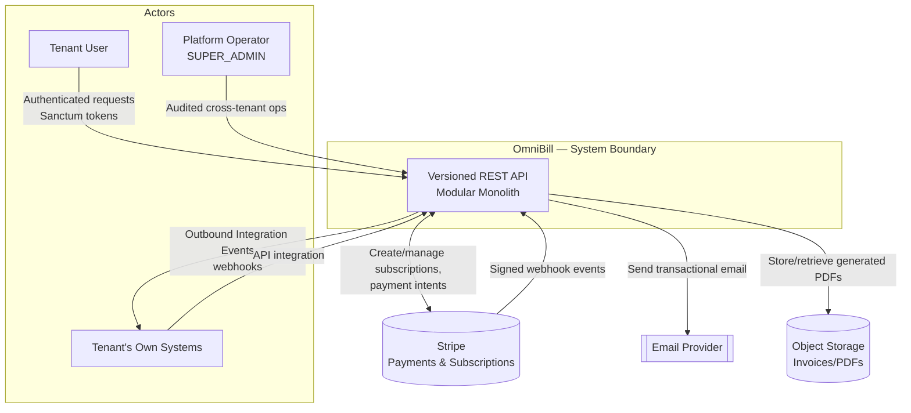

### 7.8 Interaction overview

A typical tenant-facing interaction crosses the system boundary once (the initial API call) and then fans out asynchronously: the synchronous request only ever validates, authorizes, and — for billing operations — initiates work; any actual money movement, document generation, or notification happens after the response has already been returned, through the queue architecture described in Section 10 (blueprint §1.1, principle 3). Stripe is the one external system permitted to *initiate* an interaction with OmniBill (via webhook), reflecting its role as source of truth for payment state rather than a passive downstream API.

---

## 8. Architectural Overview

### 8.1 Overall architectural style

OmniBill's architectural style is a **modular monolith**: a single deployable Laravel 13 application, internally decomposed into bounded-context modules with enforced boundaries, deployed as horizontally scalable stateless web and worker nodes (blueprint §1.1, Decision). This is a deliberate style choice, not a default — the blueprint explicitly evaluated and rejected microservices-per-context and serverless-functions-per-job-type for the platform's current scale (thousands of tenants, not billions of daily events).

### 8.2 Modular monolith rationale

The modular monolith is chosen because it delivers most of the maintainability benefit associated with service decomposition — clear ownership boundaries, independently testable business logic, the ability to extract a module later — without the operational cost that comes with it at this scale: no service mesh, no distributed tracing across network boundaries, and no cross-service schema versioning to maintain (blueprint §1.1). The architecture treats this as a considered trade-off with an explicit revisit trigger, not a permanent ceiling: it is reconsidered only if a single module's resource profile (CPU, memory, queue depth) diverges so far from the rest of the system that co-deployment becomes a genuine bottleneck.

### 8.3 Layered architecture

Within every module, three layers are enforced consistently (blueprint §8):

| Layer | Responsibility | Constraint |
|---|---|---|
| **Domain Services** | Pure business rules — "is this allowed / what should happen" | No I/O, no framework dependency |
| **Application Services** | Orchestrate a use case — load data, invoke domain services, persist, dispatch events | This layer *is* the module's public API; the only entry point other modules or transport layers may call |
| **Controllers** (transport layer) | HTTP concerns only — request parsing, response shaping | Delegates to exactly one Application Service call per request |

This layering is what allows the same Application Service to be invoked identically from an HTTP controller, a queue job, or an operator command — a property the architecture relies on throughout the event-driven workflows described in Section 10.

### 8.4 Component organization

Components are organized **module-first, technical-layer second**: each bounded context is a self-contained top-level unit containing its own Domain, Application, and transport layers, rather than the codebase being split globally by technical layer with modules interleaved inside it (blueprint §19). This is what makes the module-boundary discipline established in this section visible and enforceable, rather than a convention that can silently erode.

### 8.5 Module communication

> Modules do not reach into each other's data directly. All inter-module communication happens through **Application Service interfaces** (synchronous, in-process calls to another module's public API) or **Domain Events** (asynchronous, decoupled notification that something happened) — never through direct cross-module queries against another module's underlying data (blueprint §2.1, Decision).

This constraint is treated as permanent, independent of deployment topology — it is what preserves the option of extracting a module into a real service later without a rewrite, because the interface is already the seam a network boundary would be inserted at (blueprint §21).

### 8.6 Architectural principles

The following principles, established in the blueprint (§1.1) and reflected in Section 5's architectural goals, govern every design decision at every layer of this architecture:

1. Tenant data isolation is non-negotiable.
2. Billing correctness is favored over billing speed.
3. The HTTP request thread never performs billing work.
4. The system favors boring, observable, operable patterns over clever ones.
5. Module boundaries are enforced through code organization, not network hops, until there is concrete evidence a hop is needed.

### 8.7 Request flow overview

At a high level, every synchronous request that reaches OmniBill passes through the same ordered sequence of concerns before touching business logic: rate limiting, authentication, tenant resolution, authorization, and — for mutating billing operations — an idempotency check, before any Domain Service logic executes inside a transaction. Detailed treatment of authentication, authorization, and the API surface itself is deferred to a later section of this SAD; it is introduced here only to establish that **business logic is never the first thing a request touches** — every request is filtered through isolation and safety concerns first, consistent with the principles in §8.6.

### 8.8 High-level deployment philosophy

The application tier is stateless by design: no session or file state lives on a web or worker node, which is what allows horizontal scaling to be a configuration change rather than an architectural one (blueprint §13). Compute (web nodes, and worker nodes per named queue) and data (PostgreSQL, Redis, object storage) scale independently of each other, and worker pools scale independently *per queue*, reflecting that not all asynchronous work carries the same business criticality (blueprint §9.2). Full deployment topology, including node-level and data-tier scaling detail, is covered in a later section of this SAD.

### 8.9 Component diagram

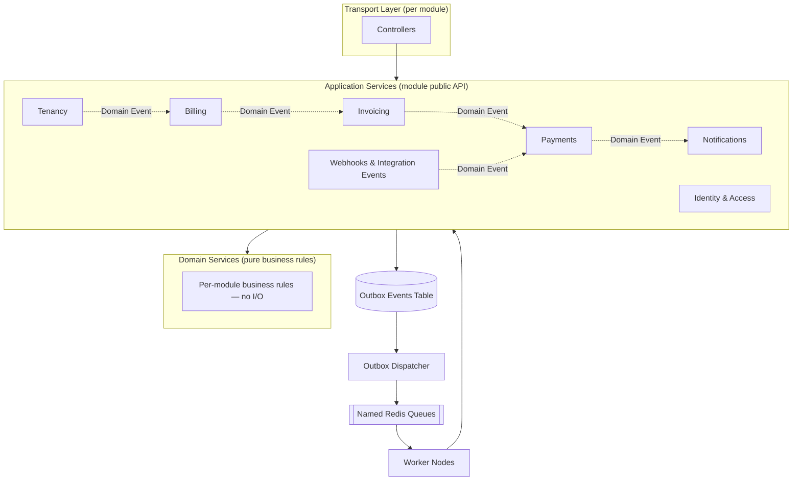

---

## 9. Architectural Drivers

Each driver below is a force that shaped the architecture as recorded in the blueprint. Business and technical concerns are listed first, followed by the specific quality-attribute drivers already introduced in Section 6, here traced back to *why* they exist and *what* they shaped.

### 9.1 Business drivers

**Why it exists:** OmniBill's product category — subscription billing infrastructure — is one where customers (tenants) are trusting the platform with their own revenue and their own customers' payment relationships. Trust and correctness are the product, not a feature of it.
**How it influenced the architecture:** Every money-moving path is designed for auditability and correctness ahead of raw performance (blueprint §1.1, principle 2).
**Decisions affected:** Stripe-as-source-of-truth for payment state (§10.4); soft-delete-only policy on financial entities (§7.3); append-only audit trail (§16); manual approval gate specifically for billing-module production deploys (§18).

### 9.2 Technical drivers

**Why it exists:** The team must ship and operate a system understandable by engineers who did not build a given part of it, at a scale (thousands of tenants) that does not yet justify distributed-systems operational overhead.
**How it influenced the architecture:** The modular monolith style (§8.1–§8.2) and the "boring, observable, operable" principle directly follow from this driver.
**Decisions affected:** Modular monolith over microservices (§1); module-first codebase organization (§19); layered Domain/Application/Controller separation (§8).

### 9.3 Security requirements

**Why it exists:** A multi-tenant billing platform is a high-value target — a single cross-tenant leak exposes another company's financial and customer data; a single spoofed payment event risks financial loss or fraud.
**How it influenced the architecture:** Isolation and authenticity are enforced at more than one layer wherever the blast radius of a failure is high, rather than relying on a single control.
**Decisions affected:** Global Scope + PostgreSQL RLS defense-in-depth (§3.1–§3.2); mandatory Stripe webhook signature verification (§14.1); server-side-only price computation (§14.1); field-level encryption for high-impact sensitive fields in addition to at-rest disk encryption (§14.2).

### 9.4 Scalability requirements

**Why it exists:** The platform must grow from its current target (thousands of tenants) without an architecture rewrite, while not over-engineering for a scale it hasn't reached.
**How it influenced the architecture:** Scaling is staged and driven by evidence, not speculative from day one.
**Decisions affected:** Stateless horizontal scaling of web/worker nodes; staged database scaling — vertical, then read replicas, then partitioning (§13); `tenant_id`-first schema design that already positions the data for future partitioning.

### 9.5 Reliability requirements

**Why it exists:** Billing is inherently asynchronous and failure-prone at the integration boundary (webhooks arrive out of order, networks fail mid-request); the architecture must make the *correct* behavior under failure the default, not an edge case handled after the fact.
**How it influenced the architecture:** No transaction is allowed to wrap an external call; every cross-aggregate consistency need goes through a durable, replayable mechanism.
**Decisions affected:** Outbox pattern for cross-aggregate consistency (§7.4); idempotent, safely-retryable queue jobs with dead-letter handling (§9.2); persist-then-process webhook pipeline (§10.4).

### 9.6 Maintainability

**Why it exists:** The codebase is expected to live and grow for years, past a handful of original contributors, without degrading into an unmaintainable "big ball of mud."
**How it influenced the architecture:** Module boundaries are enforced structurally (via interfaces and events) rather than left to convention or code review discipline alone.
**Decisions affected:** Enforced inter-module communication via Application Services and Domain Events only (§2.1); module-first folder organization (§19); Domain/Application/Controller layering enabling isolated unit testing (§8, §17).

### 9.7 Extensibility

**Why it exists:** Several capabilities are explicitly deferred (multi-currency, usage-based billing, dedicated-database tenants, third-party OAuth apps) but must not require a rearchitecture when they are eventually needed.
**How it influenced the architecture:** Seams for these future capabilities are built into today's architecture even though the capabilities themselves are not.
**Decisions affected:** `Money` value object used internally ahead of multi-currency need (§21); Subscription/Invoice aggregate separation, which already accommodates a future usage-event pipeline (§21); tenant resolution abstracted behind middleware, enabling per-tenant database routing later (§3.3, §21); module boundaries already expressed as the interface a future network seam would use (§21).

### 9.8 Performance goals

**Why it exists:** Tenant-facing API latency affects the usability of every product built on top of OmniBill, but must never be improved at the expense of billing correctness.
**How it influenced the architecture:** Performance budgets are scoped explicitly to exclude asynchronous billing side effects, which are off the request thread by design — performance and correctness are not put in tension with each other.
**Decisions affected:** P95 latency budgets of 300ms (read) / 800ms (write) (§13); mandatory eager loading / no N+1 queries on list endpoints (§13); async-by-default billing side effects (§1.1, principle 3).

### 9.9 Observability goals

**Why it exists:** An asynchronous, event-driven architecture is only operable if a single business transaction can be traced across the synchronous request and every job it spawns — otherwise failures become archaeology.
**How it influenced the architecture:** Correlation is treated as a first-class, mandatory field on every log entry and every job payload, not an optional debugging aid.
**Decisions affected:** Structured JSON logging with mandatory correlation IDs threaded through sync and async execution (§15); Pulse in all environments for real-time operational dashboards, Telescope restricted to dev/staging (§16); SLO tracking on webhook processing latency and per-queue depth (§16).

---

## 10. System Decomposition

This section describes OmniBill's major subsystems. Each subsystem corresponds to a bounded context defined in the blueprint (§2.1); the boundaries, ownership, and communication rules below are drawn directly from that context table and the aggregate boundaries in §2.3.

> **Assumption:** The blueprint's bounded-context table names eight contexts (Identity & Access, Tenancy, Billing, Invoicing, Payments, Webhooks & Integration Events, Notifications, Platform/Observability). This section maps that canonical set onto the subsystem groupings requested for this SAD; where a requested subsystem name does not correspond one-to-one with a named bounded context, that mapping is called out explicitly rather than treated as a new architectural boundary.

### 10.1 Tenant Management

| Aspect | Description |
|---|---|
| **Responsibilities** | Tenant record, tenant lifecycle state machine, tenant settings, plan assignment |
| **Architectural boundary** | Maps directly to the **Tenancy** bounded context (blueprint §2.1) |
| **Dependencies** | None inbound from other business modules for its own state; other modules depend on it for tenant status and settings |
| **Communication style** | Exposes tenant status and settings via Application Service calls; emits Domain Events on tenant state transitions (e.g., suspension) that Identity & Access and Billing react to |
| **Data ownership** | Tenant aggregate: Tenant + TenantSettings + TenantPlanAssignment (blueprint §2.3) |
| **Major components** | Tenant lifecycle state machine (Pending → Active → PastDue → Suspended → Cancelled, blueprint §4.1); soft-delete + scheduled hard-delete pipeline (blueprint §4.2) |
| **Future extensibility** | Tenant resolution is already abstracted behind middleware, so routing a given tenant to a dedicated database for compliance reasons is an additive change, not a rearchitecture (blueprint §21) |

### 10.2 Identity & Authentication

| Aspect | Description |
|---|---|
| **Responsibilities** | Users, roles, permissions, sessions/tokens |
| **Architectural boundary** | Maps directly to the **Identity & Access** bounded context (blueprint §2.1); explicitly does *not* own tenant billing state |
| **Dependencies** | Depends on Tenant Management for tenant-active status (a suspended tenant's users cannot authenticate) |
| **Communication style** | Two-layer authorization: Global Scope for tenant-boundary isolation, Policies for role-and-ownership rules within a tenant (blueprint §5.2) |
| **Data ownership** | User credentials, role assignments, Sanctum tokens and their abilities |
| **Major components** | Sanctum-based token authentication; role model (`SUPER_ADMIN`, `TENANT_ADMIN`, `TENANT_BILLING_MANAGER`, `TENANT_USER`, blueprint §4.3); centralized, explicit token revocation on suspension/reset |
| **Future extensibility** | Passport (OAuth2) layered in *alongside* Sanctum when third-party developer/app-store integrations become a real requirement — not a replacement (blueprint §5.1, §21) |

### 10.3 Customer Management

| Aspect | Description |
|---|---|
| **Responsibilities** | The Customer entity a tenant manages (their own end customers) and tokenized payment method references |
| **Architectural boundary** | The **Customer** aggregate (blueprint §2.3): Customer + PaymentMethods (tokenized references only, never raw card data). The blueprint's bounded-context table does not name "Customer Management" as an independent context; this aggregate sits adjacent to, and is referenced by, the Billing context, which owns Stripe customer linkage. This subsystem grouping is an organizational lens for this SAD, not a distinct bounded context beyond what §2.1/§2.3 already establish. |
| **Dependencies** | Referenced by Subscription (by ID only) and by Invoice (by ID only) — never joined into another aggregate's transaction |
| **Communication style** | Cross-aggregate references by ID; no direct FK constraint to Subscription or Invoice (blueprint §7.1) |
| **Data ownership** | Customer records and payment method tokens |
| **Major components** | Payment method tokenization boundary — card data never reaches OmniBill's servers; Stripe Elements/Payment Element tokenizes client-side (blueprint §14.1) |
| **Future extensibility** | The reference-by-ID pattern already used here is the same mechanism that would support multiple payment processors per customer in the future (blueprint §21) |

### 10.4 Billing (Subscription Management)

| Aspect | Description |
|---|---|
| **Responsibilities** | Subscriptions, plans, prices, Stripe customer linkage |
| **Architectural boundary** | The **Billing** bounded context (blueprint §2.1); explicitly does not own invoice documents |
| **Dependencies** | Depends on Tenant Management (plan assignment) and Customer Management (Stripe customer linkage); does not depend on Invoicing or Payments for its own consistency |
| **Communication style** | Subscription state changes are published as Domain Events; Invoicing and process managers react to them rather than Billing calling into Invoicing directly |
| **Data ownership** | Subscription aggregate: Subscription + SubscriptionItems (blueprint §2.3) — does *not* include Invoices |
| **Major components** | Subscription lifecycle state machine (Trialing → Active → PastDue → Cancelled, with plan-change self-transitions, blueprint §10.2); Cashier/Stripe adapter wrapped behind the Billing Application Service, never called directly from other modules (blueprint §10.1) |
| **Future extensibility** | Subscription is already a separate aggregate from Invoice specifically so a future usage-event → invoice-line-item pipeline can slot into the existing event architecture without redesign (blueprint §21) |

> **Assumption:** "Billing" and "Subscription Management" are requested as separate subsystems in this SAD's outline. Per the blueprint's bounded-context table, both refer to the same context — Billing owns subscriptions, plans, prices, and Stripe customer linkage as one unit. This section presents them together rather than inventing a second boundary the blueprint does not define.

### 10.5 Invoice Management

| Aspect | Description |
|---|---|
| **Responsibilities** | Invoice generation, line items, invoice lifecycle/state |
| **Architectural boundary** | The **Invoicing** bounded context (blueprint §2.1); explicitly does not own payment capture |
| **Dependencies** | References Subscription and Customer by ID only, never through a DB-level FK (blueprint §7.1) |
| **Communication style** | Reacts to Subscription Domain Events (e.g., billing-cycle triggers) to generate invoices; publishes its own Domain Events (e.g., invoice finalized) for Payments and Notifications to react to |
| **Data ownership** | Invoice aggregate: Invoice + InvoiceLineItems (blueprint §2.3) |
| **Major components** | Invoice lifecycle state machine (Draft → Open → Paid/PaymentFailed/Void/Refunded, blueprint §10.3); immutability rule — invoices are never edited once `Open`, corrections happen only via credit notes/adjustment invoices (blueprint §10.3) |
| **Future extensibility** | The `Money` value object (amount + currency) is already used internally throughout this subsystem, ahead of the multi-currency need (blueprint §21) |

### 10.6 Payment Processing

| Aspect | Description |
|---|---|
| **Responsibilities** | Payment intents, payment methods, transaction records, refunds |
| **Architectural boundary** | The **Payments** bounded context (blueprint §2.1); explicitly does not own subscription state |
| **Dependencies** | References Invoice by ID only (blueprint §2.3); receives inbound signal from the Webhooks & Integration Events subsystem, since Stripe is the source of truth for payment outcome |
| **Communication style** | Never derives success from a synchronous API response; local state transitions only on confirmed, signature-verified Stripe webhook events (blueprint §10.4) |
| **Data ownership** | Payment aggregate: Payment + PaymentAttempts (blueprint §2.3) |
| **Major components** | Persist-then-process webhook pipeline (verify signature → persist with unique `stripe_event_id` → 200 immediately → async processing, blueprint §10.4) |
| **Future extensibility** | Cashier/Stripe is isolated behind OmniBill's own Billing Application Service rather than called directly, which is what would allow a second payment processor to be added for regional coverage later without touching business code (blueprint §10.1, §21) |

### 10.7 Queue Processing

| Aspect | Description |
|---|---|
| **Responsibilities** | Asynchronous execution of billing-critical work, invoicing, notifications, and inbound/outbound webhook handling, off the HTTP request thread |
| **Architectural boundary** | Corresponds to the **Webhooks & Integration Events** bounded context for inbound/outbound event handling, plus the cross-cutting queue infrastructure described in blueprint §9. This is infrastructure that every other subsystem relies on, rather than a bounded context that owns tenant business state — the blueprint is explicit that this context "does NOT own business logic itself; it dispatches into the owning context" (§2.1) |
| **Dependencies** | Depends on the Outbox pattern for guaranteed dispatch (blueprint §7.4); every job depends on Tenant Management for re-binding tenant context (blueprint §9.3) |
| **Communication style** | Named, prioritized Redis queues (`billing-critical`, `invoicing`, `notifications`, `webhooks-inbound`, `webhooks-outbound`, `default`), each independently scalable and alertable (blueprint §9.2) |
| **Data ownership** | `outbox_events` table; `webhook_events` table (raw inbound Stripe events, unique on `stripe_event_id`) |
| **Major components** | Outbox dispatcher process; `TenantAwareJob` base class enforcing mandatory tenant re-binding on every job (blueprint §9.3); dead-letter queues (`*-failed`) with operator paging on sustained failure |
| **Future extensibility** | The same outbox/event architecture already accommodates future integration event types (e.g., a usage-event pipeline) without redesign (blueprint §21) |

### 10.8 Notification Services

| Aspect | Description |
|---|---|
| **Responsibilities** | Email/PDF delivery, templates, delivery status |
| **Architectural boundary** | The **Notifications** bounded context (blueprint §2.1); explicitly does not own domain state |
| **Dependencies** | Reacts to Domain Events from Invoicing, Payments, and Tenancy; has no dependents — nothing else in the system depends on Notifications for its own consistency |
| **Communication style** | Purely event-reactive, delivered via the `notifications` and `invoicing` queues; failures here must never block or corrupt billing state (blueprint §1.1, principle 3) |
| **Data ownership** | Delivery status/history of sent notifications; templates |
| **Major components** | Email dispatch; PDF generation pipeline writing to object storage |
| **Future extensibility** | As a purely reactive, event-subscribed subsystem, new notification types can be added by subscribing to existing Domain Events without touching the modules that emit them |

### 10.9 Shared Infrastructure

| Aspect | Description |
|---|---|
| **Responsibilities** | Logging, metrics, audit trail, and the cross-cutting concerns every other subsystem relies on (caching, rate limiting, idempotency storage) |
| **Architectural boundary** | The **Platform/Observability** bounded context (blueprint §2.1), extended here to include the Redis-backed cross-cutting mechanisms described in blueprint §11–§12 |
| **Dependencies** | Depended upon by every other subsystem; depends on none of them |
| **Communication style** | Not invoked through Application Service calls in the same sense as business modules — consumed as infrastructure (structured logging calls, cache-aside reads/writes, rate-limiter checks) available to every module |
| **Data ownership** | Append-only audit log table (independent of general structured logs, blueprint §16); Redis-backed cache, rate-limit counters, and idempotency key store |
| **Major components** | Structured JSON logging with mandatory correlation IDs (blueprint §15); Redis cache-aside layer for low-volatility data only — never financial transactional state (blueprint §11); per-tenant, plan-tiered rate limiter (blueprint §12.1); idempotency key storage (blueprint §12.2); Pulse (all environments) / Telescope (dev/staging only) (blueprint §16) |
| **Future extensibility** | The audit trail's independence from general logs already anticipates compliance/data-residency requirements that go beyond standard log retention (blueprint §16, §21) |

### 10.10 Subsystem dependency overview

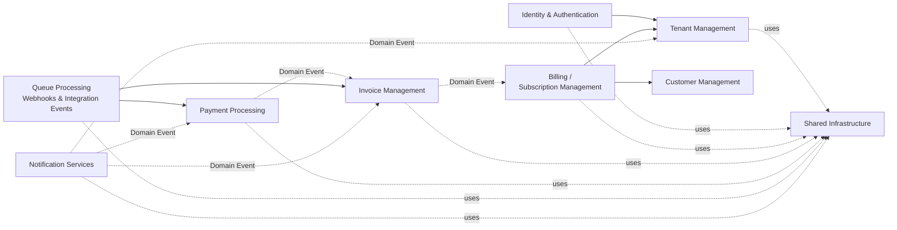

---

## 11. Domain Architecture

### 11.1 Domain philosophy

OmniBill's domain is modeled using bounded contexts and aggregates as the primary organizing concepts, with the transactional consistency boundary of an aggregate treated as sacred: crossing an aggregate boundary inside a single database transaction is explicitly called out as a code smell in the blueprint, to be handled through a domain event instead (blueprint §2.3). The domain layer's Domain Services are pure — no I/O, no framework dependency — so that business rules are the most stable, most testable part of the system, insulated from persistence and transport concerns (blueprint §8).

### 11.2 Core business capabilities

| Capability | Owning bounded context |
|---|---|
| Authenticate and authorize users | Identity & Access |
| Manage tenant identity, settings, and lifecycle | Tenancy |
| Manage subscriptions, plans, prices, and Stripe customer linkage | Billing |
| Generate and manage invoice documents | Invoicing |
| Capture, track, and refund payments | Payments |
| Receive and dispatch integration events (Stripe inbound, tenant-facing outbound) | Webhooks & Integration Events |
| Deliver email/PDF notifications | Notifications |
| Provide logging, metrics, and audit trail | Platform/Observability |

### 11.3 Bounded contexts

The eight bounded contexts and their ownership boundaries were established in Section 10 of this document and remain unchanged here; Section 11 examines the *domain modeling* inside those boundaries — aggregates, entities, value objects, and events — rather than restating the context table.

### 11.4 Aggregate roots and aggregates

Five aggregates are defined in the blueprint (§2.3), each owned by exactly one bounded context and each its own transactional consistency boundary.

#### Tenant Aggregate

| Aspect | Description |
|---|---|
| **Responsibilities** | Represents a tenant's identity, configuration, and plan assignment |
| **Ownership** | Owned by the Tenancy context |
| **Consistency boundary** | Tenant + TenantSettings + TenantPlanAssignment are modified together, in one transaction |
| **Lifecycle** | Explicit finite state machine — Pending → Active → PastDue → Suspended → Cancelled → hard delete after retention window (blueprint §4.1) |
| **Relationships with other aggregates** | Referenced by ID from Subscription, User, and every tenant-owned table via `tenant_id`; never joined into another aggregate's transaction |

#### Subscription Aggregate

| Aspect | Description |
|---|---|
| **Responsibilities** | Represents an active billing relationship — the plan a Customer follows and its line items |
| **Ownership** | Owned by the Billing context |
| **Consistency boundary** | Subscription + SubscriptionItems only — explicitly does **not** include Invoices, since subscriptions change on a human/business timescale while invoices and payments happen on a transactional timescale (blueprint §2.3, Decision) |
| **Lifecycle** | Trialing → Active → PastDue → Cancelled, with self-transitioning plan changes (blueprint §10.2) |
| **Relationships with other aggregates** | Referenced by ID from Invoice; references Customer and Plan by ID; never locked by a payment retry |

#### Invoice Aggregate

| Aspect | Description |
|---|---|
| **Responsibilities** | Represents a billable document and its line items |
| **Ownership** | Owned by the Invoicing context |
| **Consistency boundary** | Invoice + InvoiceLineItems; references Subscription and Customer by ID only, never through a DB-level FK (blueprint §7.1) |
| **Lifecycle** | Draft → Open → Paid / PaymentFailed / Void / Refunded; **immutable once `Open`** — corrections happen only via credit notes or adjustment invoices, never by mutating a finalized invoice (blueprint §10.3) |
| **Relationships with other aggregates** | Referenced by ID from Payment; references Subscription and Customer by ID |

#### Payment Aggregate

| Aspect | Description |
|---|---|
| **Responsibilities** | Represents a payment attempt and its outcome, including refunds |
| **Ownership** | Owned by the Payments context |
| **Consistency boundary** | Payment + PaymentAttempts; references Invoice by ID only |
| **Lifecycle** | State transitions driven exclusively by confirmed, signature-verified Stripe webhook events — never by the synchronous API response alone (blueprint §10.4) |
| **Relationships with other aggregates** | References Invoice by ID; never locks Subscription or Invoice during a retry |

#### Customer Aggregate

| Aspect | Description |
|---|---|
| **Responsibilities** | Represents a tenant's own end customer and their tokenized payment methods |
| **Ownership** | Sits within the Billing context's data surface (see the assumption recorded in §10.3 of this document) |
| **Consistency boundary** | Customer + PaymentMethods — tokenized references only, raw card data is never stored (blueprint §2.3) |
| **Lifecycle** | Not separately state-machined in the blueprint; lifecycle follows the Subscriptions/Invoices that reference it |
| **Relationships with other aggregates** | Referenced by ID from Subscription and Invoice |

### 11.5 Entities

Entities are the non-root objects that live inside an aggregate's consistency boundary and have no independent lifecycle outside it: `TenantSettings` and `TenantPlanAssignment` (within Tenant), `SubscriptionItems` (within Subscription), `InvoiceLineItems` (within Invoice), and `PaymentAttempts` and `PaymentMethods` (within Payment and Customer respectively) (blueprint §2.3).

### 11.6 Value objects

> **Decision (blueprint §21):** A `Money` value object (amount + currency) is used internally throughout the domain, rather than bare integers or floats — even though v1 enforces a single billing currency per tenant at the application rule level. This is a forward-looking seam for the multi-currency capability explicitly deferred as a non-goal (blueprint §1.2), built in now so it does not require a redesign later.

> **Assumption:** `Money` is the only value object the blueprint names explicitly. Other candidate value objects (e.g., a typed price or plan-tier identifier) are plausible but not enumerated as architectural decisions in the blueprint, so this document does not assert them as part of the domain model.

### 11.7 Domain services

Domain Services hold business rules with no I/O and no framework dependency — the layer that answers *"is this allowed / what should happen"* (blueprint §8). They are the fastest-feedback layer in the test pyramid (blueprint §17) precisely because they carry no infrastructure dependency to mock or stub.

### 11.8 Domain events

Domain Events are internal, in-process notifications used for module decoupling and for driving process managers, named in the past tense (e.g., `SubscriptionCancelled`) (blueprint §19). They are distinct from **Integration Events** — the versioned, externally-facing schema used for inbound Stripe webhooks and outbound tenant-facing webhooks — with an explicit translation layer between the two, because internal domain events are free to change shape as refactors happen while integration events are a public contract with tenants' own systems (blueprint §9.1).

Domain Events named explicitly in the blueprint include `SubscriptionCancelled` (naming-convention example, §19) and `TenantSettingsUpdated` (cache-invalidation trigger example, §11). The subscription-cancellation workflow — mark subscription cancelled → generate final prorated invoice → notify customer — is the blueprint's own worked example of a cross-aggregate, event-driven process (blueprint §8.1).

### 11.9 Application services

Application Services orchestrate a use case — load data, invoke domain services, persist, dispatch events — and constitute a module's entire public API; they are named as use cases, not as generic "Services" (e.g., `CancelSubscription`, not `SubscriptionService`), and every public method should read as a sentence when combined with its class, e.g., `CancelSubscription::handle($command)` (blueprint §19). This is the same layer introduced architecturally in Section 8.3 of this document; Section 11 restates it here only to anchor it against the aggregates it orchestrates.

### 11.10 Ownership boundaries

| Aggregate | Owning context | Cross-context references |
|---|---|---|
| Tenant | Tenancy | Referenced by ID everywhere via `tenant_id` |
| Subscription | Billing | References Customer, Plan by ID |
| Invoice | Invoicing | References Subscription, Customer by ID |
| Payment | Payments | References Invoice by ID |
| Customer | Billing (data surface) | Referenced by Subscription, Invoice by ID |

### 11.11 Aggregate consistency rules

> **Decision (blueprint §7.4):** A database transaction never spans more than one aggregate, and never wraps a call to an external service. Cross-aggregate consistency is achieved through the outbox pattern — a domain event row is written in the same transaction as the local write, and a separate dispatcher publishes it to a queue.

This is the single rule that governs every aggregate relationship described in §11.4 above: every "relationship with other aggregates" in this document is a reference-by-ID plus an eventual, event-driven consistency guarantee — never a shared transaction.

### 11.12 Domain invariants

| Invariant | Enforced by |
|---|---|
| No query may return another tenant's data | Global Scope + PostgreSQL RLS (blueprint §3.1) |
| An `Open` invoice's line items are immutable | Invoicing context lifecycle rule; corrections only via credit notes (blueprint §10.3) |
| Payment state is never derived from a synchronous response | Stripe webhook is the sole trigger for Payment state transitions (blueprint §10.4) |
| Prices/amounts are never client-supplied | Server always recomputes from source-of-truth Plan pricing (blueprint §14.1) |
| Financial/audit-relevant entities are never hard-deleted synchronously | Soft-delete via `deleted_at`; hard delete only via scheduled job after retention window (blueprint §7.3) |
| A transaction never spans more than one aggregate | Outbox pattern for cross-aggregate consistency (blueprint §7.4) |

### 11.13 Business lifecycle overview

Three explicit state machines govern the domain's temporal behavior, each already diagrammed at the blueprint level and referenced rather than redrawn here to avoid divergence from the canonical source: the **Tenant lifecycle** (Pending → Active → PastDue → Suspended → Cancelled, blueprint §4.1), the **Subscription lifecycle** (Trialing → Active → PastDue → Cancelled, blueprint §10.2), and the **Invoice lifecycle** (Draft → Open → Paid/PaymentFailed/Void/Refunded, blueprint §10.3). These three lifecycles are loosely coupled by design — a Tenant going `Suspended` does not itself rewrite Subscription or Invoice state; the linkage is a synchronization step carried by domain events, not an implicit derivation (blueprint §4.1, Decision).

### 11.14 Domain diagram

```mermaid
erDiagram
    TENANT ||--o{ USER : "has"
    TENANT ||--o{ SUBSCRIPTION : "has"
    TENANT ||--o{ CUSTOMER : "manages"
    CUSTOMER ||--o{ SUBSCRIPTION : "subscribes to"
    SUBSCRIPTION ||--o{ INVOICE : "generates (by ID reference)"
    INVOICE ||--o{ INVOICE_LINE_ITEM : "contains"
    INVOICE ||--o{ PAYMENT : "settled by (by ID reference)"
    SUBSCRIPTION }o--|| PLAN : "follows"
    PAYMENT }o--|| PAYMENT_METHOD : "uses"
    PAYMENT ||--o{ PAYMENT_ATTEMPT : "records"
    TENANT ||--o{ WEBHOOK_EVENT : "receives"

    TENANT {
        aggregate root Tenant
    }
    SUBSCRIPTION {
        aggregate root Subscription
    }
    INVOICE {
        aggregate root Invoice
    }
    PAYMENT {
        aggregate root Payment
    }
    CUSTOMER {
        aggregate root Customer
    }
```

---

## 12. Multi-Tenancy Architecture

### 12.1 Tenant lifecycle

Tenant state is modeled as an explicit finite state machine rather than derived live from Subscription status, because tenant access control — can this tenant's users log in at all — must be decidable with a single field read, not a join into billing tables on every request (blueprint §4.1, Decision).

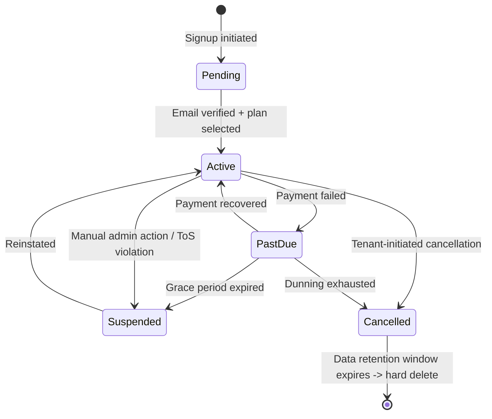

Because tenant state is decoupled from live Subscription status, a synchronization step (via domain event) is required whenever billing state changes tenant-relevant status — this coupling is explicit and event-driven, never an implicit read-time join (blueprint §4.1).

### 12.2 Tenant context

Tenant identity is resolved exactly once per request, at the edge (middleware), and bound as a **request-scoped singleton** (`CurrentTenant`) — it is never re-resolved mid-request (blueprint §3.3, Decision). A single resolution point is auditable and testable; scattering "which tenant am I" checks throughout controllers and services invites drift. The one deliberate exception to "resolved at the HTTP edge" is background jobs, which have no HTTP request and must explicitly carry and re-bind tenant context as a first-class concern, not an afterthought (blueprint §3.3, §7.4, §9.3).

### 12.3 Tenant identification

Tenant identity is resolved by **subdomain first, header fallback** (`X-Tenant-ID`), combined with a Sanctum token for the request's user identity (blueprint §3.3).

### 12.4 Tenant resolution pipeline

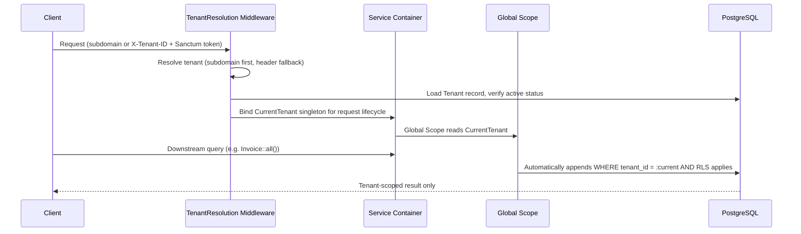

### 12.5 Request isolation

Every downstream query issued during a request is automatically scoped to the resolved tenant by a Laravel **Global Scope**, which appends the `tenant_id` predicate without requiring each call site to remember to do so (blueprint §3.1, §3.3).

### 12.6 Data isolation

> **Decision (blueprint §3.1):** Shared database, shared schema, row-level logical isolation via a mandatory `tenant_id` column on every tenant-owned table, enforced by a Global Scope, with a **second, independent layer** of PostgreSQL Row-Level Security (RLS) policies.

The reasoning for two layers rather than one is explicit in the blueprint: a Global Scope is an application-level control, correct only if every query goes through Eloquent and no code path bypasses it (`withoutGlobalScope`, raw queries, a new query-builder path that forgets the scope). RLS is a database-level control that even a raw SQL query, a rogue migration script, or a future non-Laravel service hitting the same database cannot bypass. Defense in depth here is proportionate to the blast radius of a tenancy bug — cross-tenant financial data exposure (blueprint §3.2).

**Alternatives considered and rejected:** database-per-tenant (best isolation, but migration/ops cost scales linearly with tenant count — untenable at "thousands of tenants"); schema-per-tenant (a middle ground, rejected because connection pooling and migration tooling complexity is high, and PgBouncer transaction pooling fights against `SET search_path`) (blueprint §3.1).

### 12.7 Authorization boundaries

Tenant isolation (this section) and role-and-ownership authorization are deliberately kept as two separate layers: the Global Scope answers "which tenant's data," while Laravel Policies answer "which role can do what" within that tenant. This separation keeps each layer simple and independently testable rather than duplicating tenancy checks into every Policy method (blueprint §5.2). Full treatment of the authorization model is in Section 13 of this document.

### 12.8 Membership model

Roles are tenant-scoped except `SUPER_ADMIN`, which is platform-scoped and cannot be assigned by tenant admins (blueprint §4.3).

| Role | Scope | Can manage billing | Can manage users | Can view invoices |
|---|---|---|---|---|
| `SUPER_ADMIN` | Platform | Any tenant | Any tenant | Any tenant |
| `TENANT_ADMIN` | Single tenant | Own tenant | Own tenant | Own tenant |
| `TENANT_BILLING_MANAGER` | Single tenant | Own tenant | No | Own tenant |
| `TENANT_USER` | Single tenant | No | No | Own submitted only |

> **Decision (blueprint §4.3):** `TENANT_BILLING_MANAGER` was added beyond an original two-tier tenant role model, because real organizations separate "who can add teammates" from "who can see invoices/change cards" (finance vs. ops) — baking this in now avoids a breaking RBAC migration later. The trade-off accepted is slightly more upfront policy complexity.

### 12.9 Cross-tenant protection

`SUPER_ADMIN` operations run through a **separate, explicitly-named code path** (`WithoutTenantScope`) — never through silently disabling the Global Scope inline. Every such bypass is logged to the audit trail with the operator's identity and reason (blueprint §3.4).

### 12.10 Tenant ownership model

Every tenant-owned table carries a mandatory `tenant_id` column (blueprint §3.1). Ownership at the aggregate level was established in Section 11.10 of this document; the tenancy layer is orthogonal to it — `tenant_id` scoping applies uniformly across all five aggregates (Tenant itself, Subscription, Invoice, Payment, Customer) rather than being a per-aggregate decision.

### 12.11 Failure scenarios

| Scenario | Behavior |
|---|---|
| Sanctum token invalid | 401 Unauthorized, before tenant resolution is attempted (blueprint §5.3) |
| Tenant resolved but inactive/suspended | 403 Tenant Suspended (blueprint §5.3) |
| A background job runs without re-binding tenant context | Prevented structurally — every tenant-related job extends a `TenantAwareJob` base class that serializes `tenant_id` in the payload and re-binds `CurrentTenant` at the start of execution; this is a mandatory convention, not an optional check (blueprint §9.3) |
| A tenancy bug bypasses the Global Scope | Contained by the independent RLS layer at the database level, which cannot be bypassed by application-level mistakes (blueprint §3.2) |

### 12.12 Security considerations

Cross-tenant data leakage is identified in the blueprint's threat model as a named threat, with Global Scope + RLS as its primary mitigation (blueprint §14.1). `SUPER_ADMIN` abuse is a separately named threat, mitigated by mandatory audit logging of every cross-tenant scope bypass with operator identity and justification, plus a requirement that sensitive super-admin actions require re-authentication (blueprint §14.1, §3.4).

### 12.13 Future horizontal scaling considerations

The application tier's statelessness (no local session/file state on web or worker nodes) is what allows horizontal scaling of tenant-serving capacity to be a configuration change rather than an architecture change (blueprint §13).

### 12.14 Future sharding considerations

> **Decision (blueprint §13, Revisit when):** Database scaling is staged — vertical scaling first, then read replicas for read-heavy paths, then partitioning — rather than designing for sharding from day one. The trigger for tenant-based partitioning/sharding is write throughput on the primary approaching saturation even after read-replica offload and query optimization. The `tenant_id`-first schema design already positions the data for this transition without requiring a redesign at that time.

Separately, a tenant with a genuine data-residency or compliance requirement for physical isolation is treated as a **future exception path**, not the default: tenant resolution is already abstracted behind middleware, so promoting a single tenant to a dedicated database is an additive change rather than a rearchitecture (blueprint §3.1, §21).

---

## 13. Authentication & Authorization Architecture

### 13.1 Authentication philosophy

OmniBill is an API-first product — a SPA/dashboard plus programmatic API consumers — which is why authentication is built around lightweight, statelessly-verifiable tokens rather than a full OAuth2 authorization server (blueprint §5.1).

### 13.2 Sanctum architecture

> **Decision (blueprint §5.1):** Laravel Sanctum, token-based, **one token per (user, device/client) pair**, with explicit token abilities (scopes) and server-side revocation.
> **Why:** Sanctum provides that statelessly-verifiable token model without the operational overhead of a full OAuth2 server (Passport), which is unnecessary until third-party OAuth app integrations are a real requirement.
> **Alternatives considered:** Laravel Passport (OAuth2) for full third-party app support; stateless JWT.
> **Trade-off accepted:** No standards-based OAuth2 flows (authorization code grant, etc.) at launch — acceptable since v1 has no third-party developer ecosystem.

### 13.3 Token lifecycle

Each token is scoped to a specific (user, device/client) pair and carries explicit abilities rather than being a single all-or-nothing credential (blueprint §5.1). Revocation is **explicit and centralized**: a `TENANT_ADMIN` suspending a user, a password reset, or a tenant suspension must revoke all of that user's/tenant's tokens in one operation, not rely on token expiry alone (blueprint §5.1). Sensitive scopes carry short-lived tokens as an additional mitigation against token theft/replay (blueprint §14.1).

### 13.4 Login flow

> **Assumption:** The blueprint does not include a dedicated login-flow diagram or endpoint specification — it establishes the token model (§5.1) and the composite request lifecycle *after* a token exists (§5.3). The description below stays at the level the blueprint actually specifies: a credential exchange that results in a Sanctum token scoped to a (user, device) pair, with no implementation-level detail (endpoint shape, credential type) asserted beyond that.

Conceptually, authentication issues a Sanctum token bound to the authenticating user and their device/client, with abilities appropriate to that user's role — the same role model described in Section 12.8. From that point forward, every request the client makes is evaluated through the request authentication pipeline described in §13.6.

### 13.5 Logout flow

Logout is modeled as token revocation (§13.3): the presented token's server-side record is revoked, ending its validity immediately rather than waiting for natural expiry. This is the same centralized revocation mechanism used for administrative actions (suspension, password reset), not a separate code path (blueprint §5.1).

### 13.6 Token revocation

Revocation is treated as a first-class operation because relying on expiry alone would leave a window where a suspended user or a stolen token remains valid. The blueprint requires that suspending a user, resetting a password, or suspending a tenant each revoke *all* of the affected tokens in one operation (blueprint §5.1).

### 13.7 Request authentication pipeline

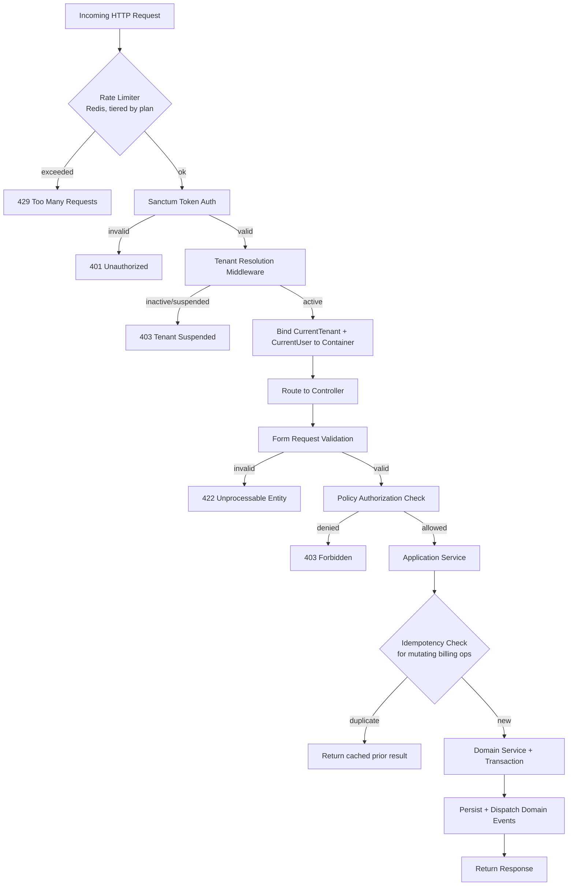

This diagram is the blueprint's own composite request lifecycle (blueprint §5.3) and is reproduced here because Section 13 is where authentication and authorization are the primary subject; it should not be re-derived differently in later sections of this SAD.

### 13.8 Authorization model

> **Decision (blueprint §5.2):** Two-layer authorization: (1) the Global Scope guarantees tenant-boundary isolation at the query level (Section 12 of this document), and (2) Laravel Policies express **role-and-ownership** rules within a tenant (e.g., "`TENANT_USER` can view only invoices they created").
> **Why:** Separating "which tenant's data" from "which role can do what" keeps each layer simple and independently testable; mixing tenancy checks into every Policy method would duplicate logic across dozens of policies.
> **Trade-off accepted:** Two concepts to reason about instead of one, mitigated by a shared base Policy class that all context-specific policies extend, so tenancy is never re-implemented per policy.

### 13.9 RBAC

Role-based access control is tenant-scoped for all roles except `SUPER_ADMIN` (platform-scoped). The role table and its capability matrix were established in Section 12.8 of this document and govern every Policy decision described below.

### 13.10 Policies

Policies express role-and-ownership rules — the second authorization layer described in §13.8 — and all extend a shared base Policy class so that tenancy scoping is never re-implemented per policy (blueprint §5.2).

### 13.11 Gates

> **Assumption:** The blueprint does not name Laravel Gates as a distinct architectural mechanism separate from Policies. Its authorization model is described exclusively in terms of the two layers in §13.8 (Global Scope + Policies). This document does not assert a separate Gate-based mechanism, to avoid introducing an architectural element the blueprint does not define.

### 13.12 Middleware responsibilities

| Middleware | Responsibility |
|---|---|
| Rate limiter | Redis-backed, sliding-window, tiered by tenant plan — rejects with 429 before authentication is attempted (blueprint §5.3, §12.1) |
| Sanctum token authentication | Validates the presented token; rejects with 401 before tenant resolution is attempted (blueprint §5.3) |
| Tenant resolution | Resolves tenant identity once, verifies active status, binds `CurrentTenant`; rejects with 403 if inactive/suspended (blueprint §3.3, §5.3) |

### 13.13 Permission evaluation

Per the request pipeline in §13.7, permission evaluation happens in a fixed order: rate limit → authentication → tenant status → form validation → Policy authorization → idempotency check → Domain Service execution. Each stage can short-circuit the request with a specific, distinct status code, so a denial is always attributable to a specific stage rather than a generic failure (blueprint §5.3).

### 13.14 Tenant-aware authorization

Every Policy decision is implicitly tenant-scoped because it only ever evaluates data that has already passed through the Global Scope — a Policy is never presented with another tenant's record to approve or deny in the first place (blueprint §3.1, §5.2). This is the practical consequence of keeping the two authorization layers separate, described architecturally in §13.8.

### 13.15 Security boundaries

| Threat | Mitigation | Blueprint reference |
|---|---|---|
| Token theft / replay | Sanctum token abilities, short-lived tokens for sensitive scopes, revocation on suspicious activity | §14.1 |
| Privilege escalation within a tenant | Policies check role AND ownership; role changes require `TENANT_ADMIN` and are audit-logged | §14.1 |
| `SUPER_ADMIN` abuse | All cross-tenant scope bypasses logged with operator identity + justification; sensitive super-admin actions require re-authentication | §14.1, §3.4 |

### 13.16 Future extensibility

> **Decision (blueprint §5.1, Revisit when):** Laravel Passport (OAuth2) is layered in **alongside**, not instead of, Sanctum for first-party clients, at the point OmniBill needs to let external developers build apps against tenant data with delegated, revocable, scoped OAuth consent — a marketplace/app-store moment. This is the same extensibility seam referenced in the blueprint's future-extensibility mapping (blueprint §21).

---

## 14. Data Architecture

### 14.1 Data ownership

Each bounded context owns its own tables, mirroring the module ownership boundaries established in Sections 10 and 11 of this document; no module reaches into another module's tables directly (blueprint §2.1).

### 14.2 Persistence philosophy

> **Decision (blueprint §11):** PostgreSQL is the single source of truth for all business and financial state. Redis is used for read-heavy, low-volatility data (cache-aside) and infrastructure concerns (queues, rate limits, idempotency keys) — **never** for financial transactional state. Invoice/payment status is always read from PostgreSQL.
> **Why:** Caching billing state risks serving stale "unpaid" status after a payment succeeded, or vice versa — an unacceptable class of bug in a billing product.
> **Trade-off accepted:** Higher database read load for invoice/payment status than a fully-cached approach would produce, mitigated by read replicas (§13) rather than by caching correctness-critical data.

### 14.3 Primary key strategy

> **Decision (blueprint §7.2):** UUIDv7 (time-ordered UUID) primary keys on all tenant-owned tables, not auto-incrementing integers.
> **Why:** UUIDs prevent enumeration attacks against a multi-tenant API — sequential IDs would let one tenant guess another's resource IDs — and are safe to generate client-side or in distributed workers without a central sequence. UUIDv7 specifically preserves rough time-ordering, avoiding the B-tree index fragmentation that plain random UUIDv4 causes at scale.
> **Alternatives considered:** Auto-increment integers with a separate public-facing "external ID"; UUIDv4.
> **Trade-off accepted:** Slightly larger index size than integers; negligible at OmniBill's target scale and outweighed by the security property.

> **Note on terminology:** This section is titled "ULID strategy" in the SAD outline requested for this part. The blueprint's canonical decision (§7.2) specifies **UUIDv7**, not ULID. The two are related time-ordered identifier schemes but are not the same specification, and the blueprint does not mention ULID anywhere. To avoid contradicting the canonical source, this document documents the primary-key strategy exactly as the blueprint defines it — UUIDv7 — rather than substituting ULID.

### 14.4 Foreign key philosophy

> **Decision (blueprint §7.1):** Foreign keys are enforced at the database level for **within-aggregate** relationships (e.g., `invoice_line_items.invoice_id`), and stored as **plain indexed UUID columns without a DB-level FK constraint** for **cross-aggregate** references (e.g., `invoices.subscription_id`).
> **Why:** Within an aggregate, referential integrity should be impossible to violate — the database is the right enforcement point. Across aggregates, a hard FK constraint couples migration order and deletion order between bounded contexts, fighting the module-independence goal (Section 8.5 of this document).
> **Trade-off accepted:** Cross-aggregate orphan records are possible in theory (e.g., a bug leaves an invoice pointing at a deleted subscription); mitigated by soft-delete-only policies on referenced aggregates (§14.6) and a nightly integrity-check job that alerts on orphans rather than silently allowing them.

### 14.5 Restrict vs. cascade rationale

> **Assumption:** The blueprint does not record an explicit `ON DELETE RESTRICT` vs. `ON DELETE CASCADE` decision as a named ADR. The following is derived directly from two decisions the blueprint *does* make (§7.1 foreign key philosophy and §7.3 delete strategy), not asserted as an independent new decision.

Because cross-aggregate references carry no DB-level FK constraint at all (§14.4), cascade/restrict behavior is only a meaningful question **within** an aggregate — e.g., between an Invoice and its InvoiceLineItems. There, the blueprint's soft-delete-only policy on financial entities (§14.6) means a "delete" is never a hard, cascading row removal in the request path in the first place; it is a status flag. The only place a true cascading hard delete occurs is the scheduled background job that removes a tenant's data after the retention window expires, which the blueprint explicitly describes as cascading through owned data as a background operation, never a synchronous request-time cascade (blueprint §4.2).

### 14.6 Delete strategy

> **Decision (blueprint §7.3):** Soft deletes (via a `deleted_at` timestamp) on every business entity that has financial or audit relevance (Tenant, Subscription, Invoice, Payment, Customer). Hard deletes only via scheduled background jobs after retention windows, and only for entities with no legal retention requirement (e.g., expired idempotency keys, stale webhook event logs).
> **Why:** Billing systems are audited; "we deleted the invoice" is rarely an acceptable answer to an auditor or a disputing customer.
> **Trade-off accepted:** Every query must exclude soft-deleted rows (handled by SoftDeletes composing with the tenancy Global Scope); table growth over time, mitigated by the archival strategy referenced in the blueprint's monitoring section.

The tenant-level instance of this same policy was already introduced in Section 12.1 of this document: soft-delete (status = Cancelled) with a defined retention window (default 30 days, configurable per compliance need), followed by a scheduled hard-delete job (blueprint §4.2).

### 14.7 Transaction philosophy

> **Decision (blueprint §7.4):** A database transaction never spans more than one aggregate, and never wraps a call to an external service (Stripe API, email provider). Cross-aggregate consistency is achieved via the **outbox pattern**: within the same transaction as a local write, a domain event row is written to an `outbox_events` table; a separate dispatcher process reads the outbox and publishes to the queue.

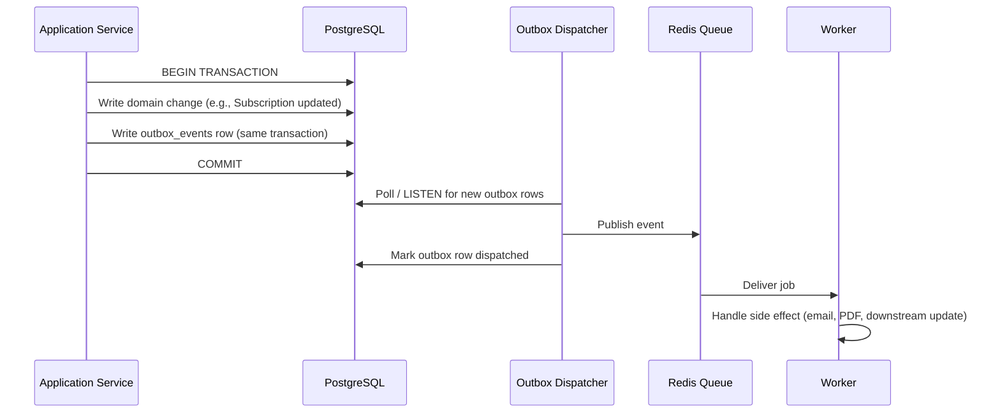

**Why:** Wrapping a Stripe API call inside a database transaction is a classic reliability bug — if the commit fails after Stripe already charged the card, or the transaction holds a row lock for the duration of a slow network call, both correctness and throughput suffer. The outbox pattern guarantees "the event is queued if and only if the local write committed," without needing a distributed transaction. **Trade-off accepted:** an extra table and a lightweight dispatcher process, and slight latency (typically sub-second) between "event happened" and "event dispatched" (blueprint §7.4).

### 14.8 Consistency model

The data architecture is **strongly consistent within an aggregate** (one transaction, one commit) and **eventually consistent across aggregates** (outbox → queue → worker). This is the same distinction drawn at the domain level in Section 11.11 of this document, restated here as a property of the persistence layer rather than the domain model.

### 14.9 Migration philosophy

> **Decision (blueprint §18):** Database migrations are always backward-compatible with the currently-deployed code — additive-first: add new nullable columns, backfill, then a later deploy removes old ones. This is what enables zero-downtime deploys with rolling worker/web node restarts.

Every merge to the main branch runs a migration dry-run against a disposable database as part of the CI pipeline (blueprint §18).

### 14.10 Naming conventions

> **Assumption:** The blueprint's explicit naming-convention decision (§19) covers Domain Events (past tense, e.g., `SubscriptionCancelled`) and Application Services (named as use cases, e.g., `CancelSubscription`) — these are code-level, not database-level, naming rules. The blueprint does not record a separate, formal table/column naming-convention ADR. Table names that do appear in the blueprint (`outbox_events`, `webhook_events`) are used consistently wherever mentioned and are treated here as established precedent to follow, not as a documented naming-standard decision in their own right.

### 14.11 Indexing philosophy

The blueprint's one explicit indexing-relevant decision is the choice of UUIDv7 over UUIDv4 specifically to avoid B-tree index fragmentation at scale, accepting a slightly larger index footprint than auto-increment integers as a known and deliberate trade-off (blueprint §7.2, §14.3). Beyond primary-key indexing, the blueprint's only other index-adjacent guidance is at the query-performance level, not the schema level: no N+1 queries are permitted on list endpoints, enforced via code review and CI query-count assertions (blueprint §13).

### 14.12 Soft delete strategy

Covered fully in §14.6 above; restated here only to note that it composes with tenancy: every query must exclude soft-deleted rows, and this exclusion is handled by the same mechanism (SoftDeletes composing with the Global Scope) that handles tenant isolation, rather than being a separate concern layered on top (blueprint §7.3).

### 14.13 Historical data preservation

Financial and audit-relevant history is preserved through two independent mechanisms: soft-delete-only policy on financial entities (§14.6), and a dedicated, **append-only audit log table** — independent of general structured logs — recording every state-changing action on Tenant, Subscription, Invoice, Payment, and RBAC changes, so it survives ordinary log-retention rotation and remains queryable for compliance requests (blueprint §16).

### 14.14 Data integrity

Because cross-aggregate references carry no DB-level FK constraint (§14.4), integrity across aggregates is guaranteed by domain events plus a **nightly integrity-check job** that alerts on orphaned cross-aggregate references (e.g., an invoice pointing at a deleted subscription) rather than silently allowing them (blueprint §7.1).

### 14.15 Database scalability considerations

> **Decision (blueprint §13):** PostgreSQL scales vertically first, then via read replicas for read-heavy reporting paths, with the primary reserved for writes and transactionally-consistent reads. Sharding is explicitly not designed for from day one.
> **Why:** Statelessness on the application tier makes horizontal compute scaling a configuration change; database scaling is deliberately staged rather than jumping straight to sharding, which is premature at target scale.
> **Trade-off accepted:** A hard scaling ceiling exists before sharding becomes necessary — acceptable because reaching that ceiling is itself a signal of success, and a good problem to revisit with real usage data rather than speculation.

### 14.16 Future partitioning considerations

The trigger for tenant-based partitioning/sharding is write throughput on the primary approaching saturation even after read-replica offload and query optimization — and the `tenant_id`-first schema design already positions the data for that transition (blueprint §13, Revisit when). This is the same forward-looking property referenced in Section 12.14 of this document; it is recorded once here as the data-architecture view of the identical decision.

---

## 15. Integration Architecture

### 15.1 Integration philosophy

OmniBill treats every external integration as a boundary to be defended, not a trusted extension of the system: no external response is treated as final for business state until it has been independently confirmed, no external call is allowed to hold open a database transaction, and every external side effect is dispatched asynchronously so a slow or failing third party cannot degrade the request thread (blueprint §1.1, principle 3; §7.4; §10.4). This philosophy is the same one already established architecturally in Sections 7 and 8 of this document; Section 15 examines it specifically through the lens of OmniBill's concrete integrations.

### 15.2 External system boundaries

The external systems and their trust posture were established in Section 7.3 of this document (Stripe, email provider, object storage). Section 15 describes *how* OmniBill integrates with each, not *what* they are.

### 15.3 Stripe integration

| Aspect | Description |
|---|---|
| **Purpose** | Payment processing and subscription/customer primitives |
| **Ownership** | The Billing context owns the integration boundary; no other module calls Stripe or Cashier directly (blueprint §10.1) |
| **Communication model** | Bidirectional — synchronous outbound calls to initiate an action (e.g., create a payment intent); asynchronous inbound webhooks that actually confirm outcome (blueprint §10.4) |
| **Failure scenarios** | Synchronous call fails or times out; webhook delivery is delayed, duplicated, or arrives out of order (3D Secure, bank delays, retries) |
| **Recovery strategy** | Local state never assumes success from the synchronous response alone; Stripe's own retry behavior on webhooks, combined with OmniBill's idempotent persist-then-process pipeline (§15.6), absorbs delivery failures without data loss |
| **Security implications** | Mandatory webhook signature verification against Stripe's signing secret before any processing; raw card data never reaches OmniBill's servers (blueprint §14.1) |

> **Decision (blueprint §10.4):** OmniBill treats Stripe as the source of truth for payment state, never deriving payment success from the synchronous API response alone. The synchronous response only initiates the attempt; the webhook is what actually transitions local state.
> **Why:** Payment processing is inherently asynchronous — treating the synchronous HTTP response as final is a well-known correctness bug in naive Stripe integrations.
> **Trade-off accepted:** A short window where local state says "processing" rather than a final state — this is the correct reflection of reality, not a flaw to hide.

### 15.4 Laravel Cashier architecture

> **Decision (blueprint §10.1):** Laravel Cashier is used strictly as a **thin adapter to Stripe's subscription/customer primitives**, wrapped behind OmniBill's own Billing Application Service. No controller or other module ever calls Cashier directly.
> **Why:** Cashier's conventions are convenient but couple business code to Cashier's API surface; wrapping it means a future migration (different payment processor, or a Cashier breaking change) touches one adapter layer, not the whole codebase.
> **Trade-off accepted:** An extra abstraction layer over Cashier's already-abstracted API — justified given billing is the product's core differentiator and must remain swappable/extensible (e.g., a second payment processor for regional coverage later).

### 15.5 Payment gateway interaction

Payment gateway interaction is scoped entirely within the boundary described in §15.3–§15.4: the Payments context is the only consumer of payment outcome, and it receives that outcome exclusively through the webhook pipeline (§15.6) rather than by querying Stripe synchronously for status. This keeps gateway interaction consistent with the aggregate boundary established in Section 11.4 — Payment state transitions are event-driven, never polled.

### 15.6 Webhook architecture

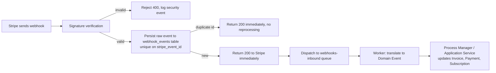

> **Decision (blueprint §10.4):** Every inbound Stripe event is persisted (with its Stripe event ID as a unique constraint) *before* business processing, and the HTTP 200 is returned to Stripe immediately after persistence — actual processing happens asynchronously in a worker.
> **Why:** Stripe retries webhooks aggressively on non-200 responses or timeouts. Persisting first with a unique constraint makes the pipeline naturally idempotent, and responding fast prevents Stripe from perceiving OmniBill as unhealthy during a traffic spike.
> **Trade-off accepted:** A processing delay between "Stripe says it happened" and "OmniBill's local state reflects it," bounded by the webhook-processing SLO (P95 < 60 seconds, blueprint §16).

Outbound webhooks — OmniBill's own Integration Events delivered to a tenant's systems — are handled by a dedicated `webhooks-outbound` queue, kept structurally distinct from the inbound `webhooks-inbound` queue so that a burst of outbound deliveries cannot starve inbound Stripe event processing, or vice versa (blueprint §9.2).

### 15.7 Email architecture

Email is owned by the Notifications context and is purely event-reactive: it subscribes to Domain Events raised by Invoicing, Payments, and Tenancy rather than being called directly by any of them, and it has no dependents of its own — a failure in email delivery must never block or corrupt billing state (Section 10.8 of this document; blueprint §1.1, principle 3). Delivery is dispatched through the `notifications` queue, kept separate from `billing-critical` so a burst of email jobs cannot starve time-sensitive payment-state jobs (blueprint §9.2).

### 15.8 Queue-based integrations

Every asynchronous integration in OmniBill — Stripe webhook processing, outbound webhook delivery, email, PDF generation — is mediated by the same named-queue architecture rather than each integration inventing its own async mechanism (blueprint §9.2). This uniformity is deliberate: it is what allows worker pools to be scaled and alerted on independently per integration's business criticality, and it is the mechanism through which the outbox pattern (Section 14.7 of this document) guarantees dispatch.

### 15.9 Future third-party integrations

| Future integration | How today's architecture already supports it |
|---|---|
| A second payment processor (regional coverage) | Cashier/Stripe is already isolated behind the Billing Application Service, not called directly from business code (blueprint §10.1, §21) |
| Third-party developer ecosystem / OAuth apps | Sanctum today, Passport layered alongside later; API versioning policy already anticipates external consumers (blueprint §5.1, §6, §21) |

### 15.10 Integration security

| Concern | Mitigation | Reference |
|---|---|---|
| Webhook spoofing | Mandatory signature verification against Stripe's signing secret; unsigned/invalid requests rejected before any processing | blueprint §14.1 |
| Amount tampering via a client-controlled integration path | Prices/amounts are never accepted from client input; server always recomputes from source-of-truth Plan pricing | blueprint §14.1 |
| Raw card data exposure | Card data never touches OmniBill's servers — client-side tokenization via Stripe Elements/Payment Element | blueprint §14.1 |
| Secrets used by integrations | All credentials (Stripe keys, etc.) via environment/secret manager, never committed, never logged (structured logger carries a redaction list) | blueprint §14.2, §15 |

### 15.11 Retry strategy

Every queued job — including the ones that mediate integrations — is designed to be **idempotent and safely retryable**, checking current state before acting rather than assuming it hasn't run before, with exponential backoff and a dead-letter queue (`*-failed`) for jobs that exhaust retries. A sustained non-zero failure rate on `billing-critical` pages an operator rather than failing silently (blueprint §9.2, §16).

### 15.12 Failure handling

Infrastructure exceptions arising from an integration (Stripe API errors, DB connection issues) are caught at the Application Service boundary, logged with full context, mapped to a 5xx/503 response as appropriate, and retried only where the operation is idempotent (blueprint §15).

### 15.13 Idempotency

Idempotency in the integration layer operates at two points: **inbound**, via the `stripe_event_id` unique constraint that makes duplicate webhook delivery naturally idempotent (§15.6), and **outbound/client-facing**, via the client-supplied `Idempotency-Key` header required on all mutating billing endpoints, stored `(tenant_id, key) -> response` in Redis for 24 hours with a durable Postgres audit row for anything that touched money (blueprint §12.2).

### 15.14 Integration contracts

Integration Events — the externally-facing schema used for both inbound Stripe webhooks and outbound tenant-facing webhooks — are kept structurally distinct from internal Domain Events, with an explicit translation layer at the boundary, because Integration Events are a public contract with external systems and must be versioned and backward-compatible, while Domain Events are free to change shape as internal refactors happen (blueprint §9.1). The REST API itself follows the same contract discipline: breaking changes require a new version path, additive changes do not, and deprecated versions carry a published sunset date communicated via response headers (blueprint §6).

### 15.15 Dependency management

OmniBill's only hard, business-critical external dependency is Stripe; the email provider and object storage are supporting dependencies whose failure degrades a specific capability (notifications, document retrieval) without corrupting billing correctness, because neither is ever treated as a source of business truth (Section 7.3 of this document). This asymmetry — one dependency that is load-bearing for correctness, others that are not — is what justifies the extra architectural care given specifically to the Stripe integration boundary (§15.3–§15.6) relative to the others.

---

## 16. Infrastructure Architecture

### 16.1 Infrastructure philosophy

Infrastructure choices follow the same "boring, observable, operable" principle that governs the application architecture (blueprint §1.1): stateless compute that scales as a configuration change, staged rather than speculative database scaling, and dev/prod parity through promoting the same container images across environments rather than maintaining environment-specific build paths (blueprint §13, §20).

### 16.2 Deployment topology

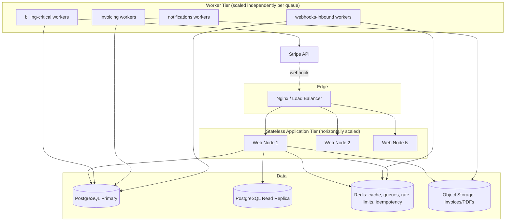

This diagram is the blueprint's own deployment topology (blueprint §20), reproduced here as the canonical infrastructure reference for this SAD; it should not be redrawn differently elsewhere in this document.

### 16.3 Docker Compose architecture

> **Decision (blueprint §20):** Containerized via Docker Compose for local/staging parity — web, worker, PostgreSQL, Redis, and a Mailhog-equivalent for local email testing, defined as services. Production deployment targets the **same images** promoted through environments, not environment-specific Dockerfiles, to guarantee dev/prod parity.
> **Why:** Environment-specific Dockerfiles are a common source of "works locally, breaks in prod" bugs; promoting the same image removes that class of failure entirely.

### 16.4 Nginx

Nginx (or an equivalent load balancer) sits at the edge, distributing requests across the stateless web tier and receiving Stripe's inbound webhook calls before they reach the application (blueprint §20). It is the single entry point through which every actor and external system described in Section 7 of this document reaches OmniBill.

### 16.5 PHP runtime

> **Assumption:** The blueprint specifies Laravel 13 as the application framework (blueprint §1.1) but does not name a specific PHP runtime version, process manager (e.g., PHP-FPM vs. a long-running application server), or web-node process model as an architectural decision. This document does not assert runtime-level specifics beyond what the blueprint states, since that level of detail belongs to the HLD/LLD.

### 16.6 PostgreSQL

PostgreSQL is deployed as a primary plus at least one read replica, with the primary reserved for writes and transactionally-consistent reads, and the replica absorbing read-heavy reporting paths (blueprint §13, §20). This is the same staged-scaling posture described in Section 14.15 of this document; Section 16 documents it as a deployed topology rather than a scaling *policy*.

### 16.7 Redis

Redis serves four distinct roles in the deployed infrastructure: cache (cache-aside, non-financial data only), queue transport (named queues per §15.8), rate-limit counters (§12.1 of the blueprint), and idempotency key storage (§12.2 of the blueprint) — all explicitly excluding financial transactional state, which remains PostgreSQL's responsibility alone (blueprint §11, §20; Section 14.2 of this document).

### 16.8 Queue workers

Worker tiers are scaled **independently per named queue**, not as a single undifferentiated worker pool, because business criticality differs sharply between queues — `billing-critical` warrants more workers and far more aggressive alerting than `notifications` (blueprint §9.2, §16, §20).

### 16.9 Scheduler

> **Assumption:** The blueprint refers to several scheduled background operations — the tenant hard-delete job (§4.2), the nightly cross-aggregate integrity-check job (§7.1), and expired idempotency-key/webhook-log cleanup (§7.3) — without naming a single "Scheduler" component or process as a distinct architectural decision. This document treats these as scheduled background jobs consistent with the worker tier described in §16.8, rather than asserting a separately named scheduler subsystem the blueprint does not define.

### 16.10 Filesystem

Generated PDFs (invoices, receipts) are written to object storage via Laravel's Filesystem abstraction rather than to local disk on any node, which is a direct consequence of the application tier's statelessness requirement — no file state may live on a web or worker node (blueprint §13, §20).

### 16.11 Environment management

Docker Compose provides local/staging parity as described in §16.3; production is not a separately built environment but the same promoted image, which is the architectural mechanism that guarantees environment parity rather than a policy enforced by convention alone (blueprint §20).

### 16.12 Configuration management

> **Assumption:** The blueprint does not describe a dedicated configuration-management architecture beyond the secret-management decision in §16.13 below and the general dev/prod parity principle in §16.3. Configuration handling beyond secrets is not asserted here as a distinct architectural decision.

### 16.13 Secret management

> **Decision (blueprint §14.2):** All credentials (Stripe keys, database credentials) are supplied via environment or a secret manager — never committed to source control, never logged. The structured logger carries a redaction list specifically to prevent secret leakage into logs (blueprint §15).
> **Why:** Secrets exposure is named explicitly as a threat in the blueprint's threat model (§14.1), and this is its primary mitigation.

### 16.14 Container responsibilities

| Container/service | Responsibility |
|---|---|
| Web node | Serves the stateless application tier — handles synchronous HTTP requests only |
| Worker node (per named queue) | Executes asynchronous jobs for its assigned queue; scaled independently of other queues |
| PostgreSQL | System of record for all business and financial state |
| Redis | Cache, queue transport, rate limiting, idempotency storage |
| Local email testing service (Mailhog-equivalent) | Development/staging-only email capture, not present in production |

### 16.15 Health checks

> **Assumption:** The blueprint does not define an explicit health-check architecture (endpoints, liveness/readiness semantics, or probe cadence) as a named decision. Operational health visibility is instead addressed through the monitoring decisions in blueprint §16 (Pulse dashboards, queue-depth alerting, failed-job-rate alerting) rather than through a dedicated health-check subsystem. This document does not invent health-check specifics beyond that.

### 16.16 Service boundaries

Infrastructure service boundaries mirror the architectural boundaries established earlier in this document: the web tier is stateless and horizontally scalable (Section 8.8); worker tiers are scoped one-to-one with named queues (Section 10.7); PostgreSQL and Redis are each scoped to a single, non-overlapping responsibility (system of record vs. cache/transport/rate-limiting), per the persistence philosophy in Section 14.2.

### 16.17 Future cloud deployment considerations

Because the production topology is defined as the same container images promoted through environments (§16.3, §16.11), moving to a managed cloud deployment target is a platform/orchestration change, not an application-architecture change — the stateless web/worker tiers, the staged database-scaling posture (Section 14.15), and the tenant-based partitioning trigger (Section 14.16) all remain valid regardless of the underlying cloud substrate (blueprint §13, §20, §21).

---

## 17. Runtime Architecture

### 17.1 Application startup

> **Assumption:** The blueprint does not describe application bootstrapping (service container binding order, module registration sequence, or startup health verification) as a distinct architectural decision. This section begins, consistent with the blueprint's own level of detail, at the point a request or job enters the running system, rather than asserting startup-sequence specifics the blueprint does not define.

### 17.2 Request lifecycle

The request lifecycle is governed by the composite pipeline already established in Section 13.7 of this document (blueprint §5.3): rate limiting → Sanctum authentication → tenant resolution → authorization → idempotency check → Domain Service execution within a transaction → response. Section 17 examines this pipeline from the runtime perspective — what is happening to shared state at each stage — rather than restating the authorization concerns already covered in Section 13.

### 17.3 Middleware pipeline

| Stage | Runtime effect |
|---|---|
| Rate limiter | Reads/writes a Redis-backed sliding-window counter keyed by tenant and plan tier; no application state is touched (blueprint §12.1) |
| Sanctum authentication | Resolves the request's `CurrentUser`; no tenant context yet exists at this point (blueprint §5.3) |
| Tenant resolution | Loads the Tenant record, verifies active status, and binds `CurrentTenant` as a request-scoped singleton for the remainder of the request (blueprint §3.3) |

### 17.4 Tenant resolution flow

Tenant resolution happens exactly once per request, at the edge, and is never re-resolved mid-request — the full sequence was diagrammed in Section 12.4 of this document (blueprint §3.3). At runtime, this means every downstream Domain Service and Application Service call within the same request executes against a single, fixed `CurrentTenant` binding; there is no runtime path by which a request can observe two different tenant contexts.

### 17.5 Authentication flow

Covered architecturally in Section 13.2–13.7 of this document. At runtime, authentication resolves before tenant resolution in the pipeline (§17.3), meaning an invalid token short-circuits the request with a 401 before any tenant-scoped work — including rate-limit accounting beyond the initial check — occurs (blueprint §5.3).

### 17.6 Authorization flow

Covered architecturally in Section 13.8–13.14. At runtime, Policy evaluation happens *after* tenant resolution and *after* form validation, meaning a Policy is only ever invoked against data that has already been tenant-scoped by the Global Scope (blueprint §5.3, §3.1).

### 17.7 API request lifecycle

For a mutating billing operation specifically, the runtime path extends the general request lifecycle (§17.2) with an idempotency check immediately before Domain Service execution: a duplicate `Idempotency-Key` within the 24-hour window returns the previously cached response without re-executing any Domain Service logic, and without opening a new database transaction (blueprint §12.2, §5.3).

### 17.8 Queue lifecycle

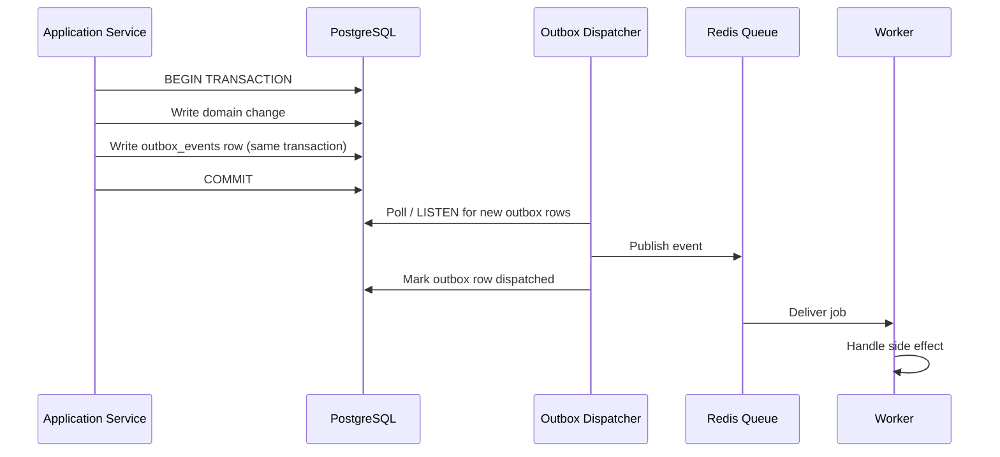

At runtime, the outbox dispatcher is a continuously running process independent of any web request — its cycle (poll/LISTEN → publish → mark dispatched) proceeds regardless of request volume, which is what decouples "the event happened" from "the event was dispatched" as two distinct runtime moments (blueprint §7.4).

### 17.9 Job execution lifecycle

Every job begins execution by re-binding `CurrentTenant` from its serialized payload — a mandatory step enforced by the `TenantAwareJob` base class, since no HTTP request exists to have resolved tenant context already (blueprint §9.3). A job is required to check current state before acting, rather than assuming it has not already run, since queues guarantee at-least-once, not exactly-once, delivery; a failing job retries with exponential backoff, and a job that exhausts retries moves to that queue's dead-letter queue, which pages an operator for `billing-critical` rather than failing silently (blueprint §9.2).

### 17.10 Webhook lifecycle

The runtime path for an inbound Stripe webhook was diagrammed in Section 15.6 of this document. At runtime, the critical property is the separation between the synchronous portion (signature verification, persistence, immediate 200 response) and the asynchronous portion (translation to a Domain Event, Application Service processing) — the synchronous portion never touches Invoice, Payment, or Subscription state directly (blueprint §10.4).

### 17.11 Subscription lifecycle

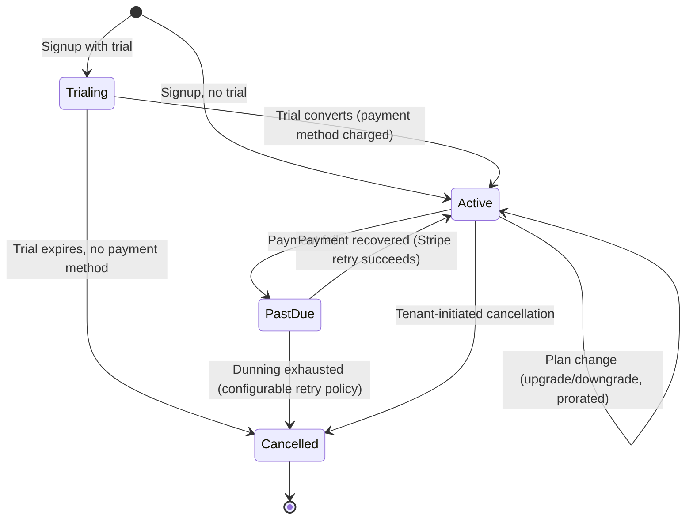

At runtime, every transition on this diagram other than the initial signup is triggered by a Domain Event or a confirmed Stripe webhook, never by a synchronous API call alone — consistent with the payment-state rule established in §15.3 (blueprint §10.2).

### 17.12 Invoice lifecycle

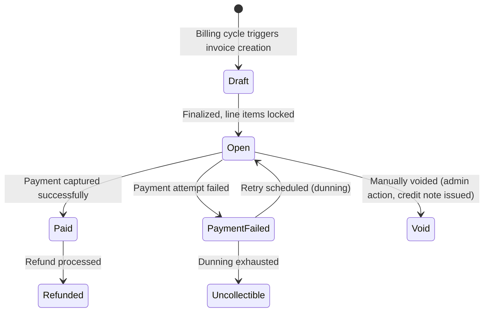

The `Draft → Open` transition is the last point at which line items can change; every transition after it is a status change only, never a line-item edit, consistent with the immutability invariant established in Section 11.12 of this document (blueprint §10.3).

### 17.13 Payment lifecycle

Payment state at runtime has no independent state-machine diagram in the blueprint; it is driven entirely by the webhook lifecycle (§17.10) acting on the Payment aggregate (Section 11.4). A Payment record transitions purely in reaction to confirmed Stripe webhook events (`payment_intent.succeeded`, `invoice.payment_failed`, etc.), and its transitions in turn drive the Invoice lifecycle's `Open → Paid` / `Open → PaymentFailed` edges (blueprint §10.4, §10.3).

### 17.14 Event flow

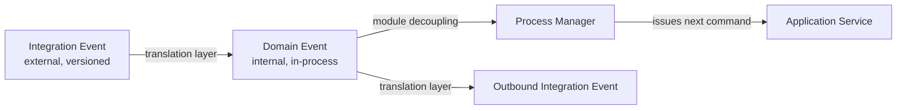

Domain Events and Integration Events remain runtime-distinct at every point, per the architectural decision in Section 11.8/15.14 of this document: an inbound Integration Event (a Stripe webhook) is translated into a Domain Event before any process manager acts on it, and an outbound Integration Event (OmniBill's own webhook to a tenant) is produced from a Domain Event through the same translation layer in reverse (blueprint §9.1).

### 17.15 Error propagation

| Layer | Runtime behavior |
|---|---|
| Domain-level exceptions | Expected business-rule violations (e.g., `SubscriptionAlreadyCancelledException`), mapped to specific 4xx responses with machine-readable error codes |
| Infrastructure exceptions | Stripe API errors, DB connection issues — caught at the Application Service boundary, logged with full context, mapped to 5xx/503, retried only where idempotent |
| Unexpected exceptions | Never leak stack traces or internal details in production; always logged with the request's correlation ID; a generic error code referencing that correlation ID is returned for support follow-up |

(blueprint §15)

### 17.16 Transaction boundaries

Restated from the data-architecture view in Section 14.7: at runtime, a transaction opens at the start of Domain Service execution and closes at the point of persisting the domain change plus its outbox row — it never remains open across an external call, and it never spans a second aggregate (blueprint §7.4).

### 17.17 Runtime state transitions

The three lifecycles in §17.11–§17.13 are runtime-coupled only through Domain Events, never through a shared transaction: a Subscription's `Active → PastDue` transition, an Invoice's `Open → PaymentFailed` transition, and a Payment's failure state are three separate commits, connected by the outbox-driven event flow described in §17.14, not by one operation touching all three aggregates at once. This is the runtime expression of the aggregate consistency rule established in Section 11.11 of this document.

---

## 18. Security Architecture

### 18.1 Security philosophy

OmniBill's security posture is governed by the same first-order principle that governs the domain: **billing correctness and tenant isolation are non-negotiable, and security is the mechanism that preserves both** (blueprint §1.1). Security decisions are therefore driven by the blast radius of the failure they prevent rather than by security theater. A cross-tenant financial data leak and a spoofed payment event are existential risks; they receive defense-in-depth treatment — multiple independent controls, any one of which stops the attack if another fails. Threats whose worst case is inconvenience receive proportionate, single-layer controls.

Every security mechanism in the architecture is derived from one or more of the threats named explicitly in the blueprint's threat model (blueprint §14.1). No mechanism described in this section is invented beyond what that document records.

### 18.2 Trust boundaries

Trust in OmniBill is not binary (trusted/untrusted) but tiered by the party's identity and the mechanism used to establish it. Four distinct trust tiers exist at runtime.

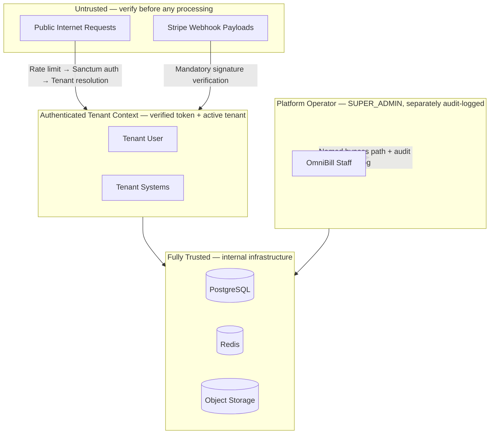

| Tier | Who | How trust is established |
|---|---|---|
| **Untrusted** | Public internet, raw Stripe webhook payloads | Nothing is trusted until verified; requests either authenticate successfully or are rejected early |
| **Authenticated Tenant** | Users and systems presenting a valid Sanctum token against an active tenant | Rate limit check → Sanctum token validation → tenant resolution → active-status verification — all must pass |
| **Platform Operator** | `SUPER_ADMIN` role, OmniBill staff only | Same authentication pipeline, plus the explicitly-named cross-tenant bypass path, plus mandatory audit log entry with operator identity and reason (blueprint §3.4) |
| **Internal Infrastructure** | PostgreSQL, Redis, object storage | Fully trusted; internal to the deployment boundary; not exposed to external actors |

> **Trade-off accepted:** The `SUPER_ADMIN` tier receives the same Sanctum authentication as any user, with the cross-tenant capability controlled by role and enforced at the bypass-path level, not by a separate authentication channel. The blueprint acknowledges this trade-off and mitigates it through audit logging and re-authentication requirements on sensitive super-admin actions (blueprint §14.1, §3.4). **Future extensibility:** If a future OmniBill compliance requirement calls for a hardware-backed MFA step for operator-level actions specifically, the explicit, named bypass-path architecture (§3.4) is already the correct insertion point — no change to the general authentication pipeline would be needed.

### 18.3 Threat model

The blueprint records the following named threats and their primary mitigations (blueprint §14.1). Section 18 expands each threat architecturally.

| # | Threat | Primary mitigation | Secondary mitigation |
|---|---|---|---|
| T1 | Cross-tenant data leakage | Global Scope (application-level, automatic `tenant_id` predicate) | PostgreSQL RLS (database-level, bypasses nothing) |
| T2 | Token theft / replay | Sanctum token abilities + explicit revocation | Short-lived tokens for sensitive scopes |
| T3 | Stripe webhook spoofing | Mandatory signature verification before any processing | Security event logged + request rejected on failure |
| T4 | Billing amount tampering (client-supplied prices) | Server always recomputes from source-of-truth Plan pricing | Prices/amounts from client input are never accepted |
| T5 | Raw card data exposure | Client-side tokenization (Stripe Elements) | OmniBill stores only Stripe payment method references |
| T6 | Privilege escalation within a tenant | Policies check role AND ownership | Role changes require `TENANT_ADMIN` + are audit-logged |
| T7 | `SUPER_ADMIN` abuse | Named bypass path only; sensitive actions require re-authentication | Every bypass audit-logged with operator identity and reason |
| T8 | Denial of service / noisy neighbor | Per-tenant, plan-tiered rate limiting (Redis sliding window) | Independent per-tenant bucket cannot exhaust shared IP-based bucket |
| T9 | Replay of mutating requests | Client-supplied `Idempotency-Key` required on billing mutations | 24-hour Redis storage with durable Postgres audit row for money-touching ops |
| T10 | SQL injection / mass assignment | Eloquent parameter binding (default); explicit `$fillable` allow-lists on every model | Never `$guarded = []` |
| T11 | Secrets exposure | Credentials via environment/secret manager; never committed or logged | Structured logger carries a redaction list |

### 18.4 Authentication security

Authentication security centers on three properties: the token is verifiable without a network call, revocable immediately rather than relying on expiry, and scoped to limit the blast radius of a stolen token.

**Purpose:** Establish the identity of the requesting user and their device/client pair before any tenant or authorization logic runs.

**Threat mitigated:** T2 (token theft/replay).

**Mechanism:** One Sanctum token per (user, device/client) pair, with explicit abilities (scopes). Token abilities limit what a given token can do even if stolen — a token issued for read-only reporting cannot initiate a payment even if exfiltrated.

**Revocation model:** Revocation is explicit and centralized. A `TENANT_ADMIN` suspending a user, a password reset, or a tenant suspension each revoke *all* affected tokens in one operation. Relying on expiry alone would leave a window during which suspended credentials remain valid (blueprint §5.1).

**Trade-off accepted:** Explicit centralized revocation requires a revocation-check step on every authenticated request (the token's server-side record must be valid), rather than the purely stateless JWT model where expiry is the only control. This is the correct trade-off for a billing platform where \"suspended user's token still works for N hours\" is an unacceptable failure mode.

**Future extensibility:** Laravel Passport (OAuth2) is layered in *alongside* Sanctum — not as a replacement — when OmniBill requires delegated, revocable, scoped consent for third-party developer apps. The seam is already at the Authentication context boundary (blueprint §5.1, §21).

### 18.5 Authorization security

**Purpose:** Enforce what an authenticated, tenant-resolved user is permitted to do within their tenant.

**Threat mitigated:** T6 (privilege escalation within a tenant).

**Two-layer model:**

| Layer | Concern answered | Where enforced |
|---|---|---|
| **Global Scope** | *Which tenant's data* — a Policy is never presented with another tenant's record | Application layer, automatic on every query |
| **Policies** | *Which role can do what within a tenant* — e.g., `TENANT_USER` can view only invoices they created | Policy check stage in the request pipeline, after tenant resolution |

Separating the two layers is what keeps each one simple and independently testable. Mixing tenancy checks into every Policy method would duplicate logic across dozens of policies and create surfaces where tenancy accidentally gets re-implemented incorrectly (blueprint §5.2).

**Trade-off accepted:** Two concepts to reason about instead of one, mitigated by a shared base Policy class that all context-specific policies extend, so tenancy is never re-implemented per-policy.

**Future extensibility:** The Policy layer is the correct extension point for fine-grained permission rules (e.g., API key scopes for a developer ecosystem) without touching the tenancy layer.

### 18.6 Tenant isolation security

Tenant isolation is the single security property with the highest blast radius if it fails — a cross-tenant leak exposes another company's financial and customer data. It therefore receives the only true defense-in-depth treatment in the architecture: two independent enforcement layers, either of which stops a cross-tenant read even if the other fails entirely.

**Layer 1 — Global Scope (application layer):** Automatically appends `WHERE tenant_id = :current_tenant` to every query. Correct as long as every query goes through Eloquent and no code path uses `withoutGlobalScope`, raw queries, or a new query-builder path that omits the scope (blueprint §3.2).

**Layer 2 — PostgreSQL Row-Level Security (database layer):** Independent of the application; applies even to raw SQL queries, rogue migration scripts, or a future non-Laravel service hitting the same database. A bug in application-level scoping cannot leak data because the database itself refuses the cross-tenant read (blueprint §3.2).

**Purpose:** T1 (cross-tenant data leakage) — addressed twice, independently.

**Trade-off accepted:** Shared-schema tenancy with row-level isolation is appropriate for many small-to-medium tenants; a single noisy-neighbor tenant can theoretically affect others sharing the database. This is mitigated by per-tenant rate limiting (§18.10) and query-level resource limits, not by physically isolating data (blueprint §3.1).

**Future extensibility:** A tenant requiring physical data isolation for compliance reasons (e.g., data residency law) is accommodated as a future exception path: tenant resolution is already abstracted behind middleware, so routing that tenant to a dedicated database is an additive change, not a rearchitecture (blueprint §3.1, §21).

### 18.7 API security

API security operates at two scopes: the transport boundary (rate limiting, authentication, validation) and the resource boundary (authorization, idempotency, amount integrity).

**Rate limiting:** Redis-backed sliding-window, tiered by tenant plan, applied per-tenant (not per-IP). Per-IP limiting is wrong for a B2B product where many users of one tenant may share a NAT/office IP; per-tenant limiting aligns rate limits with what is actually being sold (plan tiers) and protects tenants from each other (blueprint §12.1). See §18.10 for the full rate-limiting treatment.

**Input validation:** All input is validated before it reaches any Domain Service, at the form-validation stage in the request pipeline (blueprint §5.3). Validation failures return 422 with machine-readable error codes and never reach business logic.

**Price integrity:** Prices and amounts are never accepted from client input for anything already defined server-side in the Plan catalog; the server always recomputes from source-of-truth plan pricing (blueprint §14.1). This eliminates T4 (billing amount tampering) structurally — the correct amount is computed, not validated against what the client claims.

**Idempotency:** Client-supplied `Idempotency-Key` required on all mutating billing endpoints, preventing double-execution on network retries. Full treatment in §18.12.

**Versioning and sunset:** Breaking API changes require a new version path; additive changes do not. Deprecated versions carry a sunset date via response headers (blueprint §6). This protects tenant-facing integration stability — a security concern to the extent that forced rapid migrations can push tenants to insecure integrations.

### 18.8 Input validation strategy

**Purpose:** Prevent malformed, malicious, or unexpected input from reaching Domain Services.

**Threats mitigated:** T10 (SQL injection / mass assignment), T4 (amount tampering).

**Architectural position:** Validation sits between routing and Policy authorization in the request pipeline (blueprint §5.3). It fails fast with a 422 before any authorization logic runs against unvalidated data.

**Scope of validation:**

| Concern | Where enforced |
|---|---|
| Type and shape correctness | Form request validation layer, before the controller delegates to Application Service |
| Prices and amounts for server-defined catalog items | Never validated client-supplied values — server recomputes from the Plan catalog (blueprint §14.1) |
| SQL injection | Eloquent parameter binding by default; this is a structural property of the ORM, not a validation rule |
| Mass assignment | Explicit `$fillable` allow-lists on every model; `$guarded = []` is prohibited (blueprint §14.1) |

**Trade-off accepted:** Validation at the HTTP edge means Domain Services can assume they receive structurally valid input. The trade-off is that a Domain Service invoked from a non-HTTP path (e.g., an Artisan command) must apply the same input guarantees itself — which is mitigated by the Domain Service's own precondition checks and the Application Service's orchestration discipline.

### 18.9 Output encoding philosophy

OmniBill is a JSON API, not an HTML-rendering application; XSS via output encoding is not a primary surface (blueprint §6). The relevant output concern is **information leakage**: internal details, stack traces, and other diagnostic information must not be present in production API responses.

**Principle:** Unexpected exceptions are never propagated to API responses in production. Instead, the response contains a generic error code referencing the request's correlation ID — sufficient for a tenant to reference in a support request, and insufficient for an attacker to learn about internal structure (blueprint §15).

**Secondary principle:** Structured logs are the output channel for diagnostic detail, not API responses. The structured logger carries a redaction list for sensitive fields (Stripe keys, credentials, token hashes), so even log output is safe for aggregation pipelines that may not have strict access controls (blueprint §14.2, §15).

### 18.10 Rate limiting philosophy

**Purpose:** Protect the platform from abuse and protect tenants from each other under load.

**Threat mitigated:** T8 (denial of service / noisy neighbor).

**Mechanism:** Redis-backed sliding-window rate limiter, applied per-tenant (not per-IP), tiered by the tenant's subscription plan, evaluated as the first middleware stage — before authentication is attempted (blueprint §5.3, §12.1).

| Plan | Requests / minute | Burst allowance |
|---|---|---|
| Free | 60 | 10 |
| Pro | 300 | 50 |
| Enterprise | Custom (contractual) | Custom |

**Architectural rationale:** Evaluating rate limits before authentication is deliberate — it prevents unauthenticated request floods from even reaching the authentication logic. The per-tenant unit of isolation is correct because one tenant's traffic should not degrade another's regardless of whether they share a network origin.

**Trade-off accepted:** The rate limiter key is slightly more complex (tenant + optionally per-endpoint category) than a naive per-IP bucket; this complexity is justified by the correct unit of fairness.

**Future extensibility:** The tiered-by-plan structure makes it straightforward to add new tiers (e.g., a Startup plan between Free and Pro) without a limiter redesign — the plan tier maps directly to a Redis key prefix.

### 18.11 Sensitive data handling

OmniBill's data classification (blueprint §14.2) establishes three tiers:

| Classification | Examples | Handling |
|---|---|---|
| **Restricted** | Stripe payment method tokens, Sanctum token hashes, password hashes | Encrypted at rest; never logged; never returned in API responses |
| **Confidential** | Tenant financial data (invoices, payments, subscriptions) | Tenant-scoped access only; soft-deleted, never hard-deleted synchronously |
| **Internal** | Platform metrics, aggregate usage stats | Not tenant-accessible; retained per standard operational log rotation |

**Application-level field encryption:** Fields that are themselves sensitive beyond tenant-scoping — for example, API keys a tenant configures for their own outbound webhook integrations — receive application-level field encryption (encrypted casts) in addition to at-rest disk encryption at the infrastructure level (blueprint §14.2).

**Purpose of field-level encryption:** Disk encryption protects against physical media theft; it does not protect against a SQL injection result, a backup-file mishandling scenario, or a misconfigured database access policy. Field-level encryption ensures that even a direct database read of the encrypted column yields no usable value without the application-layer key.

**Trade-off accepted:** Encrypted fields cannot be searched or filtered directly in SQL — acceptable because these are precisely the fields that should never be queried by value.

### 18.12 Secret management

**Threat mitigated:** T11 (secrets exposure).

**Principle:** All credentials — Stripe keys, database passwords, any per-environment secret — are supplied via environment variables or a secret manager and are never committed to source control and never written to logs (blueprint §14.2).

**Structural enforcement:** The structured logger carries an explicit redaction list. A log line that would otherwise contain a Stripe API key or a database URL is intercepted and the sensitive value is replaced with a redacted placeholder before writing to any log sink. This is a structural property of the logging layer, not a per-call-site discipline (blueprint §15).

**Trade-off accepted:** Redaction lists must be actively maintained as new secret fields are introduced. The alternative — relying on individual engineers to never log secrets — is not a structural guarantee.

### 18.13 Encryption strategy

OmniBill operates with two complementary encryption layers:

| Layer | Scope | Protects against |
|---|---|---|
| **At-rest disk encryption** (infrastructure) | All data on any storage medium | Physical media theft, unauthorized storage access |
| **Application-level field encryption** (encrypted casts) | Specific high-impact fields (e.g., tenant-configured API keys) | SQL injection exfiltration, backup-file mishandling |

**In-transit encryption:** All traffic between clients and the system, and all traffic between OmniBill and Stripe, travels over TLS. The blueprint does not define a specific TLS version floor as a named architectural decision, placing that specification at the infrastructure/HLD layer.

**Payment card data:** Card data is never encrypted by OmniBill because it never enters OmniBill's infrastructure. Client-side tokenization via Stripe Elements means the card number is tokenized before the network call is made; OmniBill receives only the resulting payment method reference (blueprint §14.1, §6.2).

### 18.14 Password management

**Principle:** Passwords are hashed, never stored in recoverable form, and never logged. A password reset invalidates all existing tokens for the user — it does not leave the old token active while the new password is valid (blueprint §5.1).

> **Assumption:** The blueprint does not name a specific hashing algorithm (e.g., bcrypt, Argon2) as an architectural decision — that belongs to the implementation layer. This document records the architectural constraints (hash, no plaintext, no logging, revoke-on-reset) without naming an algorithm.

### 18.15 Token security

| Property | Mechanism |
|---|---|
| One token per (user, device/client) | Enforced at issuance; device/client pair uniqueness prevents a single compromised token from invalidating all of a user's sessions |
| Explicit token abilities (scopes) | Limits the blast radius of a stolen token; a token issued for read-only access cannot initiate payments even if exfiltrated |
| Immediate revocation | Server-side revocation on user suspension, password reset, or tenant suspension — expiry alone is not relied upon |
| Short-lived tokens for sensitive scopes | Additional mitigation for T2 (token theft/replay) on particularly sensitive capabilities |

### 18.16 Session security

OmniBill is an API-first product with no server-rendered session state (blueprint §5.1, §13). There are no server-side sessions in the traditional sense — authentication state lives in Sanctum tokens, which are stored server-side as revocable records, not in browser cookies or local filesystem sessions on web nodes. This means session fixation, session hijacking via cookie theft, and cross-site request forgery via cookie-based authentication are not applicable attack surfaces for the primary API surface.

**Trade-off accepted:** The absence of traditional session state means the application has no server-side session store to protect, simplifying the session-security surface at the cost of requiring clients to manage token lifecycle correctly.

### 18.17 Audit logging strategy

The audit trail is a dedicated, **append-only audit log table** — independent of the general structured logs — recording every state-changing action on Tenant, Subscription, Invoice, Payment, and RBAC changes (blueprint §16). Its independence from general logs is architecturally significant: it survives log-retention rotation and remains queryable for compliance requests that may reach back months or years beyond standard log retention windows.

**Purpose:** Support compliance inquiries, dispute resolution, and detection of unauthorized or anomalous actions.

**What is audited:**

| Category | Scope |
|---|---|
| Tenant lifecycle transitions | Activation, suspension, cancellation, reinstatement |
| Subscription state changes | Plan changes, cancellations, trial conversions |
| Invoice state changes | Finalization, payment, voiding, refunds |
| Payment events | Capture, failure, retry, refund |
| RBAC changes | Role assignments, role removals — requires `TENANT_ADMIN` and is audit-logged |
| `SUPER_ADMIN` cross-tenant access | Every bypass, with operator identity, the target tenant, and the stated justification |

**Architectural trade-off:** Maintaining two independent persistence paths (general structured logs + append-only audit table) adds write overhead at every state-changing action. This is accepted because the audit table's correctness (completeness, append-only invariant, survival beyond log rotation) cannot be guaranteed if it shares the same retention pipeline as operational logs.

### 18.18 Security monitoring

Security monitoring at the architecture level is addressed through three mechanisms established in the blueprint: structured logging with mandatory fields (blueprint §15), Laravel Pulse for real-time operational dashboards in all environments (blueprint §16), and explicit dead-letter queue alerting for the `billing-critical` queue (blueprint §16).

**Security-specific monitoring signals:**

| Signal | What it indicates | Response |
|---|---|---|
| Stripe webhook signature verification failure | A spoofed or tampered webhook delivery (T3) | Rejected before any processing; logged as a security event for review |
| 401 spike on a given tenant | Potential credential brute-force or token replay attempt (T2) | Rate limiter absorbs traffic; structured log spike queryable by `tenant_id` |
| `WithoutTenantScope` usage in audit log | `SUPER_ADMIN` cross-tenant access; may indicate account abuse (T7) | Normal operations produce audit entries; anomalous patterns are detectable by querying the audit log |
| Dead-letter queue growth on `billing-critical` | Sustained billing-pipeline failures | Pages operator (blueprint §16) |

**Assumption:** The blueprint does not define a Security Information and Event Management (SIEM) system, intrusion detection system, or anomaly-detection pipeline as named architectural components. Security signal collection is the mechanism available; what consumes those signals (a SIEM, a log aggregation platform, an alerting service) is an operational infrastructure choice the blueprint leaves open.

### 18.19 Security incident considerations

The architecture establishes the preconditions for effective incident response rather than defining an incident response process (which belongs to operational governance, not the SAD).

**Preconditions the architecture provides:**

| Capability | How the architecture enables it |
|---|---|
| Identifying the scope of a breach | Structured JSON logs with mandatory `tenant_id` and `correlation_id` on every entry; the audit table covering all state-changing actions |
| Containing a compromised credential | Explicit centralized token revocation — a single operation revokes all tokens for a user or an entire tenant immediately |
| Reconstructing a transaction | Correlation IDs threaded through every sync request and every async job it spawns; the outbox pattern's audit trail of dispatched events |
| Preventing a leak from propagating | RLS as an independent database-layer control — a compromised application-layer credential cannot bypass it |
| Recovering from an anomalous state change | Soft-delete-only policy on financial entities; the append-only audit log; no state is permanently and silently destroyed in the request path |

### 18.20 OWASP alignment

The following OWASP Top 10 (2021) categories are addressed structurally by the architecture.

| OWASP 2021 | Architectural control |
|---|---|
| **A01 – Broken Access Control** | Two-layer authorization: Global Scope (tenant isolation) + Policies (role-and-ownership); UUIDs prevent enumeration attacks; Policies checked after validation in every request |
| **A02 – Cryptographic Failures** | Field-level encryption for high-impact sensitive fields; at-rest disk encryption; TLS in transit; passwords hashed, never stored recoverable; card data never reaches the application |
| **A03 – Injection** | Eloquent parameter binding by default (SQL injection structurally prevented); explicit `$fillable` allow-lists eliminate mass assignment |
| **A04 – Insecure Design** | The architecture itself is the control: threat-modeled, defense-in-depth for the highest-blast-radius threats, principle of least privilege in the RBAC model |
| **A05 – Security Misconfiguration** | Secrets via environment/secret manager; dev/prod parity via promoted container images; Telescope disabled in production (blueprint §16) |
| **A06 – Vulnerable and Outdated Components** | CI pipeline enforces PHPStan static analysis and runs the full test suite on every merge (blueprint §18 CI/CD section); component updates are a CI concern, not an architecture concern |
| **A07 – Identification and Authentication Failures** | Explicit centralized token revocation; no expiry-only reliance; one token per device/client pair with explicit abilities |
| **A08 – Software and Data Integrity Failures** | Stripe webhook signature verification before any processing; outbox pattern guarantees event integrity at the database level |
| **A09 – Security Logging and Monitoring Failures** | Structured JSON logging with mandatory fields on every entry; append-only audit table independent of log rotation; real-time dashboards (Pulse) in all environments |
| **A10 – Server-Side Request Forgery** | OmniBill makes outbound calls only to known, configured endpoints (Stripe API, email provider, object storage); no user-supplied URL is ever used as an outbound call target |

### 18.21 Defense in depth

Defense in depth is applied selectively, proportionate to the blast radius of the failure it guards against. Two threats are singled out for multi-layer treatment because their failure consequences are existential:

| Threat | Layer 1 | Layer 2 | Why two layers |
|---|---|---|---|
| Cross-tenant data leakage (T1) | Global Scope (application) | PostgreSQL RLS (database) | Application-level controls can be bypassed by raw queries, future non-Laravel services, or bugs in scope composition; the database layer cannot be bypassed by any application path |
| Stripe webhook spoofing (T3) | Signature verification before any processing | Persist with unique `stripe_event_id` before processing | Signature verification prevents spoofed events; the unique constraint prevents duplicate processing of legitimate events that Stripe retries |

All other threats receive single-layer controls proportionate to their risk profile, as recorded in the threat model table (§18.3).

---

## 19. Scalability Strategy

### 19.1 Scalability philosophy

The architecture's scalability posture is explicitly **staged and evidence-driven**, not speculative (blueprint §13). The guiding principle is that every scaling step should be triggered by a real, measured signal rather than by anticipation of a scale that may never arrive. This is consistent with the blueprint's overall preference for well-understood, low-operational-cost patterns over architecturally complex ones.

The staged progression is:

```
Compute: vertical → horizontal (stateless nodes, config change)
Database: vertical → read replicas → tenant-based partitioning (sharding as last resort)
Queues: independent worker pools per named queue, scaled per queue's depth/criticality
Cache: cache-aside for low-volatility data only; financial state always from PostgreSQL
```

> **Decision (blueprint §13):** Database scaling is deliberately staged — vertical first, then read replicas, then partitioning — rather than designing for sharding from day one.
> **Why:** Reaching the ceiling of each stage is itself a signal of success. Designing for sharding before that ceiling is reached is a cost and complexity that OmniBill's target scale does not yet justify, and the `tenant_id`-first schema already positions the data for the transition when it does become necessary.
> **Revisit when:** Write throughput on the primary approaches saturation even after read-replica offload and query optimization.

### 19.2 Vertical scaling

The first scaling lever for both compute and data tiers is vertical — adding capacity to existing nodes rather than adding nodes. This is the lowest-operational-cost first move and is appropriate for a system at the \"thousands of tenants\" scale that defines OmniBill's current design point (blueprint §1.1).

Vertical scaling of the PostgreSQL primary is the specific lever called out by the blueprint as the first database scaling response, before read replicas or partitioning. The application architecture supports this transparently: no code change is required to take advantage of a larger primary (blueprint §13).

### 19.3 Horizontal scaling

Horizontal scaling of compute is a **configuration change, not an architecture change** — the defining property of a stateless application tier (blueprint §13). Web nodes and worker nodes carry no local state:

| State category | Where it lives |
|---|---|
| Session / authentication state | Redis (Sanctum token records) |
| Cache | Redis (shared across all nodes) |
| File storage | Object storage (S3-compatible) |
| Queue transport | Redis (shared across all worker nodes) |
| Business and financial state | PostgreSQL (shared primary + replica) |

Adding a web node or a worker node requires no migration, no data redistribution, and no coordination protocol. The load balancer (Nginx or equivalent) distributes traffic across web nodes; the queue transport (Redis) distributes jobs across worker nodes reading the same named queues (blueprint §20).

### 19.4 Stateless API design

Statelessness is not an emergent property of the architecture — it is an explicit design constraint enforced at every layer (blueprint §13):

- No file-based session storage on web nodes.
- No local on-disk file write by any web or worker node.
- No in-memory singleton state that cannot be lost and rebuilt from a store between requests.

The one apparent exception — the `CurrentTenant` and `CurrentUser` singletons bound per request — are request-scoped, not process-scoped. They are discarded at the end of the request cycle and have no cross-request lifetime. Worker node jobs re-bind `CurrentTenant` at job start from the serialized `tenant_id` in the job payload, rather than inheriting ambient state from the previous job (blueprint §9.3).

**Trade-off accepted:** Statelessness requires that Redis and PostgreSQL remain available for every request. There is no graceful degradation path where a node falls back to local state if Redis is unreachable — Redis availability is a liveness dependency for the application tier. This is accepted because Redis availability is itself a highly reliable property of a correctly deployed Redis instance, and the architectural benefit (horizontal scaling as a config change) outweighs the liveness dependency.

### 19.5 Queue scalability

Named queues are the architecture's primary mechanism for scaling background processing independently of the web tier and independently of each other (blueprint §9.2).

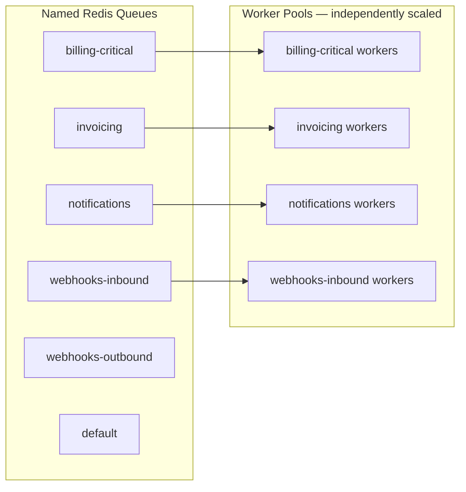

**Scaling each pool:** Worker pool size for each named queue is set independently. A burst of email notifications does not compete with payment-state jobs for worker capacity because they consume separate named queues with separate worker pools. Monitoring queue depth per named queue (§21.7) is the operational trigger for scaling a specific pool upward (blueprint §9.2, §16).

**Backpressure:** Queue depth monitoring is the backpressure signal. A growing `billing-critical` queue depth triggers operator attention far more aggressively than a growing `notifications` depth, reflecting the difference in business criticality (blueprint §16).

**Trade-off accepted:** More worker process configuration to manage than a single undifferentiated pool. This is accepted because the operational benefit — independent scaling and independent alerting per queue — is what makes the system correctly prioritized under load.

### 19.6 Database scalability

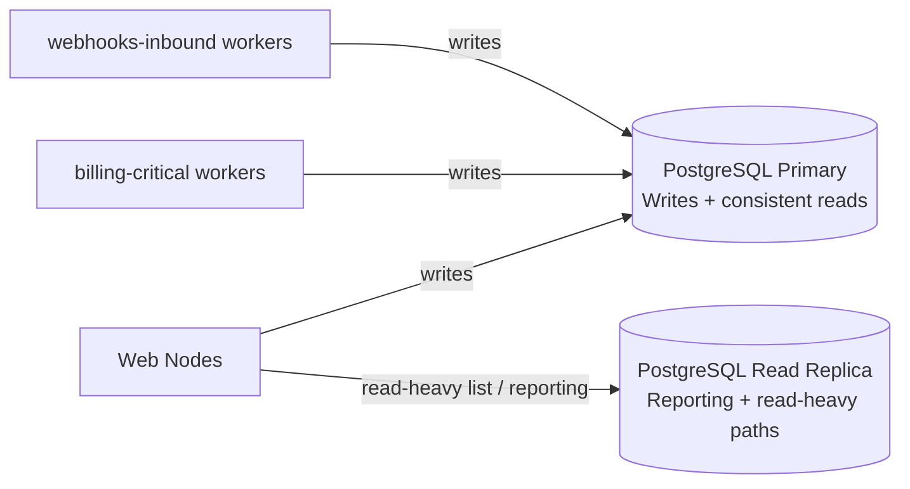

**Primary:** All writes, and all reads where strong consistency is required (invoice/payment status, tenant active status), go to the primary (blueprint §13). The architectural rule from §14.2 — financial transactional state is never cached — means these reads are always against the primary, providing the correct consistency guarantee at the cost of higher primary read load.

**Read replicas:** Read-heavy, latency-tolerant paths — such as reporting queries, plan catalog reads, and list endpoints where slight staleness is acceptable — are directed to read replicas, offloading the primary (blueprint §13).

**Partitioning trigger:** The `tenant_id`-first schema design means the natural partition key already exists on every tenant-owned table. When write throughput on the primary approaches saturation after replica offload and query optimization, tenant-based table partitioning is the first step, requiring no schema redesign (blueprint §13, Revisit when).

### 19.7 Redis scalability

Redis serves four structurally distinct roles (cache, queue transport, rate-limit counters, idempotency key storage). At the current design-point scale, a single well-configured Redis instance is sufficient for all four roles. The architecture does not require Redis Cluster from day one.

**Scaling path:** Redis Cluster (horizontal partitioning of the key space) is the scaling mechanism for Redis if a single instance approaches capacity. Because all four uses of Redis in the architecture are key-value or list operations without cross-key transactions (aside from Lua scripts for atomic rate-limit operations), partitioning the key space is feasible without a protocol change.

**Trade-off accepted:** Financial state is never in Redis (blueprint §11), which means a Redis failure has no financial-data-loss impact, only a service-availability impact. This is the correct trade-off — Redis unavailability affects API responsiveness and queue processing, not the integrity of the financial record.

### 19.8 Cache strategy

> **Decision (blueprint §11):** Redis cache-aside pattern for read-heavy, low-volatility data only. Financial transactional state (invoice/payment status) is never cached — always read from PostgreSQL.

The cache is a performance optimization for data that changes rarely and tolerates brief staleness (plan catalogs, tenant settings, permission sets). It is explicitly not a durability mechanism.

**Cache key convention:** `{tenant_id}:{resource}:{id}` — the tenant ID prefix is always part of the key. This serves dual purposes: tenant isolation (one tenant cannot accidentally read another's cached data) and efficient invalidation (a tenant-wide cache flush on plan change is a single prefix-key sweep, not a full cache flush) (blueprint §11).

**Invalidation mechanism:** Event-driven, via domain events (e.g., `TenantSettingsUpdated` triggers explicit invalidation of the `{tenant_id}:settings:*` prefix). TTLs are a safety net — a background expiry that prevents stale cache entries from surviving indefinitely if an invalidation event is missed — not the primary invalidation mechanism (blueprint §11).

**What is cached:**

| Cacheable | Not cacheable |
|---|---|
| Plan catalog (rare change, many reads) | Invoice status (correctness-critical) |
| Tenant settings (rare change, many reads per request) | Payment status (correctness-critical) |
| Permission sets / role rules (rarely updated mid-session) | Subscription active/cancelled state (used for access control decisions) |

### 19.9 Tenant growth strategy

The shared-schema, row-level tenancy model (Section 12, blueprint §3.1) is designed to handle thousands of tenants without per-tenant provisioning cost. New tenants are added without any schema change, any new database instance, or any worker configuration update.

**Growth levers:**

| Tenant count growth | Mechanism |
|---|---|
| Increased API request volume | Add web nodes (horizontal scale, config change) |
| Increased billing job volume | Add workers to relevant named queues |
| Increased database read load | Add or promote read replicas |
| Increased database write load | First: query optimization + vertical scaling. Then: read-replica offload of reads currently on primary. Then: tenant-based partitioning |
| Single large tenant requiring dedicated isolation | Promoted to dedicated database; tenant resolution abstracted behind middleware already accommodates this (blueprint §3.1, §21) |

### 19.10 Read-heavy workloads

List endpoints, reporting queries, and plan catalog reads are the primary read-heavy workload categories.

**Architectural controls:**
- No N+1 queries permitted on any list endpoint; eager loading is mandatory (blueprint §13). A single list query should not fan out into N additional queries for N records.
- Read replicas absorb read-heavy reporting paths, preserving primary capacity for writes and consistency-critical reads.
- Cache-aside for plan catalogs and tenant settings reduces database load for the most frequently read, least-frequently-changing data.
- P95 read endpoint latency budget is 300ms, enforced via code review and CI query-count assertions (blueprint §13).

### 19.11 Write-heavy workloads

Write-heavy workloads in OmniBill are dominated by webhook processing, invoice generation, and subscription state changes — all of which are asynchronous by design (blueprint §1.1, principle 3).

**Architectural controls:**
- The HTTP request thread never performs write-heavy billing work; writes from the request thread are limited to the domain change plus its outbox row in a single, bounded transaction.
- Worker tiers absorb write load generated by billing events, with `billing-critical` workers scaled independently of other queues.
- The outbox pattern decouples the rate of domain changes from the rate of downstream write effects — a burst of Stripe webhook events queues into `webhooks-inbound` without blocking the request tier.
- P95 write endpoint latency budget is 800ms, excluding async billing side effects by design (blueprint §13).

### 19.12 Background processing scalability

Background processing (queue workers) scales independently of the web tier because worker nodes and web nodes are separate, independently scaled process groups (blueprint §9.2, §20). Scaling a worker pool requires adding worker node instances reading from that queue — no coordination with the web tier, no migration.

**Scaling trigger:** Queue depth monitoring per named queue (§21.7) is the operational trigger. A growing queue depth that does not recover within the SLO window for that queue's business criticality is the signal to add workers.

**Isolation benefit:** Because each named queue has its own worker pool, a processing backlog on `notifications` has zero impact on `billing-critical` job latency. The separation is structural, not a configuration convention.

### 19.13 Storage scalability

Generated PDFs and documents are stored in S3-compatible object storage via Laravel's Filesystem abstraction (blueprint §20). Object storage scales independently of the application tier and the database tier, with no OmniBill-specific scaling action required — capacity and throughput scaling are managed by the storage provider.

The architectural property that enables this is that object storage is never a source of business truth (Section 7.3, blueprint §7). PostgreSQL remains authoritative for invoice state; the object storage reference (a URL or key) is a durable pointer, not the record of record. A temporary object storage outage degrades PDF retrieval without corrupting invoice state.

### 19.14 Future sharding considerations

When write throughput on the PostgreSQL primary approaches saturation after read-replica offload and query optimization, the natural first step is **tenant-based table partitioning** — logically dividing large tables by `tenant_id` ranges or hash buckets within the same database instance, without the operational cost of true cross-node sharding (blueprint §13, Revisit when).

If true cross-node sharding becomes necessary, the architecture is already positioned:

- `tenant_id` is present on every tenant-owned table as a primary partition key candidate.
- Tenant resolution is abstracted behind middleware — routing a tenant's queries to a specific shard is an additive change at the resolution layer, not a change to every query in the codebase.
- Cross-aggregate references are by ID only (Section 14.4), with no DB-level FK constraints across aggregates — this is the same property that makes cross-shard references tractable without cascading FK issues.

**Trade-off accepted:** The current architecture cannot shard without work. That work is scoped and bounded by the design decisions already in place; it is not a rearchitecture.

### 19.15 Future microservice extraction considerations

The modular monolith's module boundaries are already expressed as the interfaces a future network seam would be inserted at (blueprint §2.1, §21). If a single module's resource profile diverges so far from the rest of the system that co-deployment becomes a genuine bottleneck — the blueprint's explicit revisit trigger (blueprint §1.1) — extracting that module into a separate service requires:

1. Replacing the in-process Application Service call with a network call at the module boundary (which is already an interface).
2. Replacing the in-process Domain Event with a message on a network-accessible queue (which already uses Redis queues).
3. Establishing a separate database for that module (which already has isolated data ownership per §14.1).

No other module's code changes, because no other module reaches into the extracted module's data directly. This is the architectural guarantee the module-boundary discipline was built to provide.

### 19.16 Capacity planning philosophy

Capacity planning in OmniBill is metrics-driven, not speculative (blueprint §13, §16). The blueprint establishes the following SLOs as the primary capacity triggers:

| Signal | Threshold | Action |
|---|---|---|
| P95 API read latency | ≥ 300ms | Investigate N+1, index coverage, vertical compute scaling |
| P95 API write latency | ≥ 800ms (excluding async side effects) | Investigate transaction scope, query optimization |
| Webhook processing P95 | ≥ 60 seconds | Scale `webhooks-inbound` worker pool; investigate queue depth |
| `billing-critical` queue depth | Sustained non-zero growth | Page operator; scale worker pool |
| PostgreSQL primary write throughput | Approaching saturation post-replica offload | Begin tenant-based partitioning evaluation |

Capacity decisions are reviewed against real production data, not re-litigated from intuition alone — this is the operational implementation of the blueprint's instruction to treat \"Revisit when\" triggers as literal, monitored conditions (blueprint §21).

---

## 20. Reliability Strategy

### 20.1 Reliability philosophy

OmniBill's reliability posture is shaped by one overriding constraint: **billing correctness is more important than availability in any individual request**. A billing system that returns a 503 is degraded; a billing system that double-charges a customer or loses a payment state transition is broken. The architecture makes the correct behavior under failure the default, not an edge case handled after the fact (blueprint §9.2, §9.5).

This produces three reliability principles:

1. **Failures are expected and designed for, not hoped against.** External services (Stripe, email) fail; network calls time out; jobs are retried. The architecture treats these as normal operating conditions, not exceptional ones.
2. **No external call is allowed to hold open a database transaction.** This is the single rule that eliminates the most common class of billing-system reliability bug (blueprint §7.4).
3. **Asynchronous work is durable.** An event written to the outbox is committed atomically with the domain change; it will be dispatched, eventually, even if every node restarts between the write and the dispatch (blueprint §7.4).

### 20.2 Fault tolerance

Fault tolerance in OmniBill is structural — it arises from the architecture rather than from try/catch blocks at individual call sites.

| Failure type | Structural tolerance |
|---|---|
| External API call (Stripe) fails or times out | The database transaction has already committed (or not) before the external call; no partial state is left in the database due to an API failure |
| Worker node crashes mid-job | The job is re-delivered from the queue; because every job is idempotent and checks current state before acting, re-delivery is safe (blueprint §9.2) |
| Stripe delivers a webhook twice | The `stripe_event_id` unique constraint prevents the second delivery from being processed; the second delivery receives a 200 immediately (blueprint §10.4) |
| Redis becomes temporarily unavailable | API requests that require rate-limit or idempotency checks fail open (a policy decision at the infrastructure level) or fast-fail with a 503; no financial data loss occurs because Redis is not the financial system of record |
| Outbox dispatcher process crashes | The outbox row remains unprocessed; when the dispatcher restarts, it reads unprocessed rows and continues publishing; no event is permanently lost (blueprint §7.4) |

### 20.3 Graceful degradation

The architecture's design ensures that failures in supporting subsystems degrade a specific capability without corrupting billing state.

| Subsystem failure | Degraded capability | Billing state impact |
|---|---|---|
| Email provider unavailable | Notifications are delayed or queued for retry | None — email delivery is never on the critical path for billing state |
| Object storage unavailable | PDF retrieval degrades; generated PDFs cannot be written until restored | None — PostgreSQL holds invoice state; object storage holds the document artifact |
| Read replica unavailable | Read-heavy list endpoints fall back to the primary (accepting higher primary load) | None — financial state reads from the primary are always correct |
| `notifications` queue backed up | Email delivery delayed | None — `billing-critical` and `webhooks-inbound` are unaffected |
| Redis cache unavailable | Cache-aside misses; reads fall through to PostgreSQL | Performance degraded; correctness unaffected — PostgreSQL is always the source of truth |

The pattern across all rows is the same: systems that are not on the critical path for financial state can fail without compromising correctness, because the architecture deliberately avoided making them sources of truth.

### 20.4 Failure recovery

**Job-level recovery:** Every queued job retries with exponential backoff on failure. A job that exhausts its retry limit moves to its queue's dead-letter queue (`*-failed`). A sustained non-zero failure rate on `billing-critical` pages an operator rather than failing silently (blueprint §9.2). The dead-letter queue is inspectable — an operator can read the failed job's payload, diagnose the root cause, and requeue after fixing the underlying condition.

**Outbox recovery:** If the outbox dispatcher stops processing (process crash, deployment), unprocessed outbox rows accumulate. When the dispatcher restarts, it reads all unprocessed rows and publishes them to their queues — there is no permanent event loss, only a delay. The dispatcher's polling/LISTEN model is inherently restart-safe (blueprint §7.4).

**Webhook recovery:** Stripe retries webhook deliveries for up to 72 hours with exponential backoff. Because OmniBill's webhook pipeline acknowledges immediately after persistence and processes asynchronously, a temporary worker outage during which Stripe re-attempts deliveries results in duplicate deliveries that are naturally handled by the `stripe_event_id` unique constraint (blueprint §10.4).

**State recovery:** Because financial entities are never hard-deleted synchronously, and because the audit log is append-only and independent of log rotation, any anomalous state change can be traced and, where appropriate, corrected by replaying domain events or by operator-initiated state corrections — there is no \"the data is gone\" scenario for financial records within the retention window (blueprint §7.3, §16).

### 20.5 Retry strategy

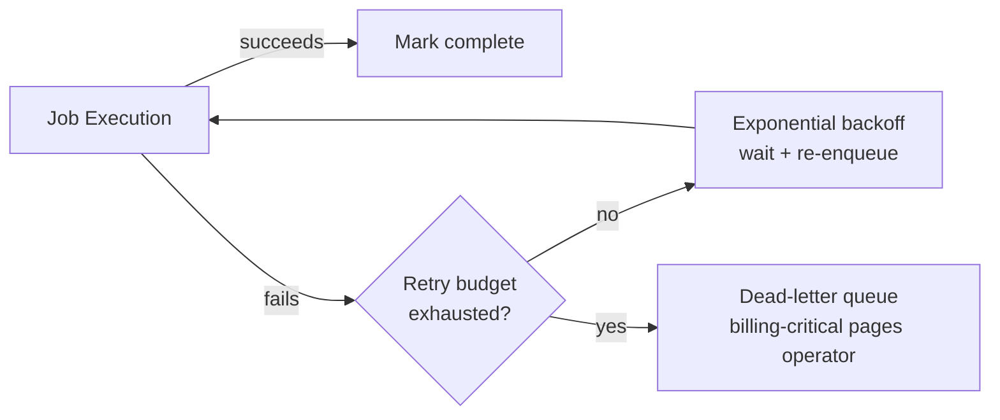

**Principles:**
- Every job checks current state before acting; it does not assume it has not already run (at-least-once delivery guarantee from Redis queue).
- Retry is safe only because jobs are idempotent; a job that is not idempotent by design is a design error, not a retry-strategy concern.
- Exponential backoff reduces the load on a degraded downstream service (e.g., Stripe returning 429 or 503) rather than retrying at the rate that caused the failure.
- The dead-letter queue is the operator's action queue: every entry is a job that could not recover automatically and requires human judgment.

**Trade-off accepted:** Exponential backoff introduces latency between a failure and recovery. For the `billing-critical` queue, this latency is bounded by the queue's SLO (P95 webhook processing < 60 seconds); the dead-letter queue plus operator paging is the escalation path when the retry budget is exhausted (blueprint §16).

### 20.6 Transaction consistency

Transaction consistency in OmniBill operates at two scopes:

**Within-aggregate (strong consistency):** All writes to entities within a single aggregate are committed in one database transaction. This is the strongest consistency guarantee the architecture provides and applies to every within-aggregate write (blueprint §7.4, §11.11).

**Cross-aggregate (eventual consistency via outbox):** Changes that span aggregate boundaries are eventually consistent — the outbox pattern guarantees the event will be dispatched and processed once the originating transaction commits, but the delay between \"committed\" and \"downstream aggregate updated\" is bounded by queue latency rather than being zero (blueprint §7.4).

> **Decision (blueprint §7.4):** A database transaction never spans more than one aggregate, and never wraps an external call.
> **Why:** Coupling transaction scope to external call duration introduces lock-hold time proportional to external latency — a performance and reliability hazard. The outbox pattern achieves the same eventual outcome with a bounded, predictable delay and no lock held across the external call.

### 20.7 Idempotency

Idempotency in OmniBill operates at two distinct levels:

**API-level idempotency:** Client-supplied `Idempotency-Key` on all mutating billing endpoints. A repeated key within the 24-hour window returns the original response without re-executing Domain Service logic. This prevents double-execution of operations triggered by network retries (blueprint §12.2, §6).

**Job-level idempotency:** Every queued job is designed to check current state before acting. A job that has already successfully applied its effect will detect this at the state-check step and exit cleanly rather than re-applying the effect. This absorbs at-least-once delivery from the queue without producing double side effects (blueprint §9.2).

**Webhook-level idempotency:** The `stripe_event_id` unique constraint on the `webhook_events` table provides natural idempotency for inbound Stripe events — a duplicate delivery is detected at persistence time and returns a 200 immediately without reprocessing (blueprint §10.4).

The three idempotency mechanisms are complementary and address different points in the processing chain. No single one is sufficient alone.

### 20.8 Event consistency

Domain Events and the outbox pattern are the mechanism for cross-aggregate eventual consistency. The consistency guarantee is:

> If the originating transaction commits, the event will be dispatched and processed at least once. If the originating transaction rolls back, no event is dispatched.

This guarantee is provided by writing the event row to the `outbox_events` table **within the same transaction** as the domain change. There is no scenario where a domain change commits without an event row, or an event row is written without the domain change committing (blueprint §7.4).

**Consistency boundary for sagas (process managers):** Cross-aggregate workflows — e.g., subscription cancellation → final invoice → notification — are modeled as explicit process managers that listen for domain events and issue the next command. Each step in the saga is its own transaction: if step 2 fails, step 1 has already committed. The process manager's role is to retry step 2 (or escalate to the dead-letter queue) rather than rolling back step 1 (blueprint §8.1). This is the correct design for a distributed workflow where rollback is either impossible (a Stripe charge already processed) or undesirable (an invoice already finalized).

### 20.9 Queue reliability

| Reliability property | Mechanism |
|---|---|
| At-least-once delivery | Redis queue; jobs are acknowledged only after successful execution, not on pickup |
| No silent job loss | Dead-letter queues for every named queue; `billing-critical` dead-letter pages operator (blueprint §9.2) |
| Event dispatch durability | Outbox pattern — events are not published directly to the queue from application code; they are written transactionally and dispatched by the outbox process (blueprint §7.4) |
| Tenant context preservation | `TenantAwareJob` base class enforces `tenant_id` serialization and re-binding at job start; no job can accidentally run without a tenant context (blueprint §9.3) |

### 20.10 Database consistency

| Property | Mechanism |
|---|---|
| Write durability | PostgreSQL primary with synchronous writes; no write is acknowledged until durable |
| Read consistency for financial state | Financial state (invoice, payment status) always read from the primary, never from cache or replica (blueprint §11) |
| Read replica lag tolerance | Read replicas are used only for read-heavy paths where brief staleness is acceptable (blueprint §13); financial state is excluded |
| Cross-aggregate integrity | Nightly integrity-check job alerts on orphaned cross-aggregate references (e.g., invoice pointing at deleted subscription); no silent allowance of orphans (blueprint §7.1) |

### 20.11 Error isolation

Error isolation is structural at the module boundary (blueprint §2.1) and at the queue boundary (blueprint §9.2).

**Module-level isolation:** An exception in the Notifications module cannot propagate into the Billing module because modules communicate only through Application Service interfaces and Domain Events — not through shared in-memory state or direct call chains that cross module boundaries. A failure in a downstream domain-event handler does not roll back the originating transaction (blueprint §2.1, §8.1).

**Queue-level isolation:** A failure rate spike in the `notifications` queue does not affect `billing-critical` job execution. Each named queue has its own worker pool; queue-level failures are contained within that queue's dead-letter queue (blueprint §9.2).

**Error-response isolation:** Unexpected exceptions at the application layer never leak stack traces or internal details in production API responses — the exception is logged with the correlation ID, and the client receives only a generic error code referencing that ID. The error boundary between the internal system and the external API surface is maintained at the controller/exception-handler boundary (blueprint §15).

### 20.12 Circuit breaker considerations

> **Assumption:** The blueprint does not define a circuit breaker pattern as a named architectural component or mechanism. The architectural approach described in the blueprint — outbox-pattern durable dispatch, retry-with-exponential-backoff, dead-letter queue escalation, no external call inside a DB transaction — provides most of the practical benefit a circuit breaker is designed to deliver in this context: preventing cascading failure from a degraded external dependency (Stripe, email) from propagating into the transactional core.

The specific scenario a circuit breaker is most valuable for — a rapidly failing external API call holding resources while retrying aggressively — is structurally prevented by the outbox/queue architecture: external calls happen in worker processes with exponential backoff, not in the synchronous request path holding DB connections. If a future integration pattern were added where a synchronous external call is made in the request thread, a circuit breaker should be considered at that point as a named architectural addition.

### 20.13 Backup philosophy

> **Assumption:** The blueprint does not specify a backup architecture, retention policy, or recovery point objective (RPO) as a named architectural decision. Backup and recovery strategy is an operational infrastructure concern the blueprint leaves to the HLD/operational runbook layer. This document records the architectural properties that constrain backup design rather than asserting a specific backup schedule.

**Architectural constraints relevant to backup:**
- Financial/audit-relevant entities use soft-delete with a defined retention window; hard deletes happen only after that window via a scheduled background job. A point-in-time backup must be restorable to a state before any scheduled hard delete to be useful for compliance recovery.
- The append-only audit log table is the authoritative compliance record — its integrity must be preserved in any backup and restoration procedure.
- PostgreSQL is the system of record; Redis and object storage are secondary and can be rebuilt or repopulated from PostgreSQL state if needed (within the constraints of what PostgreSQL actually records — object storage files must be backed up separately if PDF content is to be preserved).

### 20.14 Disaster recovery considerations

> **Assumption:** The blueprint does not define RTO (Recovery Time Objective) or RPO, failover topology, or geographic redundancy as named architectural decisions. The following is derived from the architectural properties the blueprint does establish, not asserted as a new architectural decision.

**Architectural properties that bound recovery:**
- **Stateless application tier:** Web and worker nodes carry no state; recovery for compute is re-deploying the same promoted container images — no data recovery needed for this tier.
- **PostgreSQL primary:** The system-of-record recovery. The promoted-container-image model (same image across environments, blueprint §20) means application code is always consistent with the recovered database schema, as long as the recovery restores to a post-migration state.
- **Outbox and queue state:** Redis queues are ephemeral. If Redis queue state is lost in a disaster, in-flight jobs are lost. The outbox table in PostgreSQL provides recovery: unprocessed outbox rows can be re-dispatched after Redis recovery, re-publishing events that were in flight at the time of failure.
- **Audit log:** The append-only audit table is part of the PostgreSQL backup and is subject to the same RPO as the primary database.

### 20.15 Operational resilience

Operational resilience — the ability to maintain normal operations under partial failures and during maintenance — is supported by three architectural properties:

**Zero-downtime deployments:** Additive-first migration strategy (new nullable columns, backfill, later removal) means the currently-deployed application code remains compatible with the schema during a rolling deployment, and the new code is compatible with the old schema in the brief window before the migration completes (blueprint §18).

**Independent scaling and restart of worker tiers:** Worker nodes for each named queue can be restarted or scaled independently without affecting the web tier or other queues. Jobs are re-delivered from the queue when a worker restarts (blueprint §9.2, §20).

**Operator visibility without Telescope in production:** Laravel Pulse provides real-time operational dashboards — queue depth, slow queries, exception rates — in all environments without the data-retention and sensitive-data exposure concerns of Telescope, which is restricted to development and staging (blueprint §16). An operator responding to an incident at 3 AM has the operational signals they need without enabling a tool whose prod presence is itself a risk.

---

## 21. Observability

### 21.1 Observability philosophy

Observability is a first-class architectural concern in OmniBill, not an afterthought instrumented at the end of development. The architecture's event-driven, asynchronous nature — where a single business transaction (e.g., a subscription upgrade) fans out across an HTTP request, multiple queue jobs, and database writes across multiple aggregates — makes observability structurally necessary: without it, the system is undebuggable at the operational timescale (blueprint §1.1, principle 4; blueprint §15, §16).

The three pillars of observability — **logs, metrics, and traces** — are addressed in the architecture at different levels of depth: structured logs and metrics are defined as named architectural decisions in the blueprint; distributed tracing is a future extension the architecture is positioned to accommodate.

OmniBill's observability design satisfies a specific operational requirement: **any engineer on call, unfamiliar with a given module, must be able to diagnose a billing incident from the available signals without needing to read the module's code** (blueprint §1.1, principle 4).

### 21.2 Structured logging

> **Decision (blueprint §15):** Structured JSON logging everywhere — no free-text log lines.

Every log entry carries a mandatory field set:

| Field | Purpose | Nullable |
|---|---|---|
| `timestamp` | When the event occurred | No |
| `level` | Severity (debug, info, warning, error, critical) | No |
| `tenant_id` | Which tenant's context — enables per-tenant log filtering | Yes (pre-tenant-resolution events) |
| `request_id` / `correlation_id` | Ties all events from a single business transaction together across sync and async execution | No |
| `user_id` | Which user initiated the action | Yes (system-generated events) |
| `event` | What happened — a structured event name, not a free-text message | No |
| `context` | Additional structured key-value context specific to the event | Yes |

**Purpose:** Structured logs are queryable at scale without brittle regex parsing. A log aggregation pipeline can group, filter, and alert on `tenant_id`, `event`, or `correlation_id` directly, enabling fast incident diagnosis (blueprint §15).

**Redaction:** The structured logger maintains an explicit redaction list for sensitive fields — Stripe API keys, database credentials, Sanctum token values. A log line that would capture one of these values has the sensitive portion replaced with a redacted placeholder before writing to any log sink. This is a structural guarantee of the logging layer, not a per-call-site discipline (blueprint §14.2, §15).

**Trade-off accepted:** Structured JSON logs are less pleasant to `tail -f` by eye than human-readable text. This is resolved by log viewer tooling, not by giving up structure. The operational benefit — queryability at scale — is permanent; the ergonomic cost is a tooling choice (blueprint §15).

### 21.3 Correlation IDs

The correlation ID is the single most important observability mechanism in an asynchronous, event-driven architecture. It is generated at the edge middleware at the start of every HTTP request and threaded through:

- Every log entry in the synchronous request lifecycle.
- The serialized payload of every queue job dispatched as a result of that request.
- Every log entry in every worker that processes those jobs.
- Any domain events and the jobs they generate transitively.

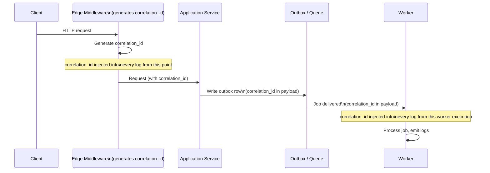

**Purpose:** A single `correlation_id` value lets an engineer retrieve the complete execution trace of one business transaction — the HTTP request, every job it spawned, every downstream event — from a log aggregation query, without knowing in advance which worker nodes or which queue jobs were involved.

**Trade-off accepted:** Correlation IDs must be propagated explicitly into every job payload and re-injected into the logging context at job start. This is a mandatory convention enforced by the `TenantAwareJob` base class, analogous to how `tenant_id` is enforced — it is structural discipline, not optional instrumentation.

### 21.4 Metrics

The blueprint does not define a specific metrics collection library or time-series database as a named architectural decision. Metrics in the architecture are observable through two primary mechanisms:

**Laravel Pulse** collects operational metrics — queue depths, slow queries, exception counts, request throughput — in all environments (blueprint §16). This is the primary production metrics surface available to on-call engineers.

**Log-derived metrics:** Structured logs with consistent `event` and `tenant_id` fields provide a queryable basis for operational metrics when integrated with a log aggregation platform. Exception rates, latency distributions, and event frequencies are all derivable from structured log queries rather than requiring a separate instrumentation layer.

**Trade-off accepted:** The absence of a named APM (Application Performance Monitoring) agent or time-series metrics pipeline as a blueprint-level architectural decision means this document does not assert one. The monitoring posture is defined by Pulse (all environments) and structured logs; an APM agent integration is an infrastructure-level addition that the logging and metric architecture would accommodate without a redesign.

### 21.5 Application monitoring

Application-level monitoring is centered on the signals the blueprint explicitly defines as SLO-relevant (blueprint §16):

| Signal | Target | Monitoring mechanism |
|---|---|---|
| P95 API read latency | ≤ 300ms | Request-level timing, observable via Pulse or log-derived aggregation |
| P95 API write latency | ≤ 800ms (excluding async side effects) | Request-level timing |
| Webhook processing P95 | < 60 seconds (event received to local state updated) | Timestamped log events at webhook receipt and processing completion, correlated by `stripe_event_id` |
| Failed job rate on `billing-critical` | Any sustained non-zero rate pages operator | Dead-letter queue depth monitoring via Pulse |
| Exception rate by module | Abnormal spikes indicate regressions | Structured log `level=error` aggregated by module |

**What should be monitored and why:**

| What | Why |
|---|---|
| Webhook processing latency | Stripe is the source of truth for payment state; a slow webhook pipeline means local state lags reality — a business risk, not just a performance metric |
| `billing-critical` dead-letter depth | A non-zero and growing depth means the billing pipeline is degraded; no automated recovery is possible without operator intervention |
| API latency budgets | Tenant integrations depend on predictable API latency; budget violations signal a regression before a customer reports it |
| Exception rates | Early warning of regressions introduced in a recent deploy |

### 21.6 Infrastructure monitoring

Infrastructure monitoring covers the data-tier and compute-tier resources that underpin application behavior.

| Infrastructure layer | Signals to monitor |
|---|---|
| **PostgreSQL primary** | Query latency, connection pool utilization, lock wait time, write throughput, replication lag (primary → replica) |
| **PostgreSQL read replica** | Replication lag; high lag means read-heavy paths served from the replica are receiving increasingly stale data |
| **Redis** | Memory utilization, eviction rate, connection count; evictions indicate the cache is undersized for the current working set |
| **Worker nodes** | CPU and memory utilization per worker pool; indicates whether a pool needs scaling up |
| **Object storage** | Storage consumption growth rate; relevant for capacity planning of the PDF archive |

**Why infrastructure monitoring supports billing correctness:** A PostgreSQL primary approaching connection-pool saturation directly threatens request throughput and job execution. Replication lag on the read replica determines whether read-heavy list endpoints are receiving timely data. These are not purely operational concerns — they have direct billing-correctness implications at the margins (a tenant checking whether their invoice was paid, for example).

### 21.7 Laravel Pulse

> **Decision (blueprint §16):** Laravel Pulse is enabled in **all environments**, including production.

Pulse provides real-time operational dashboards covering: queue depth per named queue, slow queries (query time and frequency), exception rates, and request throughput. It is designed to be lightweight enough for production use and does not capture the detailed request/query data that makes Telescope unsuitable for production (blueprint §16).

**Purpose:** Provides the on-call engineer with a real-time operational view of the system without requiring access to the log aggregation platform — a faster, lower-friction signal during an active incident.

**What Pulse shows:**

| Dashboard signal | Operational interpretation |
|---|---|
| Queue depth per named queue | Growing `billing-critical` depth requires immediate attention; growing `notifications` depth is lower urgency |
| Slow query frequency | A sudden increase in slow queries indicates a regression (missing index, query plan change, schema change) |
| Exception rate | Spike after a deploy indicates a regression |
| Request throughput | Baseline establishment and anomaly detection |

**Trade-off accepted:** Pulse has its own data retention model and storage requirements. Its data is operational, not compliance-relevant, so it does not need to survive beyond standard log rotation.

### 21.8 Laravel Telescope

> **Decision (blueprint §16):** Laravel Telescope is enabled in **development and staging environments only. It is never enabled in production.**

Telescope captures detailed per-request data: every query, every job, every cache hit/miss, every model event. This detail is invaluable during development and debugging but creates two production concerns: (1) its data-capture overhead is non-trivial at production request volumes, and (2) the data it stores would itself become a sensitive-data exposure surface in production — it would capture query results, request payloads, and job arguments, all of which may contain tenant financial data.

**Purpose in allowed environments:** Telescope is a debugging tool for development and staging. Engineers use it to inspect query counts (catching N+1 regressions before they reach production), examine job payloads, and trace request flows during feature development.

**Future extensibility:** If a production equivalent of Telescope's level of detail is needed for a specific debugging scenario, the correlation ID mechanism (§21.3) combined with a log aggregation platform's trace reconstruction capability provides a production-safe path to the same information from structured logs.

### 21.9 Health checks

> **Assumption:** The blueprint does not define an explicit health-check architecture — liveness/readiness endpoint specifications, probe cadences, or specific health-check response semantics — as a named decision (blueprint §16.15 of Section 16 in this document records this assumption). Operational health is addressed through Pulse dashboards and queue-depth alerting rather than through a dedicated health-check subsystem.

The architectural property that matters for health-check design is statelessness: a web node is healthy if it can accept a request and reach PostgreSQL, Redis, and the queue. These are the three live dependencies a health check must verify. The specific implementation of that check (endpoint path, response shape, probe interval) belongs to the operational infrastructure layer, not the SAD.

### 21.10 Alerting philosophy

Alerting is designed around **actionable signals** — each alert should correspond to a condition where a human action is required or possible. Noisy, non-actionable alerts are a reliability hazard in their own right (alert fatigue).

| Alert category | Trigger | Expected action |
|---|---|---|
| `billing-critical` dead-letter growth | Any sustained non-zero rate | Immediate operator response; inspect dead-letter queue, identify root cause, requeue after fix |
| Webhook processing P95 exceeds 60s | Sustained SLO breach | Investigate `webhooks-inbound` queue depth and worker health |
| API latency budget breach | P95 read > 300ms or write > 800ms sustained | Investigate recent deploys, query plan changes, index coverage |
| Stripe webhook signature failure spike | Multiple invalid signatures in a short window | Security review; may indicate an attack or a Stripe signing-secret misconfiguration |
| PostgreSQL replication lag | Exceeds a threshold relevant to read-replica staleness | Investigate network between primary and replica; consider query routing changes |

**What is not alerted on directly:** Normal operational variance, one-time transient errors that self-recover within SLO bounds, and informational log entries. The structured log `event` field and aggregation allow these to be reviewed without generating alerts.

### 21.11 Error reporting

Error reporting in OmniBill follows the three-tier model established in the blueprint's error-handling section (blueprint §15):

| Error tier | Log behavior | API response | Operator action |
|---|---|---|---|
| Domain-level exceptions (expected business rule violations) | Logged at `info` or `warning` with full context and `correlation_id` | 4xx with machine-readable error code | None required — these are expected |
| Infrastructure exceptions (Stripe API errors, DB connection issues) | Logged at `error` with full context and `correlation_id` | 5xx / 503 as appropriate | Monitor for sustained error rate; may indicate external degradation |
| Unexpected exceptions | Logged at `critical` with full context and `correlation_id` | Generic error code referencing `correlation_id` | Immediate review if sustained; may indicate a regression |

**Key property:** No exception in any tier leaks internal structure, stack traces, or sensitive field values to the API response. The API response carries only the `correlation_id` and a stable error code; the full diagnostic detail is in the structured log, accessible to engineers with log access but not to the requesting tenant.

### 21.12 Performance monitoring

Performance monitoring is addressed at two levels: the P95 latency SLOs tracked by Pulse and log-derived aggregation (§21.5), and the N+1 query guardrail enforced at development time by Telescope (§21.8).

**N+1 query prevention:** The blueprint establishes that no N+1 queries are permitted on any list endpoint, enforced via code review checklist and CI query-count assertions in tests (blueprint §13). Telescope's query-count visibility in development/staging is the tool that makes this rule verifiable before a change reaches production.

**Slow query monitoring:** Pulse surfaces slow queries in all environments — frequency and duration. A sudden increase in slow-query frequency after a deploy is the primary signal of a query regression (missing index, query plan change, or schema migration side effect).

**Trade-off accepted:** Performance monitoring relies on Pulse's sampling (production-safe) and Telescope's per-query capture (dev/staging only). There is no per-query APM trace in production by default. The structured log `context` field provides a path to adding per-request timing at specific instrumentation points if a production performance investigation requires more granularity than Pulse provides.

### 21.13 Slow query monitoring

Slow query monitoring is a Pulse responsibility in all environments. The operational value is directional: a query consistently appearing in the slow-query list indicates either a missing index, a data-volume growth that has changed the query plan, or an N+1 issue that passed code review and CI. Each of these has a distinct resolution — index addition, query refactoring, or eager-loading fix — but all of them are discoverable from the slow-query signal without requiring a production profiling session.

### 21.14 Queue monitoring

Queue depth per named queue is the primary operational metric for the background processing tier.

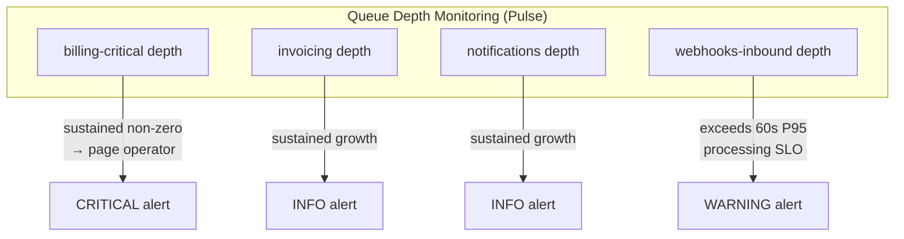

**Why queue monitoring is a correctness concern, not just a performance concern:** A growing `billing-critical` queue depth means payment state changes are being delayed. A delayed `SubscriptionCancelled` event means a tenant's subscription appears active past its cancellation. A delayed `invoice.payment_failed` event means the dunning process does not start on time. Queue depth is not merely a throughput metric — it is a billing-correctness signal.

### 21.15 Distributed tracing considerations

The correlation ID architecture (§21.3) provides the logical foundation for distributed tracing without requiring a tracing infrastructure today. Every log entry emitted during a business transaction — synchronous and asynchronous — is tagged with the same `correlation_id`, enabling a log aggregation query to reconstruct the trace of a given transaction from structured logs.

This is not a fully equivalent substitute for a true distributed tracing system (it lacks span duration, parent-child span relationships, and sampled trace trees), but it satisfies the primary operational need — \"show me everything that happened as a result of this one business transaction\" — within the constraints of a modular monolith where all execution happens within a single codebase boundary.

### 21.16 Future OpenTelemetry integration

The correlation ID convention and structured logging field set are compatible with an OpenTelemetry integration: the `correlation_id` maps naturally to an OTel trace ID, and the structured log fields (`tenant_id`, `event`, `context`) are suitable as OTel span attributes.

**When this becomes relevant:** If OmniBill is ever decomposed into actual separately deployed services (the revisit trigger established in blueprint §1.1), distributed tracing across network boundaries becomes necessary in a way the correlation-ID-in-logs approach cannot fully address. At that point, an OpenTelemetry SDK integration — emitting traces to an OTel Collector — would be the natural extension, using the same `correlation_id` as the trace root.

Until that point, the structured log approach is a proportionate and operationally simpler solution for a modular monolith (blueprint §1.1, §21).

### 21.17 Operational dashboards

| Dashboard | Environment | Audience | Primary signals |
|---|---|---|---|
| **Laravel Pulse** | All environments including production | On-call engineers, engineering leadership | Queue depth per named queue, slow queries, exception rates, request throughput |
| **Laravel Telescope** | Development and staging only | Individual engineers during feature development and debugging | Per-request query count, job payloads, cache events, model events |
| **Audit log queries** | Production (direct DB or reporting tool) | Platform operators, compliance team | State-changing actions on Tenant, Subscription, Invoice, Payment, RBAC |
| **Structured log aggregation** | All environments | On-call engineers | Correlation-ID-scoped traces, per-tenant event timelines, exception clusters |

**Operational dashboard coverage gaps noted by the blueprint:** The blueprint does not define a billing-specific business-level dashboard (e.g., active subscriptions over time, revenue processed per interval, dunning success rate) as an architectural component. These are product analytics concerns rather than operational monitoring concerns and are expected to be served from the PostgreSQL read replica via a reporting tool or query layer, not from the monitoring architecture defined here.


## 22. Architectural Risks

### 22.1 Risk assessment framework

Each risk below is described in terms of its nature, its potential impact on OmniBill's operations or business, its current likelihood given the architecture's mitigations, and the monitoring signal that would indicate the risk is materializing. Impact and likelihood are rated on a three-point scale: **High / Medium / Low**.

Risks are derived from architectural trade-offs recorded in the Blueprint — every \"trade-off accepted\" entry in the blueprint is a potential risk entry here, stated in risk terms rather than design terms. No new risks are invented.

---

### 22.2 Architectural and design risks

| # | Risk | Description | Impact | Likelihood | Mitigation | Monitoring signal |
|---|---|---|---|---|---|---|
| **AR-01** | Modular monolith boundary erosion | Over time, inter-module discipline erodes: modules begin reaching into each other's tables or calling each other's Domain Services directly, turning the \"modular monolith\" into a coupled monolith. | High — makes future extraction impossible; reduces testability; creates a \"big ball of mud\" failure mode the architecture is explicitly designed to prevent | Medium — entropy is the natural direction without enforcement | Module-first folder organization makes violations structurally visible; enforced by PHPStan import rules and code-review checklist; cross-module communication restricted to Application Services and Domain Events (blueprint §2.1, §19) | CI static-analysis failures on cross-module direct model imports; cross-module query counts in integration tests |
| **AR-02** | Aggregate boundary violations | A transaction is written that spans two aggregates (e.g., updating Invoice and Subscription in one database transaction), violating the aggregate consistency rule | High — introduces hidden coupling between aggregates; creates locking bugs at the intersection of subscription-timescale and payment-timescale writes | Low — the rule is an explicit, named architectural constraint; the outbox pattern provides the alternative | Outbox pattern as the mandated cross-aggregate mechanism; aggregate boundaries enforced by domain model structure; code-review checklist item | Deadlock or lock-wait alerts on billing-critical paths; CI transaction-span assertions in integration tests |
| **AR-03** | Premature feature addition not deferred | A non-goal (usage-based billing, multi-currency, reseller hierarchies) is implemented before the architecture has the seams ready, producing an ad-hoc implementation that bypasses the module-boundary and aggregate-boundary rules | Medium — creates technical debt specific to the feature added; the v1 architecture has seams for most deferred features, reducing the risk of a rogue implementation | Low — the Blueprint explicitly names these as non-goals and the SAD transmits them to HLD/LLD authors | Blueprint §1.2 explicit non-goals; this SAD's scope statement; HLD/LLD authors are expected to reference this document | Architecture review of any scope expansion affecting Billing, Invoicing, or Tenancy modules |

---

### 22.3 Technical risks

| # | Risk | Description | Impact | Likelihood | Mitigation | Monitoring signal |
|---|---|---|---|---|---|---|
| **TR-01** | N+1 query regressions in list endpoints | A developer adds a list endpoint or modifies an existing one without eager loading, producing N+1 queries that degrade latency under real load | Medium — degrades P95 read latency below the 300ms SLO; at high tenant count the per-request query count grows linearly | Medium — common class of bug in ORM-based applications without enforcement | Mandatory eager loading enforced via code-review checklist and CI query-count assertions (blueprint §13); Telescope query-count capture in development/staging | P95 read latency approaching 300ms in Pulse; Telescope query-count spike for a specific endpoint |
| **TR-02** | Global Scope silent bypass | An engineer uses `withoutGlobalScope`, writes a raw query, or adds a new query-builder path that omits the Global Scope, creating a cross-tenant data leak surface | High — potential cross-tenant financial data exposure; highest-blast-radius bug class in the system | Low — two independent layers (Global Scope + RLS) mean both must be bypassed simultaneously for a real leak; RLS provides the structural backstop | PostgreSQL RLS as the independent database-layer backstop (blueprint §3.2); code-review checklist item | RLS policy violation errors in PostgreSQL logs (would surface if application scope fails and RLS catches the cross-tenant query) |
| **TR-03** | Outbox dispatcher liveness failure | The outbox dispatcher process stops running, causing domain events to accumulate in the `outbox_events` table without being dispatched | High — delayed downstream processing: invoice generation, notifications, subscription-state synchronization all stall | Low — the dispatcher is a simple, restartable process; unprocessed rows survive a crash and are re-processed on restart | Outbox rows are durable in PostgreSQL; restart recovers processing (blueprint §7.4); monitoring for dispatcher health | Growing `outbox_events` unprocessed row count; alerts on unprocessed outbox rows older than the webhook P95 SLO threshold |
| **TR-04** | Redis data loss under failure | Redis loses queue state (e.g., instance failure without persistence), causing in-flight jobs to be lost | Medium — in-flight jobs (not yet acknowledged) are lost; downstream side effects for those jobs do not execute; no financial-record loss since Redis is never the system of record | Low — Redis persistence (AOF or RDB) is a standard operational configuration; the outbox pattern provides re-dispatch for events not yet published to the queue | Outbox-pattern recovery: unprocessed outbox rows are re-dispatched after Redis is restored; Redis is explicitly not the financial system of record (blueprint §11) | Redis process restart events; unprocessed outbox row accumulation |
| **TR-05** | PostgreSQL primary saturation | Write throughput on the PostgreSQL primary approaches or exceeds capacity, degrading write latency across all billing operations | High — billing-critical write latency degrades; webhook processing and subscription state changes are all write-path operations | Low at current design-point scale; rises as tenant count and event volume grow | Staged scaling: vertical scaling first, then read-replica offload of reads, then tenant-based partitioning (blueprint §13); `tenant_id`-first schema already positions data for partitioning | PostgreSQL primary write latency; connection pool utilization; P95 write endpoint latency approaching 800ms SLO |

---

### 22.4 Operational risks

| # | Risk | Description | Impact | Likelihood | Mitigation | Monitoring signal |
|---|---|---|---|---|---|---|
| **OR-01** | `billing-critical` dead-letter queue growth | Jobs on the `billing-critical` queue exhaust retries and accumulate in the dead-letter queue without operator response | High — billing operations (subscription state changes, payment processing) remain in an incomplete state; tenants experience visible billing errors | Low normally; increases during external dependency degradation (Stripe outages) | Dead-letter growth pages operator immediately (blueprint §16); jobs are inspectable and re-queueable after root cause resolution | Dead-letter queue depth (Pulse); paging alert on any sustained non-zero `billing-critical` dead-letter depth |
| **OR-02** | Stripe webhook processing backlog | Inbound Stripe webhook volume exceeds `webhooks-inbound` worker capacity during a spike, growing the queue depth and violating the P95 < 60-second SLO | Medium — local state lags Stripe-truth for payment/invoice status; tenants may see stale payment state briefly | Medium — possible during significant plan-upgrade events or Stripe bulk-retry scenarios | Independent `webhooks-inbound` worker pool scalable separately from other queues (blueprint §9.2); queue depth monitoring alerts before SLO is breached | `webhooks-inbound` queue depth (Pulse); webhook processing latency metric |
| **OR-03** | Telescope left on in production | Laravel Telescope is accidentally enabled in production, creating a sensitive-data capture surface and a performance overhead | High — Telescope stores request/query payloads including tenant financial data; exposes sensitive data to the Telescope storage backend | Low — the explicit decision to restrict Telescope to development/staging is documented (blueprint §16); production deployment should enforce this at the environment/container level | Explicit environment-configuration enforcement: Telescope is never enabled in production images; documented in the deployment checklist (blueprint §16) | Environment configuration audit on each production deploy |
| **OR-04** | Missing `tenant_id` on a new table | A developer adds a new tenant-owned table without the mandatory `tenant_id` column, creating an unscoped data surface | High — data on the new table is accessible across tenants | Low — module-first organization makes cross-tenant tables structurally visible; migration review is part of the CI billing-module manual approval gate (blueprint §18) | CI migration dry-run catches schema changes; billing-module manual approval gate for production (blueprint §18); code-review checklist | CI migration analysis; PostgreSQL schema audits |

---

### 22.5 Business risks

| # | Risk | Description | Impact | Likelihood | Mitigation | Monitoring signal |
|---|---|---|---|---|---|---|
| **BR-01** | Scale ceiling reached before mitigation | Tenant count or event volume outgrows the modular-monolith deployment before the architecture is evolved, causing service degradation | High — user-visible latency, failed billing operations, loss of tenant trust | Low at current design point; rises as the platform succeeds | Architecture review triggered by SLO breaches or by the blueprint's explicit \"Revisit when\" conditions (blueprint §21); all scaling levers (horizontal compute, read replicas, partitioning) are available without a rearchitecture | All SLO metrics simultaneously under pressure; `tenant_id`-first schema read for partitioning readiness |
| **BR-02** | Third-party Stripe API breaking change | Stripe makes a breaking change to its API or webhook event schema, causing OmniBill's Stripe integration to fail | High — payment processing and subscription management are core to the product | Medium — Stripe has a versioned API and communicates deprecations with advance notice | Cashier/Stripe isolated behind OmniBill's Billing Application Service (blueprint §10.1); change touches one adapter layer only; webhook fixture testing with real Stripe payloads (blueprint §17) | Stripe API deprecation notices; CI test failures on recorded webhook fixtures |
| **BR-03** | Legal data retention challenge | A regulatory body or legal proceeding requires data that was destroyed in a scheduled hard-delete job before the retention window had expired, or requires data outside the standard retention window | High — legal/compliance exposure | Low — defined retention windows with soft-delete first; scheduled hard-delete only after the window | Configurable per-compliance-need retention window (blueprint §4.2); soft-delete ensures no synchronous destruction; hard delete requires a scheduled process to be running, giving a window to halt | Hard-delete job run logs; retention-window configuration audit |

---

### 22.6 Scalability risks

| # | Risk | Description | Impact | Likelihood | Mitigation | Monitoring signal |
|---|---|---|---|---|---|---|
| **SR-01** | Noisy-neighbor database impact | A single tenant with unusually high query volume degrades PostgreSQL performance for other tenants on the shared database | Medium — other tenants experience latency degradation; potential SLO breach for the general tenant population | Low-to-Medium — per-tenant rate limiting reduces the API surface; raw database access from background jobs is harder to rate-limit at the tenant level | Per-tenant, plan-tiered rate limiting on the API surface (blueprint §12.1); query-level resource limits at the PostgreSQL level (infrastructure configuration); the dedicated-database exception path exists for large tenants (blueprint §3.1, §21) | PostgreSQL query duration outliers by `tenant_id`; P95 API latency degradation |
| **SR-02** | Redis memory exhaustion | Redis cache and queue transport share a single instance; combined memory pressure from cache data and queue job payloads causes evictions of queue items | Medium — queue job eviction would cause silent job loss; financial state is not in Redis but in-flight job payloads are | Low — queue data volume is bounded by worker throughput; cache eviction policy (LRU) should prefer cache over queue data | Redis Cluster is the scaling path for capacity (blueprint §19.7); cache TTLs limit cache volume; Redis persistence (RDB/AOF) provides queue durability | Redis memory utilization; Redis eviction rate; eviction type (key types being evicted) |

---

### 22.7 Security risks

| # | Risk | Description | Impact | Likelihood | Mitigation | Monitoring signal |
|---|---|---|---|---|---|---|
| **SEC-R-01** | Stripe signing secret compromise | The Stripe webhook signing secret is exposed, allowing an attacker to craft valid-appearing webhook payloads | High — attacker could inject payment state transitions (marking payments as succeeded, cancelling subscriptions) | Low — secret stored via environment/secret manager, never committed or logged | Immediate secret rotation in Stripe's dashboard invalidates the old secret; all Stripe events after rotation would require the new secret for signature validation | Unauthorized access to secret storage; Stripe events failing signature verification after a signing-secret rotation event |
| **SEC-R-02** | Application-level field encryption key loss | The application-level encryption key (for encrypted-cast fields) is lost or rotated incorrectly, making encrypted fields unreadable | High — tenant-configured API keys and other encrypted-cast fields become permanently unreadable | Low — key rotation is an operational procedure that can be performed with proper tooling without data loss | Key management is an operational concern; the architecture establishes the requirement (blueprint §14.2); HLD/LLD specifies the key rotation procedure | Decryption errors on encrypted-cast field reads |
| **SEC-R-03** | `SUPER_ADMIN` credential compromise | An OmniBill platform operator's account credentials are compromised, giving an attacker cross-tenant access via the `SUPER_ADMIN` bypass path | High — cross-tenant financial data access; potential for fraudulent operations on any tenant's billing state | Low — `SUPER_ADMIN` is a platform-scoped role not assignable by tenant admins; explicit audit logging of all cross-tenant access | Audit log review capability for detecting anomalous cross-tenant access patterns; re-authentication requirement on sensitive `SUPER_ADMIN` actions (blueprint §3.4, §14.1); immediate token revocation on credential compromise | `WithoutTenantScope` usage patterns in audit log; access from unexpected geographic locations |

---

### 22.8 Integration risks

| # | Risk | Description | Impact | Likelihood | Mitigation | Monitoring signal |
|---|---|---|---|---|---|---|
| **IR-01** | Stripe outage | Stripe's API is unavailable, preventing payment initiation and blocking subscription creation or update operations that require Stripe customer/subscription objects | High for new billing operations; existing state is unaffected since PostgreSQL holds all local state | Medium — Stripe has a public SLA and status page; outages are uncommon but not unprecedented | Async-by-default design means existing operations in the queue continue until the queue is exhausted; job retry with exponential backoff (blueprint §9.2); local state is preserved | Stripe status page monitoring; Stripe API call error rate; `billing-critical` job failure rate |
| **IR-02** | Email provider outage | Transactional email delivery fails — invoice receipts, payment failure notifications, and tenant alerts are not delivered | Low-to-Medium — tenants do not receive time-sensitive communications; no billing state is affected | Medium — email provider outages are more common than database or Stripe outages | Email delivery is never on the critical path for billing state (blueprint §1.1, principle 3); failed email jobs retry with exponential backoff; the `notifications` dead-letter queue captures persistent failures | `notifications` dead-letter queue growth; email delivery success rate |
| **IR-03** | Outbound webhook delivery failure | OmniBill's own outbound webhook deliveries to a tenant's systems fail persistently, leaving the tenant's systems with stale state about their own billing events | Medium — tenant integrations that depend on OmniBill's outbound webhooks malfunction | Medium — network issues, tenant endpoint changes, or recipient service failures are possible | Outbound webhook jobs retry with exponential backoff; the `webhooks-outbound` dead-letter queue captures persistent failures; tenant is responsible for their own webhook endpoint availability | `webhooks-outbound` dead-letter queue depth; per-tenant outbound webhook success rate |

---

### 22.9 Deployment risks

| # | Risk | Description | Impact | Likelihood | Mitigation | Monitoring signal |
|---|---|---|---|---|---|---|
| **DR-01** | Non-backward-compatible migration in a rolling deploy | A migration is deployed that is not backward-compatible with the currently running application code, causing errors in the rolling deployment window | High — requests fail until the deployment completes; data could be in an intermediate state | Low — additive-first migration policy enforced by CI dry-run and code review (blueprint §14.9, §18) | Additive-first migration strategy; CI migration dry-run on every merge; billing-module manual approval gate (blueprint §18) | Application error rate spike during rolling deploy; CI pipeline failure on migration dry-run |
| **DR-02** | Billing module deployed without manual approval | A change to the billing module bypasses the manual approval gate and is deployed directly to production | High — billing-module changes have the highest blast radius; an untested change could affect payment processing or subscription state | Low — the approval gate is a process control enforced by the CI/CD pipeline (blueprint §18) | Manual approval gate for billing-module production deploys (blueprint §18); cannot be bypassed without a deliberate pipeline modification | CI/CD audit log; deploy event notifications |

---

### 22.10 Data risks

| # | Risk | Description | Impact | Likelihood | Mitigation | Monitoring signal |
|---|---|---|---|---|---|---|
| **DAT-R-01** | Cross-aggregate orphan accumulation | A bug or race condition produces orphaned cross-aggregate references (e.g., an Invoice that references a soft-deleted Subscription by an ID that can no longer be resolved for display purposes) | Low — data is not lost, but display/reporting queries may need to handle missing references | Low — soft-delete policy prevents hard deletion of referenced aggregates within the retention window; cross-aggregate references use no FK constraints so orphans are logically possible | Nightly integrity-check job alerts on orphaned cross-aggregate references (blueprint §7.1); soft-delete-only policy limits the orphan scenario | Nightly integrity-check job report; orphan count alerts |
| **DAT-R-02** | Outbox row accumulation | The outbox dispatcher falls behind, producing an accumulating backlog of unprocessed `outbox_events` rows that are not timely dispatched | Medium — events are delayed but not lost; downstream processing (invoice generation, notifications) lags domain changes | Low — the outbox dispatcher is a simple, low-latency poller/LISTEN process; failure is surfaced quickly | Outbox rows are durable and survive dispatcher restart; monitoring for unprocessed row age alerts before business impact | Unprocessed `outbox_events` row count and age; alerts when oldest unprocessed row exceeds the webhook P95 SLO age |
| **DAT-R-03** | Idempotency key Redis eviction | A client's idempotency key is evicted from Redis before the 24-hour window expires (due to memory pressure), causing a retry to re-execute as though it were a new request | Medium — double execution of a billing mutation is possible; the durable Postgres audit row provides post-hoc detection | Low — idempotency key eviction is prevented by appropriate Redis memory configuration and LRU policy; the Postgres audit row for money-touching operations is a secondary safety net | Redis memory and eviction rate monitoring; idempotency key miss rate on retry requests |

---

### 22.11 Third-party dependency risks

| # | Risk | Description | Impact | Likelihood | Mitigation | Monitoring signal |
|---|---|---|---|---|---|---|
| **TP-R-01** | Laravel major version breaking change | A future Laravel major version includes breaking changes to Sanctum, Cashier, or the queue/event systems that require significant adaptation | Medium — framework upgrade work disrupts feature delivery | Low — Laravel has a published release schedule and long-term support cadence; breaking changes are communicated well in advance | Cashier/Stripe wrapped behind OmniBill's Billing Application Service (blueprint §10.1); Sanctum usage is the only authentication mechanism until Passport is added — changes are isolated to the Identity & Access module | Laravel release announcements; dependency update PRs |
| **TP-R-02** | PostgreSQL-incompatible RLS behavior | A PostgreSQL version upgrade changes RLS policy behavior in a way that silently weakens or strengthens the tenant isolation guarantee | High — a weakening would be a cross-tenant exposure risk; a strengthening could block legitimate `SUPER_ADMIN` queries | Very Low — PostgreSQL RLS semantics are stable; version upgrades are tested against a migration dry-run | Staging environment mirrors production PostgreSQL version; RLS policies are tested in CI as integration tests | CI RLS integration test suite; any PostgreSQL upgrade in staging should include explicit RLS policy verification |

---

## 23. Architecture Decision Summary

This section consolidates every major architectural decision documented across the Blueprint and this SAD into a single reference table. Each entry cites its governing blueprint section and the SAD section where it is treated in detail. The decisions are listed in the order they appear in the Blueprint's own decision log (blueprint §22).

> No decisions are invented or altered in this section. Every entry below is derived directly from the Blueprint's Architecture Decision Records (ADRs).

---

### 23.1 Modular monolith architecture

| Aspect | Detail |
|---|---|
| **Decision** | Build OmniBill as a single deployable Laravel 13 application, internally decomposed into bounded-context modules, rather than a network of independently deployed microservices. |
| **Rationale** | At the expected scale (thousands of tenants, not billions of daily events), a modular monolith delivers most of the maintainability benefit of service decomposition — clear ownership, independently testable logic, extractable modules — without the operational cost of a service mesh, distributed tracing across network hops, or cross-service schema versioning. |
| **Benefits** | Simpler deployment topology; unified observability; no inter-service network overhead; module boundaries are enforced structurally without a network layer; reduced operational cost. |
| **Trade-offs** | A future true scale-out of a single module (e.g., the Billing engine independent of the API) requires extraction work. Co-deployment means all modules share the same runtime resource profile. |
| **Future evolution** | Extraction of a module into a real service is possible without a rewrite because module boundaries are already expressed as Application Service interfaces and Domain Events — the seam a network boundary would be inserted at. Revisit trigger: a single module's resource profile diverges so far that co-deployment becomes a genuine bottleneck. |
| **Blueprint reference** | §1.1 | **SAD reference** | §8.1, §8.2 |

---

### 23.2 Inter-module communication via Application Services and Domain Events

| Aspect | Detail |
|---|---|
| **Decision** | Modules do not reach into each other's data directly. All inter-module communication happens through Application Service interfaces (synchronous in-process calls to another module's public API) or Domain Events (asynchronous decoupled notification). Never through direct cross-module Eloquent queries. |
| **Rationale** | This is what makes a future extraction into real services possible without a rewrite — the interface is already the seam a network boundary would be inserted at — and it prevents the \"big ball of mud\" failure mode monoliths are known for. |
| **Benefits** | Module independence; independent testability; future extraction path preserved; clear ownership of business state. |
| **Trade-offs** | More boilerplate (interfaces, DTOs) than direct model access; more concepts to reason about than a flat codebase. |
| **Future evolution** | The constraint holds permanently regardless of deployment topology. If a module is extracted, the in-process Application Service call is replaced by a network call at the same interface boundary — no other module's code changes. |
| **Blueprint reference** | §2.1 | **SAD reference** | §8.5, §11.9 |

---

### 23.3 Multi-tenancy: shared database, shared schema, row-level isolation

| Aspect | Detail |
|---|---|
| **Decision** | Shared database, shared schema, row-level logical isolation via a mandatory `tenant_id` column on every tenant-owned table, enforced by a Laravel Global Scope (application layer), with PostgreSQL Row-Level Security (RLS) policies as an independent, database-level second layer. |
| **Rationale** | Shared-schema tenancy is the correct cost/complexity point for a platform expecting many small-to-medium tenants. RLS as a second layer provides defense in depth proportionate to the blast radius of a tenancy bug — cross-tenant financial data exposure. |
| **Benefits** | Simpler migrations, backups, and cross-tenant analytics; no per-tenant provisioning cost; two independent enforcement layers for the highest-consequence failure class. |
| **Trade-offs** | A single noisy-neighbor tenant can affect others on the shared database; mitigated by per-tenant rate limiting and query-level resource limits. True enterprise data isolation requires a separate code path. |
| **Future evolution** | Tenant resolution is abstracted behind middleware, so routing a compliance-requiring tenant to a dedicated database is an additive change, not a rearchitecture. Revisit trigger: a tenant's contractual requirements demand physical data isolation. |
| **Blueprint reference** | §3.1, §3.2 | **SAD reference** | §12.6, §18.6 |

---

### 23.4 Tenant resolution strategy

| Aspect | Detail |
|---|---|
| **Decision** | Tenant identity is resolved exactly once per request, at the edge (middleware), bound as a request-scoped singleton (`CurrentTenant`), and never re-resolved mid-request. Resolution is by subdomain first, `X-Tenant-ID` header as fallback. Background jobs explicitly carry and re-bind `tenant_id` in their payload. |
| **Rationale** | A single resolution point is auditable and testable. Scattering \"which tenant am I\" checks throughout controllers and services invites drift. |
| **Benefits** | Predictable, testable tenant context; impossible to observe two different tenant contexts within one request; background jobs are structurally prevented from running without tenant context. |
| **Trade-offs** | Background jobs must explicitly serialize and re-bind tenant context — this is a first-class convention, not optional. |
| **Future evolution** | Routing a tenant to a dedicated database is an additive change at the resolution layer (blueprint §3.1, §21). |
| **Blueprint reference** | §3.3 | **SAD reference** | §12.2–§12.4, §17.4 |

---

### 23.5 Tenant lifecycle as an explicit finite state machine

| Aspect | Detail |
|---|---|
| **Decision** | Tenant state (Pending → Active → PastDue → Suspended → Cancelled) is an explicit finite state machine, not derived live from Subscription status on each request. |
| **Rationale** | Tenant access control — can this tenant's users log in at all — must be decidable with a single field read, not a join into billing tables on every request. |
| **Benefits** | O(1) access control check per request; clean separation between tenant lifecycle and billing lifecycle; explicit, auditable state transitions. |
| **Trade-offs** | A synchronization step (via domain event) is required whenever billing state changes tenant-relevant status — the coupling is event-driven and explicit, not implicit. |
| **Future evolution** | Additional tenant states (e.g., a \"Migrating\" state for physical isolation moves) can be added at the state machine level. |
| **Blueprint reference** | §4.1 | **SAD reference** | §12.1 |

---

### 23.6 Authentication: Sanctum tokens with explicit abilities

| Aspect | Detail |
|---|---|
| **Decision** | Laravel Sanctum, token-based, one token per (user, device/client) pair, with explicit token abilities (scopes) and server-side revocation. |
| **Rationale** | OmniBill is an API-first product. Sanctum provides lightweight, statelessly-verifiable tokens without the operational overhead of a full OAuth2 server (Passport), which is unnecessary until third-party OAuth app integrations are a real requirement. |
| **Benefits** | Stateless token verification; per-device revocability; ability scopes limit blast radius of stolen tokens; no OAuth2 server operational overhead at launch. |
| **Trade-offs** | No standards-based OAuth2 flows (authorization code grant) at launch; acceptable since v1 has no third-party developer ecosystem. |
| **Future evolution** | Laravel Passport (OAuth2) is layered in *alongside* Sanctum when OmniBill needs delegated, revocable, scoped OAuth consent for a third-party developer ecosystem. Revisit trigger: a marketplace/app-store moment. |
| **Blueprint reference** | §5.1 | **SAD reference** | §13.2, §18.4 |

---

### 23.7 Authorization: two-layer model

| Aspect | Detail |
|---|---|
| **Decision** | Two-layer authorization: (1) the Global Scope guarantees tenant-boundary isolation at the query level; (2) Laravel Policies express role-and-ownership rules within a tenant. These are kept as separate, independently testable layers. |
| **Rationale** | Separating \"which tenant's data\" from \"which role can do what\" keeps each layer simple. Mixing tenancy checks into every Policy method would duplicate logic across dozens of policies. |
| **Benefits** | Independent testability of each layer; no Policy is ever presented with another tenant's data; a shared base Policy class prevents tenancy from being re-implemented per policy. |
| **Trade-offs** | Two concepts to reason about instead of one, mitigated by the shared base Policy class. |
| **Future evolution** | The Policy layer is the extension point for fine-grained permission rules (e.g., API key scopes for a developer ecosystem) without touching the tenancy layer. |
| **Blueprint reference** | §5.2 | **SAD reference** | §13.8, §18.5 |

---

### 23.8 API design: versioned REST with idempotency keys

| Aspect | Detail |
|---|---|
| **Decision** | A single versioned REST API (`/api/v1`), resource-oriented, JSON:API-inspired response envelope. Breaking changes require a new version path; additive changes do not. Client-supplied `Idempotency-Key` header required on all state-mutating billing endpoints. |
| **Rationale** | REST with predictable envelopes is the lowest-friction integration point for billing API consumers. Idempotency keys prevent double-execution on network retries — a correctness-critical requirement for money-moving operations. |
| **Benefits** | Predictable integration; versioned contract stability; double-execution prevention; consumer-friendly REST semantics. |
| **Trade-offs** | Some over-fetching/under-fetching; mitigated with sparse fieldsets and include conventions. API consumers must be educated to generate and reuse idempotency keys correctly. |
| **Future evolution** | gRPC becomes attractive for internal east-west traffic if the monolith is ever split, independent of the external REST API. OAuth2 can be layered alongside for external developer integrations. |
| **Blueprint reference** | §6 | **SAD reference** | §18.7, §18.12 |

---

### 23.9 Primary key strategy: UUIDv7

| Aspect | Detail |
|---|---|
| **Decision** | UUIDv7 (time-ordered UUID) primary keys on all tenant-owned tables, not auto-incrementing integers. |
| **Rationale** | UUIDs prevent enumeration attacks — sequential IDs let one tenant guess another's resource IDs. UUIDv7 specifically preserves rough time-ordering, avoiding the B-tree index fragmentation that plain random UUIDv4 causes at scale. |
| **Benefits** | Security through non-enumerability; client-side and distributed-worker safe generation; improved index performance vs. random UUIDv4. |
| **Trade-offs** | Slightly larger index size than auto-increment integers; negligible at OmniBill's target scale. |
| **Future evolution** | Compatible with future sharding by `tenant_id` — UUIDs work cleanly as cross-shard primary keys with no central sequence dependency. |
| **Blueprint reference** | §7.2 | **SAD reference** | §14.3 |

---

### 23.10 Foreign key philosophy: within-aggregate enforcement only

| Aspect | Detail |
|---|---|
| **Decision** | Foreign keys are enforced at the database level for **within-aggregate** relationships only. Cross-aggregate references are stored as plain indexed UUID columns without a DB-level FK constraint. |
| **Rationale** | Within an aggregate, referential integrity should be impossible to violate — the database is the right enforcement point. Across aggregates, a hard FK constraint couples migration order and deletion order between bounded contexts, fighting module independence. |
| **Benefits** | Module-independent migration order; no cross-aggregate deletion coupling; aggregate boundary discipline is structurally enforced. |
| **Trade-offs** | Cross-aggregate orphan records are theoretically possible; mitigated by soft-delete-only policy and a nightly integrity-check job. |
| **Future evolution** | The same pattern accommodates future sharding — cross-shard references can only be by ID, not FK-constrained, which this decision already reflects. |
| **Blueprint reference** | §7.1 | **SAD reference** | §14.4 |

---

### 23.11 Delete strategy: soft-delete financial entities, hard-delete only via scheduled jobs

| Aspect | Detail |
|---|---|
| **Decision** | Soft deletes (via `deleted_at` timestamp) on every business entity with financial or audit relevance. Hard deletes only via scheduled background jobs after defined retention windows, and only for entities with no legal retention requirement. |
| **Rationale** | Billing systems are audited; \"we deleted the invoice\" is rarely an acceptable answer to an auditor or a disputing customer. |
| **Benefits** | Full financial history preserved within the retention window; accidental deletion is recoverable; legal retention requirements are structurally honored. |
| **Trade-offs** | Every query must exclude soft-deleted rows (handled by Eloquent SoftDeletes composing with the Global Scope); table growth over time, mitigated by archival. |
| **Future evolution** | Per-compliance-need configurable retention windows are already supported (blueprint §4.2). |
| **Blueprint reference** | §7.3 | **SAD reference** | §14.6, §14.12 |

---

### 23.12 Transaction philosophy: outbox pattern for cross-aggregate consistency

| Aspect | Detail |
|---|---|
| **Decision** | A database transaction never spans more than one aggregate and never wraps an external call. Cross-aggregate consistency is achieved via the outbox pattern: within the same transaction as a local write, a domain event row is written to `outbox_events`; a separate dispatcher publishes to the queue. |
| **Rationale** | Wrapping a Stripe API call inside a DB transaction is a classic reliability bug. The outbox pattern guarantees \"the event is queued if and only if the local write committed\" without a distributed transaction. |
| **Benefits** | No partial state from external call failure; no lock held across a slow network call; eventual cross-aggregate consistency guaranteed; queue dispatch durability. |
| **Trade-offs** | An extra table and dispatcher process; slight latency between \"event happened\" and \"event dispatched\" (typically sub-second). |
| **Future evolution** | The outbox pattern naturally accommodates new integration event types (e.g., usage-event pipeline) without architectural changes. |
| **Blueprint reference** | §7.4 | **SAD reference** | §14.7, §20.8 |

---

### 23.13 Service layering: Domain / Application / Controller

| Aspect | Detail |
|---|---|
| **Decision** | Three explicit layers within every module: Domain Services (pure business rules, no I/O), Application Services (orchestrate a use case — the module's public API), and Controllers (HTTP concerns only — parse, delegate, shape). |
| **Rationale** | This separation makes business rules testable without HTTP or a database, and allows the same Application Service to be called identically from a controller, a queue job, or an Artisan command. |
| **Benefits** | Fast-feedback unit tests on Domain Services; identical Application Service interface for all callers; HTTP concerns isolated to controllers. |
| **Trade-offs** | More classes and indirection than a fat-model approach; justified by the long project lifetime. |
| **Future evolution** | The Application Service interface is already the seam a future network boundary would be inserted at if a module is extracted. |
| **Blueprint reference** | §8 | **SAD reference** | §8.3, §11.7–§11.9 |

---

### 23.14 Cross-aggregate workflows: explicit process managers (sagas)

| Aspect | Detail |
|---|---|
| **Decision** | Cross-aggregate workflows (e.g., subscription cancellation → final invoice → customer notification) are modeled as explicit process managers subscribed to domain events, not orchestrated synchronously inline in a single Application Service method. |
| **Rationale** | Inline orchestration hides the fact that each step can fail independently; making it event-driven forces failure/retry semantics to be designed rather than assumed. |
| **Benefits** | Each step is independently retryable; failure at step 2 does not roll back step 1; the workflow state is traceable via structured logs and correlation IDs. |
| **Trade-offs** | More moving parts to trace for a given business workflow; mitigated by structured logging with a correlation ID threaded through every step. |
| **Future evolution** | Process managers are the natural extension point for new cross-aggregate workflows. |
| **Blueprint reference** | §8.1 | **SAD reference** | §20.8 |

---

### 23.15 Queue architecture: named, prioritized queues per concern

| Aspect | Detail |
|---|---|
| **Decision** | Redis-backed Laravel Queues with separate named queues per concern and priority: `billing-critical`, `invoicing`, `notifications`, `webhooks-inbound`, `webhooks-outbound`, `default`. |
| **Rationale** | Without separate queues, a burst of low-priority email jobs can starve time-sensitive payment-state jobs. Separate queues allow worker pools to be scaled and alerted on independently. |
| **Benefits** | Independent scaling per queue; independent alerting thresholds per queue's business criticality; no cross-concern starvation. |
| **Trade-offs** | More worker process configuration to manage than a single undifferentiated pool. |
| **Future evolution** | New integration event types (e.g., a usage-event queue) slot into the existing queue architecture without redesign. |
| **Blueprint reference** | §9.2 | **SAD reference** | §19.5, §21.14 |

---

### 23.16 Stripe integration: Stripe as source of truth for payment state

| Aspect | Detail |
|---|---|
| **Decision** | OmniBill treats Stripe as the source of truth for payment state. The synchronous response only initiates an attempt; the Stripe webhook is what actually transitions local state. Stripe webhook signature verification is mandatory before any processing. |
| **Rationale** | Payment processing is inherently asynchronous (3D Secure, bank delays, retries). Treating the synchronous response as final is a well-known correctness bug in naive Stripe integrations. |
| **Benefits** | Correct handling of asynchronous payment outcomes; idempotent persist-then-process pipeline absorbs Stripe's aggressive retry behavior; spoofed webhooks are rejected at the signature-verification boundary. |
| **Trade-offs** | A short window where local state says \"processing\" rather than a final state — this is the correct reflection of reality. |
| **Future evolution** | Cashier/Stripe is isolated behind the Billing Application Service; a second payment processor can be added at the adapter layer without touching business code. |
| **Blueprint reference** | §10.1, §10.4 | **SAD reference** | §15.3–§15.6, §23.16 |

---

### 23.17 Caching strategy: cache-aside for low-volatility data only

| Aspect | Detail |
|---|---|
| **Decision** | Redis cache-aside for read-heavy, low-volatility data (plan catalogs, tenant settings, permission sets). Financial transactional state (invoice/payment status) is never cached — always read from PostgreSQL. |
| **Rationale** | Caching billing state risks serving stale payment/invoice status — an unacceptable class of bug. Plan catalogs and settings tolerate brief staleness well. |
| **Benefits** | Reduced database read load for common, slowly-changing data; correctness of financial state is guaranteed by always reading from the authoritative source. |
| **Trade-offs** | Higher database read load for invoice/payment status than a fully-cached approach; mitigated by read replicas. |
| **Future evolution** | Event-driven cache invalidation (via domain events) makes adding new cacheable entities straightforward without TTL-only reliance. |
| **Blueprint reference** | §11 | **SAD reference** | §19.8 |

---

### 23.18 Rate limiting: per-tenant, plan-tiered sliding window

| Aspect | Detail |
|---|---|
| **Decision** | Redis-backed sliding-window rate limiter, tiered by the tenant's subscription plan, applied per-tenant (not per-IP). |
| **Rationale** | Per-IP limiting is wrong for a B2B product where many users of one tenant may share a NAT/office IP. Per-tenant limiting aligns rate limits with what is being sold (plan tiers) and protects tenants from each other. |
| **Benefits** | Correct unit of fairness (tenant, not IP); plan-aligned limits; tenants are protected from each other regardless of shared network origin. |
| **Trade-offs** | Slightly more complex limiter key than per-IP; rate limiting is checked before authentication, meaning pre-authentication requests are throttled at the tenant resolution level. |
| **Future evolution** | New plan tiers map directly to new rate-limit configurations without redesigning the limiter. |
| **Blueprint reference** | §12.1 | **SAD reference** | §18.10, §19.16 |

---

### 23.19 Scalability: stateless horizontal scaling with staged database growth

| Aspect | Detail |
|---|---|
| **Decision** | Horizontally scalable stateless web/worker nodes; PostgreSQL scales vertically first, then via read replicas for read-heavy paths, then tenant-based partitioning. Sharding is not designed for from day one. |
| **Rationale** | Statelessness makes horizontal scaling a configuration change. Database scaling is staged and evidence-driven rather than speculative, because reaching the ceiling of each stage is itself a success signal. |
| **Benefits** | Horizontal compute scaling requires no architecture change; staged database scaling avoids premature complexity; `tenant_id`-first schema positions data for future partitioning. |
| **Trade-offs** | A hard scaling ceiling exists before sharding; acceptable because the trigger for sharding is a good problem to revisit with real usage data. |
| **Future evolution** | Revisit trigger: write throughput on the primary approaches saturation after read-replica offload and query optimization. |
| **Blueprint reference** | §13 | **SAD reference** | §19.2–§19.6 |

---

### 23.20 Security: defense in depth for highest-consequence threats

| Aspect | Detail |
|---|---|
| **Decision** | Defense in depth (multiple independent controls) is applied selectively and proportionately to the blast radius of failure. Cross-tenant data leakage and Stripe webhook spoofing receive two independent layers; all other threats receive single-layer controls proportionate to their risk profile. |
| **Rationale** | Security theater wastes engineering resources and adds complexity without proportionate risk reduction. The two named threats have existential consequences and justify the extra layer cost. |
| **Benefits** | Proportionate security investment; no single point of failure for the two highest-consequence threats; other threats receive effective, right-sized controls. |
| **Trade-offs** | Two independent enforcement systems (Global Scope + RLS) must be maintained consistently. |
| **Future evolution** | Additional defense-in-depth layers (e.g., hardware MFA for `SUPER_ADMIN` actions) can be inserted at the named bypass-path boundary without changing the general authentication pipeline. |
| **Blueprint reference** | §14 | **SAD reference** | §18.21 |

---

### 23.21 Observability: structured logging with mandatory correlation IDs

| Aspect | Detail |
|---|---|
| **Decision** | Structured JSON logging everywhere, with a mandatory field set on every log entry (`timestamp`, `level`, `tenant_id`, `correlation_id`, `user_id`, `event`, `context`). Correlation ID generated at the edge middleware and threaded through every downstream job. |
| **Rationale** | Free-text logs are unqueryable at scale. Correlation IDs are what make the async, event-driven architecture debuggable — tracing \"what happened to this one webhook\" across three queues requires a shared identifier. |
| **Benefits** | End-to-end traceability of any business transaction across sync and async execution; queryable logs without brittle regex parsing; production-safe monitoring without Telescope. |
| **Trade-offs** | Correlation IDs must be propagated explicitly into every job payload and re-injected at job start — a mandatory convention. |
| **Future evolution** | The correlation ID maps naturally to an OpenTelemetry trace ID; a future OTel integration uses the same identifier as the trace root. |
| **Blueprint reference** | §15, §16 | **SAD reference** | §21.2–§21.3 |

---

### 23.22 Monitoring: Pulse in all environments, Telescope in development/staging only

| Aspect | Detail |
|---|---|
| **Decision** | Laravel Pulse enabled in all environments including production. Laravel Telescope enabled in development and staging only — never in production. |
| **Rationale** | Pulse is lightweight enough for production. Telescope's detailed request/query capture would itself become a sensitive-data exposure surface if left on in production, and its overhead is unsuitable for production request volumes. |
| **Benefits** | Real-time operational dashboards available to on-call engineers in production; detailed debugging capability available in safe environments without production exposure risk. |
| **Trade-offs** | No per-query APM trace in production by default; structured log aggregation provides a production-safe alternative for deeper investigation. |
| **Future evolution** | An OpenTelemetry APM integration provides a production-safe alternative to Telescope-level detail if it becomes operationally necessary. |
| **Blueprint reference** | §16 | **SAD reference** | §21.7, §21.8 |

---

### 23.23 CI/CD: manual approval gate for billing-module production deploys

| Aspect | Detail |
|---|---|
| **Decision** | Every merge to the main branch runs the full automated test suite, PHPStan static analysis, and a migration dry-run. Billing-module changes specifically require an additional manual approval gate before production deploy. |
| **Rationale** | Full automation is right for most of the codebase. The billing module's blast radius (real money, real customer trust) justifies one human confirmation step — a deliberate, narrow exception, not a general manual-approval-everywhere policy. |
| **Benefits** | Fast CI for non-billing changes; human verification of the highest-consequence change category; migration dry-run catches backward-incompatible schema changes. |
| **Trade-offs** | Slightly slower deploy cadence for billing-touching changes. |
| **Future evolution** | The manual gate applies to the billing module as currently defined; as modules are added or renamed, the gate's scope should be explicitly reviewed. |
| **Blueprint reference** | §18 (Blueprint CI/CD section) | **SAD reference** | §22.9 |

---

### 23.24 Codebase organization: module-first, not layer-first

| Aspect | Detail |
|---|---|
| **Decision** | Organize by bounded context/module first, technical layer second: each bounded context is a self-contained top-level unit containing its own Domain, Application, and transport layers, rather than a global split by technical layer with modules interleaved inside it. |
| **Rationale** | Module-first organization is what makes the module-boundary discipline established in Section 8.5 visible and enforceable in the codebase itself. Cross-module imports become visually obvious and statically lintable. |
| **Benefits** | Module boundaries are structurally visible; cross-module coupling is statically detectable; a developer working on Billing can see the entire bounded context in one directory. |
| **Trade-offs** | A steeper on-ramp for engineers used to default Laravel layer-first conventions. |
| **Future evolution** | When a module is extracted into a real service, the module directory becomes the basis for the new service's codebase — no restructuring is required. |
| **Blueprint reference** | §19 (Blueprint) | **SAD reference** | §8.4 |

---

## 24. References

### 24.1 Primary architectural source

| Document | Role | Notes |
|---|---|---|
| **OmniBill Architecture Blueprint** (`docs/blueprint/OmniBill_Architecture_Blueprint.md`) | **Canonical architectural specification** — all architectural decisions originate here | This document is the authoritative source. The SAD formalizes it; HLD and LLD drill into it. No architectural decision in the SAD or any downstream document should contradict the Blueprint. |

### 24.2 Architecture Decision Records

All Architecture Decision Records (ADRs) are recorded inline in the OmniBill Architecture Blueprint using a lightweight ADR format (Decision / Why / Alternatives considered / Trade-off accepted / Revisit when). The Blueprint serves as the ADR ledger for this project.

Section 23 of this SAD (Architecture Decision Summary) consolidates every Blueprint ADR into a single structured reference. The two documents should be read in conjunction: the Blueprint for the original ADR with full alternatives-considered context; Section 23 of this SAD for the formalized summary with SAD cross-references.

| ADR topic | Blueprint section | SAD Section 23 entry |
|---|---|---|
| Modular monolith | §1.1 | §23.1 |
| Inter-module communication | §2.1 | §23.2 |
| Multi-tenancy model | §3.1, §3.2 | §23.3 |
| Tenant resolution | §3.3 | §23.4 |
| Tenant lifecycle state machine | §4.1 | §23.5 |
| Sanctum authentication | §5.1 | §23.6 |
| Two-layer authorization | §5.2 | §23.7 |
| REST API + idempotency | §6 | §23.8 |
| UUIDv7 primary keys | §7.2 | §23.9 |
| Foreign key philosophy | §7.1 | §23.10 |
| Soft-delete strategy | §7.3 | §23.11 |
| Outbox pattern | §7.4 | §23.12 |
| Service layering | §8 | §23.13 |
| Process managers (sagas) | §8.1 | §23.14 |
| Named queue architecture | §9.2 | §23.15 |
| Stripe as source of truth | §10.1, §10.4 | §23.16 |
| Cache-aside, no financial caching | §11 | §23.17 |
| Per-tenant rate limiting | §12.1 | §23.18 |
| Stateless horizontal scaling | §13 | §23.19 |
| Defense in depth | §14 | §23.20 |
| Structured logging + correlation IDs | §15, §16 | §23.21 |
| Pulse/Telescope environment split | §16 | §23.22 |
| Billing-module CI/CD gate | §18 (Blueprint) | §23.23 |
| Module-first organization | §19 (Blueprint) | §23.24 |

### 24.3 Downstream project documentation

The following documents are the direct downstream consumers of this SAD. They do not exist at the time of this writing but are referenced here to establish the documentation chain and the traceability expectations placed on their authors.

| Document | Role | Key relationship to this SAD |
|---|---|---|
| **High-Level Design (HLD)** | Translates SAD architectural decisions into subsystem-level design specifications, component interfaces, and sequence diagrams | HLD authors must trace every subsystem design decision back to a SAD section; they must not introduce architectural decisions not present in the SAD or Blueprint |
| **Low-Level Design (LLD)** | Translates HLD into implementation-level specifications: class structures, database schemas, API endpoint shapes, message formats | LLD authors must not contradict HLD or SAD; this is the first document that appropriately contains Laravel-specific class names, table DDL, or endpoint specifications |
| **Software Requirements Specification (SRS)** | Documents functional and non-functional requirements that the architecture is designed to satisfy | The SRS is the upstream input to the HLD/SAD; the quality attributes in Section 6 of this SAD (P95 latency budgets, isolation requirements, SLOs) should trace to SRS requirements |

### 24.4 Technology references

The following technologies are referenced in the Blueprint and formalized in this SAD. The technology selections themselves are architectural decisions recorded in the Blueprint; the references below are provided for documentation completeness and for engineers new to the project who need context.

| Technology | Role in OmniBill | Blueprint reference |
|---|---|---|
| **Laravel 13** | Application framework — PHP web/worker application runtime | §1.1 |
| **PostgreSQL** | System of record for all business and financial state; RLS enforcement layer | §3.1, §7, §13 |
| **Redis** | Cache (cache-aside), queue transport (named queues), rate-limit counters, idempotency key storage | §9.2, §11, §12 |
| **Laravel Sanctum** | Token-based API authentication | §5.1 |
| **Laravel Cashier** | Thin adapter to Stripe's subscription/customer API primitives | §10.1 |
| **Stripe** | Payment gateway and subscription management; source of truth for payment state | §10 |
| **S3-compatible object storage** | Durable storage for generated invoice PDFs | §13, §20 |
| **Nginx** | Edge load balancer / reverse proxy | §20 |
| **Docker / Docker Compose** | Containerization and dev/staging/prod environment parity | §20 |
| **Laravel Pulse** | Real-time operational monitoring dashboards (all environments) | §16 |
| **Laravel Telescope** | Detailed request/query debugging (development and staging only) | §16 |

### 24.5 Industry standards and patterns referenced

| Standard / Pattern | Context in this document |
|---|---|
| **Domain-Driven Design (DDD)** — bounded contexts, aggregates, domain events, application services | Foundational vocabulary for the module and domain architecture (Sections 10, 11) |
| **Outbox pattern** | Cross-aggregate consistency without distributed transactions (Section 14.7, Section 20.8) |
| **Saga / process manager pattern** | Cross-aggregate workflow coordination (Section 11.8, Section 20.8) |
| **CQRS-adjacent principles** | Read-replica offloading for read-heavy paths; financial state always read from the primary (Section 14.15, Section 19.6) |
| **OWASP Top 10 (2021)** | Security alignment table (Section 18.20) |
| **Twelve-Factor App** | Stateless process design; environment-based configuration; dev/prod parity (Sections 16.3, 19.4) |
| **OpenTelemetry** | Referenced as the future distributed tracing integration target (Section 21.16) |
| **RFC 7807 — Problem Details for HTTP APIs** | Context for machine-readable error codes returned to API consumers (Sections 17.15, 21.11) |

### 24.6 Document revision history

| Version | Status | Sections covered | Notes |
|---|---|---|---|
| Part 1 | Reviewed | §1–§6 | Introduction, Purpose, Scope, Audience, Goals, Quality Attributes |
| Part 2 | Reviewed | §7–§11 | System Context, Architectural Overview, Drivers, System Decomposition, Domain Architecture |
| Part 3 | Reviewed | §12–§15 | Multi-Tenancy, Authentication & Authorization, Data Architecture, Integration Architecture |
| Part 4 | Reviewed | §16–§17 | Infrastructure Architecture, Runtime Architecture |
| Part 5 | Reviewed | §18–§21 | Security Architecture, Scalability Strategy, Reliability Strategy, Observability |
| Part 6 | **Final** | §22–§24 + Full editorial review | Architectural Risks, Architecture Decision Summary, References; consistency review applied to the complete document |

---

*OmniBill Software Architecture Document — Final. All sections 1–24 complete. This document is the definitive architectural specification for OmniBill and serves as the reference for all downstream HLD, LLD, and SRS authoring.*
